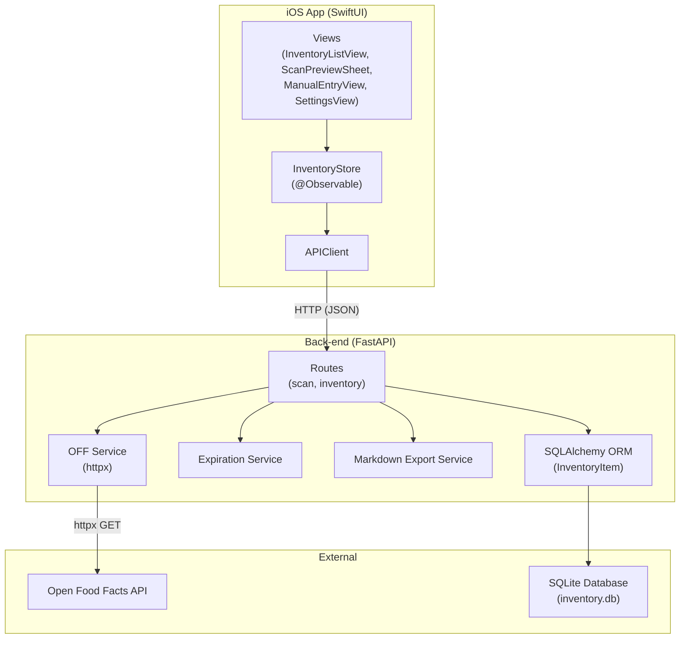

# Architecture

## Overview

Inventario is a pantry/inventory management application with two main components:

- A **[Python/FastAPI back-end](../modules/backend-api.md)** that provides a REST API for [CRUD operations on inventory items](../modules/backend-routes-inventory.md), [barcode scan lookups via Open Food Facts](../modules/backend-routes-scan.md), [expiration date estimation](../modules/backend-service-expiration.md), and [markdown export](../modules/backend-service-markdown-export.md).
- A **[Swift/SwiftUI iOS front-end](../components/ios-app-entry.md)** (iOS 17+) that consumes the API and presents a native user interface for scanning barcodes, manually adding items, viewing inventory, and managing settings.

The [back-end follows a layered architecture](./overview.md) (routes → services → models). The iOS app follows a [Store-View pattern](../concepts/ios-state-management.md) built around Swift's `@Observable` macro and the standard [`URLSession` networking stack](../concepts/ios-networking.md).

## Component Diagram



The iOS app communicates with the FastAPI back-end over HTTP. The back-end routes delegate to service modules for business logic and to SQLAlchemy for persistence. The scan service calls the external Open Food Facts API. See [Getting Started](../getting-started.md) for setup and running instructions.

## Back-End Layering

The Python back-end follows a three-layer architecture inside a single FastAPI application.

### Layer 1: Routes (Controllers)

Files: [`routes/scan.py`](../modules/backend-routes-scan.md), [`routes/inventory.py`](../modules/backend-routes-inventory.md)

Routes receive HTTP requests, validate input via Pydantic schemas, call the appropriate service layer, and return responses.

- **`POST /api/scan`** — accepts a `ScanRequest` (barcode), delegates to `fetch_product` from the OFF service, returns a `ScanResponse`.
- **`POST /api/inventory`** — accepts an `InventoryCreate`, optionally calls `estimate_expiration` from the expiration service, creates an `InventoryItem` row, returns `InventoryOut`.
- **`POST /api/inventory/manual`** — same as above but without a barcode (manual entry).
- **`GET /api/inventory`** — queries all items ordered by expiration date ascending.
- **`PATCH /api/inventory/{id}`** — partial update using `exclude_unset` on `InventoryUpdate`.
- **`DELETE /api/inventory/{id}`** — deletes an item by ID.
- **`GET /api/inventory/export`** — calls `to_markdown` from the markdown export service, returns `text/markdown`.

All inventory routes receive a SQLAlchemy `Session` via FastAPI dependency injection from [`database.get_db`](../modules/backend-database.md).

### Layer 2: Services (Business Logic)

Three service modules, each with a single responsibility:

- **[services/off.py](../modules/backend-service-off.md)** — `fetch_product(barcode)` uses `httpx.AsyncClient` to call `https://world.openfoodfacts.org/api/v0/product/{barcode}.json`, parses the response, and returns a dict with `name`, `brand`, `categories`, `image_url`, and `found` status. Returns `None` on network/HTTP errors.

- **[services/expiration.py](../modules/backend-service-expiration.md)** — `estimate_expiration(category_tags, reference_date)` looks up a shelf life in days from `config.DEFAULT_SHELF_LIFE` by matching normalized category tags (e.g. `"en:pasta"` → `"pasta"` → 365 days). Returns `reference_date + shelf_life`. Falls back to 30 days (the `"default"` key).

- **[services/markdown_export.py](../modules/backend-service-markdown-export.md)** — `to_markdown(items)` builds a markdown table string with columns: Prodotto, Brand, Quantità, Scadenza, Stato, Note. Items with `is_estimated` flag receive a warning note from `config.ESTIMATED_NOTE`.

### Layer 3: Models (ORM)

File: [`models.py`](../modules/backend-models.md)

A single SQLAlchemy model `InventoryItem` on the `inventory_items` table:

| Column | Type | Notes |
|--------|------|-------|
| `id` | Integer | PK, auto |
| `barcode` | String | Nullable, indexed |
| `name` | String | Not null |
| `brand` | String | Nullable |
| `expiration_date` | Date | Nullable |
| `is_estimated` | Boolean | Default false |
| `category` | String | Nullable |
| `image_url` | String | Nullable |
| `created_at` | DateTime | UTC, auto-set |
| `quantity` | Integer | Default 1 |

The database is SQLite (`sqlite:///./inventory.db`). Tables are created automatically on app startup via `Base.metadata.create_all()` inside the FastAPI lifespan handler.

### [Schemas (Pydantic v2)](../modules/backend-schemas.md)

File: `schemas.py`

- **`ScanRequest`** — `barcode: str`
- **`ScanResponse`** — barcode, name, brand, categories, image_url, found, message
- **`InventoryCreate`** — barcode, name, brand, expiration_date (optional), category, image_url, quantity (default 1)
- **`InventoryCreateManual`** — same without barcode
- **`InventoryOut`** — all fields plus a computed `status` field (`"expired"`, `"expiring_soon"`, `"ok"`) based on `expiration_date` vs today + `EXPIRING_SOON_DAYS` (3 days)
- **`InventoryUpdate`** — all optional fields, validated with `model_validator` to ensure at least one field is set

## iOS Store-View Pattern

### Entry Point

[`InventarioApp.swift`](../components/ios-app-entry.md) creates an `InventoryStore` instance and injects it into the SwiftUI environment:

```swift
@State private var store = InventoryStore()

WindowGroup {
    ContentView()
        .environment(store)
}
```

### ContentView

`ContentView.swift` shows a `TabView` with two tabs:
- **Dispensa** (refrigerator icon) — embeds [`InventoryListView`](../components/ios-inventory-list-view.md) in a `NavigationStack`
- **Aggiungi** (plus icon) — embeds `AddMenuView` with options to scan a barcode or manually enter a product

### Store Layer

`InventoryStore` is an `@Observable` class annotated with `@MainActor`. It owns the canonical list of inventory items and exposes async methods that delegate to `APIClient`:

| Method | HTTP operation |
|--------|---------------|
| `refresh()` | `GET /api/inventory` → fills `items` |
| `add(barcode:, name:, ...)` | `POST /api/inventory` → appends to `items` |
| `addManual(name:, ...)` | `POST /api/inventory/manual` → appends to `items` |
| `update(id:, ...)` | `PATCH /api/inventory/{id}` → replaces in `items` |
| `delete(id:)` | `DELETE /api/inventory/{id}` → removes from `items` |
| `decrementQuantity(for:)` | calls `update` if quantity > 1, else `delete` |
| `exportMarkdown()` | `GET /api/inventory/export` → stores in `exportedMarkdown` |

After mutations, the store re-sorts `items` by expiration date (nil last).

### Networking Layer

`APIClient` (also `@MainActor`) wraps `URLSession` with:

- Base URL from [`APIConfig.baseURL`](../config/ios-config.md) (stored in `UserDefaults`, default `http://127.0.0.1:8000`)
- Custom date encoding/decoding strategy via `JSONDecoder.DateDecodingStrategy.inventoryDate`
- A `perform(_:)` helper that maps HTTP errors and transport errors to `APIError`

`APIError` is a `LocalizedError` enum with cases: `invalidURL`, `transport`, `decoding`, `http(status, message)`, `notFound`, `offline`.

### Models (iOS)

- **`InventoryItem`** — `Codable` / `Identifiable` / `Equatable` with `CodingKeys` mapping snake_case from the API to camelCase in Swift. The `status` field is decoded as a `String`.
- **`ScanResult`** — mirrors `ScanResponse` from the API.
- **`ItemStatus`** — `String` enum (`ok`, `expiring_soon`, `expired`) with computed `color`, `symbol`, and `label` properties for UI rendering.

### Feature Structure

The iOS app is organized by feature under `Features/`:

- **Scan/** — `ScannerView` (wraps `DataScannerViewController` from VisionKit for barcode detection), `ScannerViewWrapper` (handles permissions and presents the scanner), and `ScanPreviewSheet` (displays scan results in a form for review before saving).
- **Inventory/** — `InventoryListView` (list with pull-to-refresh), `InventoryRowView`, `StatusBadge`, `ItemDetailView`.
- **ManualEntry/** — `ManualEntryView` (form for entering product details without scanning).
- **Settings/** — `SettingsView` (server URL configuration, export markdown).

Shared UI components live in `Components/`: `QuantityStepper`, `CategoryPicker`, `ErrorBanner`, `EmptyStateView`.

## Data Flow

### Barcode Scan → Save Flow

```mermaid
sequenceDiagram
    actor User
    participant Scanner as ScannerView<br/>(VisionKit)
    participant Preview as ScanPreviewSheet
    participant Store as InventoryStore
    participant API as APIClient
    participant FastAPI as FastAPI<br/>(routes)
    participant OFF as Open Food Facts
    participant DB as SQLite

    User->>Scanner: Point camera at barcode
    Scanner->>Scanner: Detect barcode via VisionKit
    Scanner->>Preview: Present sheet with barcode
    Preview->>API: scan(barcode)
    API->>FastAPI: POST /api/scan {barcode}
    FastAPI->>OFF: httpx GET product/{barcode}.json
    OFF-->>FastAPI: Product data (or not found)
    FastAPI-->>API: ScanResponse (JSON)
    API-->>Preview: ScanResult

    User->>Preview: Review & tap "Salva"
    Preview->>Store: add(barcode, name, ...)
    Store->>API: create(barcode, name, ...)
    API->>FastAPI: POST /api/inventory {barcode, name, ...}
    FastAPI->>FastAPI: estimate_expiration() if no date given
    FastAPI->>DB: INSERT inventory_items
    DB-->>FastAPI: row
    FastAPI-->>API: InventoryOut (JSON)
    API-->>Store: InventoryItem
    Store->>Store: Append & sort items
    Preview-->>User: Dismiss sheet
```

### Request Lifecycle (Back-End)

1. FastAPI receives the HTTP request and routes it to the matching handler via the included router.
2. Pydantic validates the request body against the schema (e.g. `InventoryCreate`) and raises `422` on failure.
3. For routes that need a database session, FastAPI calls the `get_db` dependency generator, yielding a `SessionLocal` instance.
4. The route handler calls the appropriate service function (e.g. `estimate_expiration`, `fetch_product`, `to_markdown`).
5. For mutation endpoints, the handler creates/updates/deletes ORM model instances and commits the session.
6. FastAPI serializes the response using the `response_model` (e.g. `InventoryOut`) with Pydantic's `from_attributes` mode.
7. The response is sent as JSON (or `text/markdown` for the export endpoint).

## Key Design Decisions

### Layered Back-End
- **Context**: The API has a small but distinct set of responsibilities — barcode lookup (external API), expiration estimation (shelf-life logic), and markdown export (presentation).
- **Decision**: Each concern is isolated in its own service module under `services/`. Routes are thin controllers that only orchestrate. Models are pure ORM definitions.
- **Consequences**: Adding a new feature (e.g. barcode image upload) means adding a new service module and a new router without touching existing code. The trade-off is slight indirection for very small endpoints.

### iOS Store-View with @Observable
- **Context**: SwiftUI requires a single source of truth for the inventory list that multiple views (list, detail, scan preview, manual entry) can read and mutate.
- **Decision**: A single `InventoryStore` class with `@Observable` holds the entire inventory array. Views read from it and call its async methods. The store owns the `APIClient` instance.
- **Consequences**: All state mutations flow through one object, making it easy to reason about and test. The `@MainActor` annotation ensures UI updates happen on the main thread. The downside is that the store grows as features are added.

### Open Food Facts Integration as a Service
- **Context**: Scanning a barcode requires calling an external API that may be slow or unavailable.
- **Decision**: The OFF lookup is wrapped in an async `httpx` call with a 10-second timeout. The route handles `None` returns (network error) by returning a `502` JSON response.
- **Consequences**: The iOS app can distinguish between "product not found" (200 with `found: false`) and "backend unavailable" (502). `ScanPreviewSheet` shows an error view for the latter.

### Expiration Date Estimation
- **Context**: Users often do not know or forget to enter an expiration date when adding items.
- **Decision**: If no `expiration_date` is provided, the back-end calls `estimate_expiration` which maps the item's category to a default shelf life (e.g. "fresh-milk" → 7 days, "pasta" → 365 days) and sets the date from today. The `is_estimated` flag is set to `true` so the UI can warn the user.
- **Consequences**: The inventory always has a reasonable expiration date when the user provides a category. The estimate can be wrong (the item may expire sooner), which is communicated via the markdown export note and can be corrected by the user later via the update endpoint.

### SQLite for Development Simplicity
- **Context**: This is a single-user application that runs on a local network.
- **Decision**: SQLite is used as the database backend via SQLAlchemy. No separate database server is required.
- **Consequences**: Zero setup for development. The database file is a single `inventory.db` in the project root. The trade-off is no concurrent write scalability, which is acceptable for a personal inventory app.
