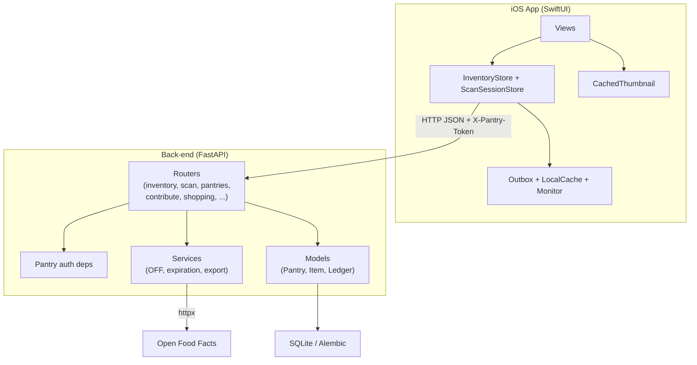
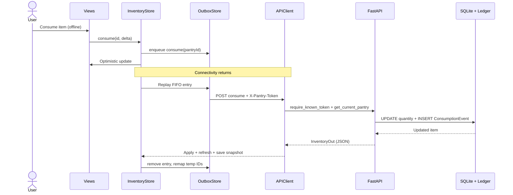

# Architecture

## Overview

Inventario is a multi-pantry inventory management application with two main components:

- A **[Python/FastAPI back-end](./modules/backend-api.md)** exposing REST routers for inventory, scan, [pantries](./api/pantries.md), [contribute](./api/contribute.md), categories, shopping, and [suggestions](./api/suggestions.md).
- A **[Swift/SwiftUI iOS front-end](./components/ios-app-entry.md)** (iOS 17+) built around a Store-View pattern with an offline-first stack.

The back-end follows a layered architecture (routes → services → models) with pantry-scoped token auth. The iOS app centers on `InventoryStore` plus a persistent outbox, a disk snapshot cache, a connectivity monitor, a scan-session queue, and a cached thumbnail view.

## Component Diagram

```mermaid
graph TD
    subgraph "iOS App (SwiftUI)"
        VIEWS["Views"]
        STORES["InventoryStore + ScanSessionStore"]
        OFFLINE["Outbox + LocalCache + Monitor"]
        THUMB["CachedThumbnail"]
        VIEWS --> STORES
        STORES --> OFFLINE
        VIEWS --> THUMB
    end

    subgraph "Back-end (FastAPI)"
        API["Routers<br/>(inventory, scan, pantries,<br/>contribute, shopping, ...)"]
        AUTH["Pantry auth deps"]
        SVC["Services<br/>(OFF, expiration, export)"]
        MODELS["Models<br/>(Pantry, Item, Ledger)"]
        API --> AUTH
        API --> SVC
        API --> MODELS
    end

    EXT_OFF["Open Food Facts"]
    DB["SQLite / Alembic"]

    STORES -- "HTTP JSON + X-Pantry-Token" --> API
    SVC -- "httpx" --> EXT_OFF
    MODELS --> DB
```

The iOS stores are the only callers of the API. Every pantry-scoped request carries an `X-Pantry-Token` header validated by the auth dependencies. Persistence is SQLAlchemy over SQLite with Alembic migrations. The scan/contribute services talk to Open Food Facts.

## Back-End Layering

Three layers inside a single FastAPI application (`backend/main.py` registers all routers and runs Alembic upgrade on lifespan, with `create_all` fallback).

### Layer 1: Routes

- `routes/inventory.py` — CRUD on items, pantry-scoped; consume endpoint appends to the ledger instead of just decrementing.
- `routes/scan.py` — `POST /api/scan` barcode lookup via the OFF service.
- `routes/pantries.py` — create/list pantries, membership, invites; token bootstrapping lives here (see [Backend Routes — Pantries](./modules/backend-routes-pantries.md)).
- `routes/contribute.py` — `POST /api/scan/contribute` forwards user corrections to Open Food Facts with an in-memory per-IP rate limit (10 req/min).
- `routes/categories.py`, `routes/shopping.py` (see [Shopping Routes](./modules/backend-routes-shopping.md)), `routes/suggestions.py` — taxonomy, shopping lists, and reorder suggestions.

### Layer 2: Auth (pantry scope)

`backend/dependencies/pantry.py` provides three dependencies (see [Pantry Sharing](./concepts/pantry-sharing.md)):

- `get_pantry_context` — requires the `X-Pantry-Token` header, 401 if missing or malformed (non-UUID).
- `require_known_token` — additionally 401s when the token owns no pantry and belongs to no pantry; used by inventory/scan/shopping so unknown tokens cannot read or write.
- `get_current_pantry(pantry_id)` — returns a `PantryContext` (string token plus pantry object) after membership check; 404 for unknown pantry, 403 for non-members.

### Layer 3: Models and services

Models (`backend/models.py`): `Pantry`, `PantryMember` (owner/editor roles), `Invite`, `ShoppingList`/`ShoppingListItem`, `InventoryItem` (now with nullable `pantry_id`, `created_by_token`, `compartment`), `ScanHistory`, and `ConsumptionEvent`.

`ConsumptionEvent` is an append-only consume ledger (see [Inventory Consume & History](./concepts/inventory-consume-history.md)): `pantry_id`, nullable `item_id` (`SET NULL` on delete), `name_snapshot`, `barcode`, `delta`, `reason`, `created_at`. No update/delete API exists; the actor token is deliberately not persisted for privacy. Services (`services/off.py`, `services/expiration.py`, `services/markdown_export.py`) keep single responsibilities: OFF fetch/contribute, shelf-life estimation, and markdown rendering.

## iOS Store-View + Offline Stack

`InventoryStore` is an `@Observable` `@MainActor` class holding `items`, `pantries`, per-item `history`, `archivedIDs`, and `selectedPantryId` (persisted in `UserDefaults`; switching clears in-memory pantry data). It delegates transport to `APIClient` over `URLSession`.

The offline stack around it:

- `OutboxStore` — FIFO persistent queue (`Application Support`, atomic JSON writes) of create/consume/update/delete mutations with per-entry `pantryId` so replay targets the originating pantry even after a pantry switch; temp negative IDs are remapped to server IDs after a successful create replay; replay policy is drop on 4xx/decode, stop on transport/offline/5xx (see [iOS Offline Outbox](./concepts/ios-offline-outbox.md)).
- `LocalInventoryCache` — per-pantry JSON snapshot in `Caches` for instant cold start and offline reading; missing or corrupt files resolve to nil and are removed.
- `ConnectivityMonitor` — `NWPathMonitor` wrapper publishing `isOnline`; the store exposes `isOffline` and replays the outbox when connectivity returns.
- `ScanSessionStore` — checkout-style scan queue with 1.5 s per-barcode debounce, duplicate suppression, 20-item cap, and per-item pending/loading/found/notFound/error states (see [iOS Scan Session](./components/ios-scan-session.md)).
- `CachedThumbnail` — replaces `AsyncImage` in lists; in-memory `NSCache` (~64 MB) keyed by URL plus pixel size, background `URLSession` download (shared `URLCache` for disk), and ImageIO downsampling so scrolling never refetches or redecodes full-size images (see [iOS Cached Thumbnail](./components/ios-cached-thumbnail.md)).

## Data Flow

```mermaid
sequenceDiagram
    actor User
    participant View as Views
    participant Store as InventoryStore
    participant Outbox as OutboxStore
    participant Net as APIClient
    participant API as FastAPI
    participant DB as SQLite + Ledger

    User->>View: Consume item (offline)
    View->>Store: consume(id, delta)
    Store->>Outbox: enqueue consume(pantryId)
    Store->>View: Optimistic update
    Note over Store,Net: Connectivity returns
    Store->>Outbox: Replay FIFO entry
    Outbox->>Net: POST consume + X-Pantry-Token
    Net->>API: require_known_token + get_current_pantry
    API->>DB: UPDATE quantity + INSERT ConsumptionEvent
    DB-->>API: Updated item
    API-->>Net: InventoryOut (JSON)
    Net-->>Store: Apply + refresh + save snapshot
    Store->>Outbox: remove entry, remap temp IDs
```

Online mutations follow the same path without the enqueue/replay steps. Reads (`GET /api/inventory`) populate both the store and the disk snapshot. Request lifecycle on the back-end: router → Pydantic validation (422 on failure) → pantry auth dependency (401/403/404) → service call → ORM commit including the ledger insert → serialized response.

## Key Design Decisions

### Pantry-scoped token auth
- **Context**: One back-end serves many shared pantries without user accounts.
- **Decision**: A UUID `X-Pantry-Token` header identifies the caller; `require_known_token` gates data routers while pantry creation/invite acceptance stays open for bootstrapping.
- **Consequences**: Simple sharing via token exchange; no password recovery — token loss means loss of access.

### Append-only consume ledger
- **Context**: Quantity edits alone lose consumption history needed for suggestions and audit.
- **Decision**: Every consume writes a `ConsumptionEvent` row; the API offers no update or delete for events (see [Inventory Consume & History](./concepts/inventory-consume-history.md)).
- **Consequences**: History and suggestions derive from immutable facts; storage grows monotonically and needs future retention/expiry handling.

### Offline-first iOS stack
- **Context**: Pantries are used in basements and stores with unreliable networks.
- **Decision**: Optimistic UI with a persistent outbox (Application Support, never purged) plus a purgeable snapshot cache (Caches) and last-write-wins replay.
- **Consequences**: The app stays usable offline and converges on reconnect; conflicting concurrent edits resolve by server-wins refresh rather than merge.
