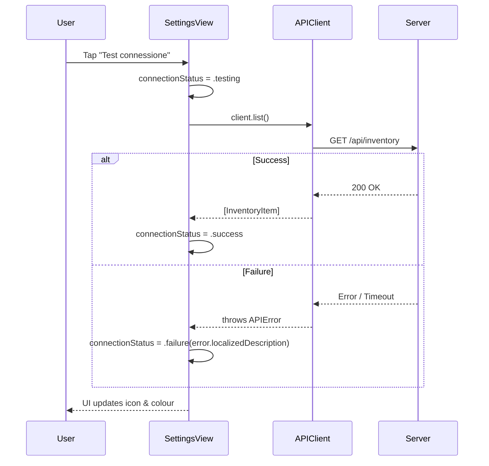

# SettingsView (iOS)

## Purpose

Provides a settings interface where users can configure the backend API URL, test connectivity, generate and share a markdown export of the pantry inventory, and view app information.

The view is a SwiftUI `Form` presented inside a `NavigationStack` with a "Fatto" (Done) toolbar button that dismisses the sheet.

## State & Dependencies

| Property | Type | Source | Description |
|----------|------|--------|-------------|
| `store` | `InventoryStore` | `@Environment` | Shared [observable store](../concepts/ios-state-management.md) that holds inventory items and the exported markdown string |
| `dismiss` | `DismissAction` | `@Environment` | SwiftUI dismiss action for closing the sheet |
| `apiURL` | `String` | `@State` | Local copy of the API base URL, initialised from `APIConfig.baseURLString` |
| `connectionStatus` | `ConnectionStatus?` | `@State` | Tracks the state of the connection test (`nil` when untested) |
| `showExportShare` | `Bool` | `@State` | Controls presentation of the share sheet (unused directly — `ShareLink` handles its own presentation) |
| `client` | `APIClient` | `let` | Instance of the [networking client](../concepts/ios-networking.md) used for the connection test |

## Sections

### Server

Contains a `TextField` bound to `apiURL` with keyboard type `.URL`, autocapitalisation disabled, and autocorrection disabled. Every change to the field is persisted immediately via [APIConfig.baseURLString](../config/ios-config.md) and resets `connectionStatus` to `nil`.

Below the text field is a "Test connessione" button. When tapped, it calls `testConnection()` in a `Task`. The button shows a trailing SF Symbol icon based on the current `connectionStatus` value (hourglass while testing, green checkmark on success, red X on failure).

### Esportazione

Two controls:

1. **"Genera esportazione"** button — calls `store.exportMarkdown()` which fetches markdown from `GET /api/inventory/export`. A green checkmark icon appears next to the label when `store.exportedMarkdown` is non-nil.

2. **"Condividi dispensa"** `ShareLink` — presents the system share sheet with the exported markdown as the item to share. The share link is disabled (`.disabled(true)`) when `store.exportedMarkdown` is `nil`, meaning the user must generate the export before sharing.

### Informazioni

Displays the app version (`1.0.0`) in a static `HStack`.

## ConnectionStatus Enum

Nested inside `SettingsView`, conforms to `Equatable`:

| Case | Associated Value | Icon | Colour | Label |
|------|------------------|------|--------|-------|
| `testing` | — | `hourglass` | `.gray` | "Verifica in corso..." |
| `success` | — | `checkmark.circle.fill` | `.green` | "Connessione riuscita" |
| `failure` | `String` | `xmark.circle.fill` | `.red` | The associated error message |

## Connection Test Flow



## API URL Persistence

The `apiURL` text field writes to `APIConfig.baseURLString` on every change via `.onChange(of: apiURL)`.

`APIConfig` is a `struct` with a static computed property backed by `UserDefaults.standard` with key `"apiBaseURL"`. The default value is `http://127.0.0.1:8000`.

```swift
static var baseURLString: String {
    get { UserDefaults.standard.string(forKey: "apiBaseURL") ?? "http://127.0.0.1:8000" }
    set { UserDefaults.standard.set(newValue, forKey: "apiBaseURL") }
}
```

This means the URL persists across app launches without any additional setup.

## Export Flow

1. User taps "Genera esportazione" → `store.exportMarkdown()` is called.
2. `InventoryStore` delegates to `APIClient.exportMarkdown()` which sends `GET /api/inventory/export` with `Accept: text/markdown`.
3. On success, the raw markdown string is stored in `store.exportedMarkdown`.
4. The `ShareLink` becomes enabled and, when tapped, presents the system share sheet with the markdown content.

## Code Structure

The view is built with [Apple frameworks](../dependencies/apple-dependencies.md) (SwiftUI, Foundation) and relies on three external types:

- **InventoryStore** — an `@Observable` `@MainActor` class providing `exportedMarkdown` and the `exportMarkdown()` method.
- **APIClient** — a `@MainActor` final class providing `list()` (used for connection testing) and `exportMarkdown()`.
- **APIConfig** — a static configuration struct backing the API URL with `UserDefaults`.
