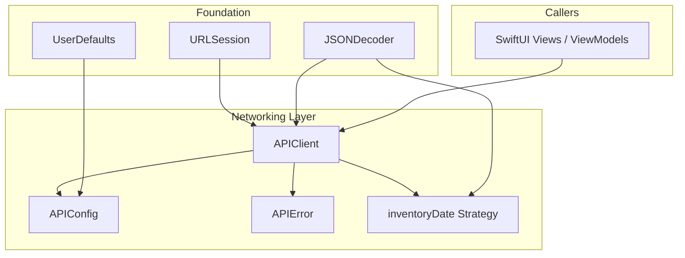

# iOS Networking

## Purpose

The iOS networking layer provides a centralized, type-safe HTTP client for communicating with the backend API. It handles request construction, response parsing, error mapping, and server URL configuration — all through a single `APIClient` entry point.

## Architecture



The networking layer is built on Foundation's `URLSession` with a shared `JSONEncoder`/`JSONDecoder` instance. Every public method on `APIClient` is `async throws` and runs on the main actor.

## APIClient

`APIClient` is a `@MainActor final class` — all network calls are initiated from the main actor. A single instance is shared throughout the app.

### Initialization

```swift
init() {
    let config = URLSessionConfiguration.default
    config.timeoutIntervalForRequest = 30
    self.session = URLSession(configuration: config)

    self.encoder = JSONEncoder()
    self.encoder.dateEncodingStrategy = .iso8601

    self.decoder = JSONDecoder()
    self.decoder.dateDecodingStrategy = .inventoryDate
}
```

- **Timeout**: 30 seconds for all requests.
- **Encoding**: ISO 8601 with `.iso8601` strategy for outgoing dates.
- **Decoding**: Custom `.inventoryDate` strategy (see below) for incoming dates.

### Public Methods

| Method | HTTP | Path | Returns |
|--------|------|------|---------|
| `scan(barcode:)` | POST | `/api/scan` | `ScanResult` |
| `create(barcode:name:brand:expirationDate:category:imageURL:quantity:)` | POST | `/api/inventory` | [InventoryItem](../concepts/ios-models.md) |
| `createManual(name:brand:expirationDate:category:quantity:)` | POST | `/api/inventory/manual` | [InventoryItem](../concepts/ios-models.md) |
| `update(id:name:brand:expirationDate:category:quantity:)` | PATCH | `/api/inventory/{id}` | [InventoryItem](../concepts/ios-models.md) |
| `list()` | GET | `/api/inventory` | `[[InventoryItem](../concepts/ios-models.md)]` |
| `delete(id:)` | DELETE | `/api/inventory/{id}` | `Void` |
| `exportMarkdown()` | GET | `/api/inventory/export` | `String` |

### Request/Response Cycle

Most methods (except `delete` and `exportMarkdown`) delegate to the private `perform(_:)` method:

1. Build `URLRequest` from `APIConfig.baseURL` + path
2. Set HTTP method, headers, and body
3. Call `perform(_:)` which:
   - Executes the request via `session.data(for:)`
   - Wraps transport errors in `APIError.transport`
   - Validates the response is an `HTTPURLResponse`
   - Checks for a 2xx status code
   - On 404: throws `APIError.notFound`
   - On other non-2xx: attempts to extract `detail` or `message` from the JSON body and throws `APIError.http(status:message:`
4. Decodes the response data with the shared `decoder`

#### `delete(id:)` — inline handling

The `delete` method does NOT use `perform(_:)`. It directly calls `session.data(for:)` and accepts 200 **or** 204 as success codes. No response body is decoded.

#### `exportMarkdown()` — custom response handling

The `export` method does NOT use `perform(_:)`. It requests `text/markdown` via the `Accept` header and converts the raw data to a UTF-8 string. Failure to decode the string produces `APIError.decoding`.

### Body Construction (POST / PATCH / UPDATE)

Methods that send JSON bodies use `JSONSerialization` (not the shared `encoder`) with a pattern:

```swift
var body: [String: Any?] = [
    "name": name,
    "brand": brand,
    "category": category,
    // ...
]
if let expirationDate {
    body["expiration_date"] = Self.dateFormatter.string(from: expirationDate)
}
let filteredBody = body.filter { $0.value != nil }.mapValues { $0! }
request.httpBody = try JSONSerialization.data(withJSONObject: filteredBody)
```

- Optional fields that are `nil` are omitted from the body.
- Dates are serialized manually with a static `DateFormatter` (`yyyy-MM-dd`, `en_US_POSIX`, UTC) rather than through the shared encoder.

## APIConfig

`APIConfig` (see [iOS Configuration](../config/ios-config.md)) is a stateless struct that reads and writes the server base URL from `UserDefaults`. The URL is configurable at runtime through [SettingsView](../components/ios-settings-view.md).

```swift
struct APIConfig {
    static var baseURLString: String {
        get { UserDefaults.standard.string(forKey: "apiBaseURL") ?? "http://127.0.0.1:8000" }
        set { UserDefaults.standard.set(newValue, forKey: "apiBaseURL") }
    }
    static var baseURL: URL { URL(string: baseURLString)! }
}
```

- **Default**: `http://127.0.0.1:8000`
- **Persistence**: stored under the key `apiBaseURL` in `UserDefaults.standard`.
- **baseURL**: a computed non-optional `URL` (force-unwraps the string; assumes stored value is always valid).

## APIError

`APIError` is an `enum` conforming to `LocalizedError` and `Equatable`.

### Cases

| Case | Associated Values | When Raised |
|------|-------------------|-------------|
| `invalidURL` | — | (reserved) |
| `transport` | `Error` | Network failure (`URLError`, timeout, etc.) |
| `decoding` | `Error` | JSON decoding failure or non-UTF-8 response |
| `http` | `status: Int`, `message: String?` | Non-2xx response (except 404) |
| `notFound` | — | HTTP 404 |
| `offline` | — | (reserved for explicit offline detection) |

### Equality

Equality is custom: `.transport` and `.decoding` cases are never equal to each other (their associated errors are not `Equatable`); `.http` compares only the status code.

### Localized Descriptions

All descriptions are in Italian:

| Case | Description |
|------|-------------|
| `.invalidURL` | "URL non valido." |
| `.transport` (no connection) | "Nessuna connessione internet." |
| `.transport` (other) | "Errore di rete: {error.localizedDescription}" |
| `.decoding` | "Errore durante l'elaborazione dei dati: {error.localizedDescription}" |
| `.http` | "Errore del server ({status}): {message}" or "Errore del server ({status})." |
| `.notFound` | "Risorsa non trovata." |
| `.offline` | "Nessuna connessione internet." |

When the underlying transport error is `NSURLErrorNotConnectedToInternet` (domain `NSURLErrorDomain`, code `-1009`), `.transport` returns "Nessuna connessione internet."

## Date Decoding Strategy

The custom static `inventoryDate` strategy on `JSONDecoder.DateDecodingStrategy` handles four date formats, tried in order:

1. **ISO 8601 with fractional seconds**: `2026-06-24T15:56:43.156Z` (parsed by `ISO8601DateFormatter` with `.withInternetDateTime | .withFractionalSeconds`)
2. **ISO 8601 without fractional seconds**: `2026-06-24T15:56:43Z`
3. **SQLite-style timestamp without timezone**: `2026-06-24T15:56:43.156523` (parsed by `DateFormatter` with format `yyyy-MM-dd'T'HH:mm:ss.SSSSSS`, `en_US_POSIX`, UTC)
4. **Date-only**: `2026-06-24` (parsed by `DateFormatter` with format `yyyy-MM-dd`, `en_US_POSIX`, UTC)

If none match, the decoder throws `DecodingError.dataCorruptedError`.

## Error Handling Flow

```
URLSession error
    └─► APIError.transport(error)
        └─► NSURLErrorNotConnectedToInternet → offline message

Non-2xx status code
    ├─► 404 → APIError.notFound
    └─► other → APIError.http(status, body.detail|body.message)

Decoding failure
    └─► APIError.decoding(error)
```

The `perform(_:)` method centralizes this logic. Methods that bypass it (`delete`, `exportMarkdown`) duplicate the pattern inline with minor variations (e.g., `delete` accepts 200/204, `export` handles raw string conversion).
