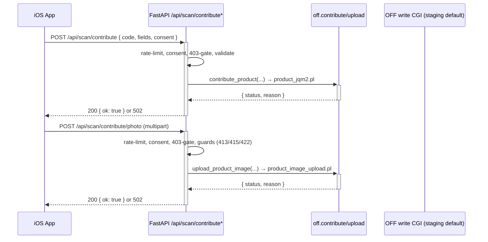

# Open Food Facts Integration

## Purpose

The Open Food Facts (OFF) integration connects the Inventario iOS app to the public OFF database in both directions: **read** (barcode scan lookup) and **write** (opt-in contribution of product metadata and photos). The backend owns all OFF wire details; iOS only sends barcodes, form data, and a CC BY-SA consent flag. The client functions live in the [OFF service](../modules/backend-service-off.md).

## Read Pattern (Scan Lookup)

```mermaid
sequenceDiagram
    participant iOS as iOS App
    participant API as FastAPI /api/scan
    participant OFF_svc as off.fetch_product()
    participant OFF_API as Open Food Facts API

    iOS->>+API: POST /api/scan { barcode }
    API->>+OFF_svc: fetch_product(barcode)
    OFF_svc->>+OFF_API: GET /api/v0/product/{barcode}.json
    alt OFF responds with product
        OFF_API-->>-OFF_svc: status=1 + product data
        OFF_svc->>OFF_svc: Extract & normalise fields
        OFF_svc-->>-API: { found: true, name, brand, categories, image_url }
        API-->>-iOS: 200 ScanResponse (found=true)
    else OFF responds no product
        OFF_API-->>-OFF_svc: status!=1 or missing product
        OFF_svc-->>-API: { found: false }
        API-->>-iOS: 200 ScanResponse (found=false, message)
    else OFF unreachable / error
        OFF_API--x-OFF_svc: HTTP or network error
        OFF_svc-->>-API: None
        API-->>-iOS: 502 MessageResponse (error message)
    end
```

The scan endpoint builds a `ScanResponse` from `fetch_product`'s return value; category tags (`en:pasta`) are stripped to their last segment (`pasta`) so they match the `DEFAULT_SHELF_LIFE` keys. A missing product is HTTP 200 with `found=false` — the scan succeeded, the database simply has no match. Only transport failures become 502.

## Write Pattern (Contribute Metadata + Photo)

Opt-in contribution via two endpoints in `backend/routes/contribute.py` (see [Contribute](../api/contribute.md)), both disabled unless `OFF_WRITE_ENABLED` resolves true (flag on **and** `OFF_USER`/`OFF_PASS` present **and** base URL valid). Both share an in-memory per-IP rate limit (10 req/min, 60 s sliding window → 429) and both require explicit `consent_cc_bysa=true` (→ 400 otherwise) because contributions are published under CC BY-SA.



### Metadata flow

1. iOS posts JSON (`code` matching `^\d{8,14}$`, at least one product field, `lang` like `it`/`it-IT`, consent flag).
2. The route validates (Pydantic → 422), enforces consent (400) and the write gate (403), then calls `contribute_product`.
3. The service posts to `product_jqm2.pl` with **only `add_*` fields** for brands/categories/labels (never the bare keys, so OFF data is appended, not overwritten), language-suffixed names (`product_name_{lang}` with the lang normalised to 2 letters), app `User-Agent`, and staging basic auth when targeting `*.openfoodfacts.net`.
4. OFF `status != 1` → 502 "rifiutato"; transport errors → 502 "comunicazione". Success → `200 {"ok": true, "code", "message"}`.

### Photo flow

1. iOS (`APIClient.uploadPhoto`) posts multipart `code` + `imagefield` + `consent_cc_bysa` + `image`; on failure the `photoError` state in `ScanPreviewSheet` shows the error and the button flips to "Riprova".
2. The route applies the guard chain below, then calls `upload_product_image`, which posts multipart to `product_image_upload.pl` with the file part named `imgupload_{imagefield}` and the sanitised filename.

### Photo guard chain (fail-closed, in order)

| # | Guard | Failure |
|---|-------|---------|
| 1 | Rate limit 10/min per IP | 429 |
| 2 | `consent_cc_bysa=true` | 400 |
| 3 | `OFF_WRITE_ENABLED` | 403 |
| 4 | `code` matches `^\d{8,14}$`; `imagefield` matches `^(front\|ingredients\|nutrition\|packaging\|other)(_[a-z]{2})?$` | 422 |
| 5 | Declared `Content-Length` over 5 MB + 1 KB multipart tolerance (pre-check before reading the body) | 413 |
| 6 | Actual bytes over 5 MB (`MAX_PHOTO_BYTES`) or empty | 413 / 415 |
| 7 | Declared `Content-Type` vs magic-byte detection must agree on JPEG/PNG/HEIC — HEIC requires a strict `ftyp` brand (`heic`, `heix`, `hevc`, …; generic `mif1`/`msf1` containers rejected) | 415 |
| 8 | JPEG/PNG minimum dimensions 640×160 (HEIC accepted without dimension check) | 422 |
| 9 | Filename sanitised (`_safe_filename`: strips newlines/quotes, non-`[A-Za-z0-9._-]` → `_`, max 128 chars) | never fails, falls back to `{code}_{imagefield}` |

## Identity and Credentials

Every write request identifies the app the same way: `User-Agent: {OFF_APP_NAME}/{OFF_APP_VERSION}` (plus `(contact)` when `OFF_CONTACT_EMAIL` is set), form credentials `user_id`/`password` from `OFF_USER`/`OFF_PASS`, and — only against the staging host `world.openfoodfacts.net` (default `OFF_WRITE_BASE_URL`) — HTTP basic auth `off:off` (overridable via `OFF_STAGING_BASIC_USER`/`OFF_STAGING_BASIC_PASS`). Production `.org` targets get no basic auth. Passwords and image bytes never appear in logs.

## Configuration

| Setting | Default | Notes |
|---------|---------|-------|
| `OFF_BASE_URL` | `https://world.openfoodfacts.org/api/v0/product` | Read path |
| `OFF_WRITE_BASE_URL` | `https://world.openfoodfacts.net/cgi` (staging) | Prod `.org` only via env; invalid/insecure values fall back to staging with a warning |
| `OFF_WRITE_ENABLED` | `false` | True only if the flag is on **and** `OFF_USER`/`OFF_PASS` are set **and** the base URL is valid |
| `OFF_USER` / `OFF_PASS` | empty | Required to enable writes; on staging use a staging-created account |
| `OFF_APP_NAME` / `OFF_APP_VERSION` / `OFF_CONTACT_EMAIL` | `DispensApp` / `0.1.0` / empty | Feed the `User-Agent` header |
| HTTP timeouts | 10 s read, 15 s metadata, 30 s photo | Hardcoded in the service |

## Response Paths Summary

| Condition | HTTP Status | Body includes |
|-----------|-------------|---------------|
| Scan: product found | 200 | `barcode`, `name`, `brand`, `categories`, `image_url` |
| Scan: product not in OFF | 200 (`found=false`) | `barcode`, `message` ("Prodotto non trovato...") |
| Scan: OFF unreachable | 502 | `message` ("Errore durante la comunicazione...") |
| Contribute/photo: accepted | 200 (`ok=true`) | `code`, `message` |
| Contribute/photo: OFF rejected or transport error | 502 | `detail` ("rifiutato" / "comunicazione") |
| Contribute/photo: gated | 429 / 403 / 400 / 422 / 413 / 415 | Guard-chain table above |

Messages are in Italian because the app's primary user base is Italian-speaking.

## Production Note

The in-memory rate limiter is per-process and does not survive restarts or scale across workers. Before go-live, replace it with `slowapi` backed by Redis (see the `TODO(prod)` in `backend/routes/contribute.py`); no extra dependency is added now to keep the current scope minimal.
