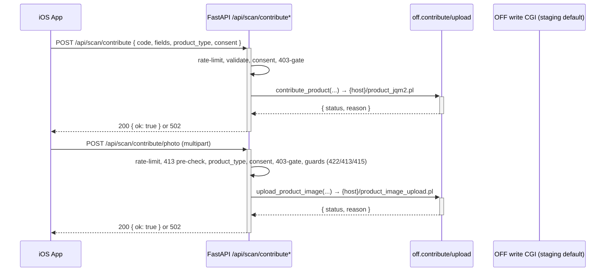

# Open Food Facts Integration

## Purpose

The Open Food Facts (OFF) integration connects the Inventario iOS app to the public Open* Facts database family in both directions: **read** (barcode scan lookup via the universal v3 API, which covers food and the beauty/petfood/product twins through `product_type`) and **write** (opt-in contribution of product metadata and photos, routed per-host by `product_type`). The backend owns all OFF wire details; iOS only sends barcodes, form data, and a CC BY-SA consent flag. The client functions live in the [OFF service](../modules/backend-service-off.md).

## Read Pattern (Scan Lookup)

The scan endpoint (`POST /api/scan`, see [Scan API](../api/scan.md)) delegates to `fetch_product`, which performs a single universal v3 read defaulting to `product_type=all`.

```mermaid
sequenceDiagram
    participant iOS as iOS App
    participant API as FastAPI /api/scan
    participant OFF_svc as off.fetch_product()
    participant OFF_API as Open* Facts v3 API

    iOS->>+API: POST /api/scan { barcode }
    API->>+OFF_svc: fetch_product(barcode, product_type=all)
    OFF_svc->>+OFF_API: GET {OFF_V3_BASE_URL}/{barcode}?product_type=all
    alt OFF responds with product
        OFF_API-->>-OFF_svc: status=1 + product data
        OFF_svc->>OFF_svc: Extract, normalise, resolve source/product_type
        OFF_svc-->>-API: { found: true, name, brand, categories, pnns_group, image_url, source, product_type }
        API-->>-iOS: 200 ScanResponse (found=true)
    else OFF responds no product
        OFF_API-->>-OFF_svc: 404 or status!=1 or missing product
        OFF_svc-->>-API: { found: false }
        API-->>-iOS: 200 ScanResponse (found=false, message)
    else OFF unreachable / error
        OFF_API--x-OFF_svc: HTTP or network error (1 retry, ~300ms)
        OFF_svc-->>-API: None
        API-->>-iOS: 502 MessageResponse (error message)
    end
```

The scan endpoint builds a `ScanResponse` from `fetch_product`'s return value; category tags (`en:pasta`) are stripped to their last segment (`pasta`), `pnns_groups_1` is normalised to a slug for the `PNNS_TO_INTERNAL` map, and the response carries the resolved `source`/`product_type` twin plus a `suggested_category`. Reads share one `httpx.AsyncClient` (10 s timeout, app `User-Agent`); each GET is retried at most once on transport errors and 5xx. `_fetch_single_v3` follows 301/302/303/307/308 once manually only when the `Location` host is allowlisted in `OFF_V3_HOSTS` values (e.g. food `302` → beauty for `8001280013973`; `Location` already carries the query) — the universal endpoint resolves sub-DBs server-side via redirect. There is no per-host fallback on `product_type != all` and no parallel fan-out: a single GET is terminal, so a v3 `failure` envelope means genuinely not found. An invalid barcode is skipped client-side (`None` → 502). A missing product is HTTP 200 with `found=false` — the scan succeeded, the databases simply have no match. Only transport failures become 502.

## Write Pattern (Contribute Metadata + Photo)

Opt-in contribution via two endpoints in `backend/routes/contribute.py` (see [Contribute API](../api/contribute.md)), both disabled unless `OFF_WRITE_ENABLED` resolves true (flag on **and** `OFF_USER`/`OFF_PASS` present **and** base URL valid). Both share an in-memory per-IP rate limit (10 req/min, 60 s sliding window → 429), both accept a `product_type` (`food`/`beauty`/`petfood`/`product`, default `food`, invalid → 422) that selects the write host via `resolve_write_url`, and both require explicit `consent_cc_bysa=true` (→ 400 otherwise) because contributions are published under CC BY-SA.



### Metadata flow

1. iOS posts JSON (`code` matching `^\d{8,14}$`, at least one product field, `lang` like `it`/`it-IT`, `product_type` default `food`, consent flag). Invalid `product_type` fails Pydantic validation → 422.
2. The route enforces rate limit (429), consent (400) and the write gate (403), then calls `contribute_product` with the normalised `product_type`.
3. The service resolves the write host per `product_type` (`resolve_write_url`: `food` → `world.openfoodfacts.org`, `beauty` → `world.openbeautyfacts.org`, `petfood` → `world.openpetfoodfacts.org`, `product` → `world.openproductsfacts.org`; staging base URLs always collapse to the single `world.openfoodfacts.net/cgi` food host) and posts to `product_jqm2.pl` with **only `add_*` fields** for brands/categories/labels (never the bare keys, so OFF data is appended, not overwritten), language-suffixed names (`product_name_{lang}` with the lang normalised to 2 letters), a `product_type` form field, app `User-Agent`, and staging basic auth when targeting `*.openfoodfacts.net`.
4. OFF `status != 1` → 502 "rifiutato"; transport errors → 502 "comunicazione". Success → `200 {"ok": true, "code", "message"}`.

### Photo flow

1. iOS (`APIClient.uploadPhoto`) posts multipart `code` + `imagefield` + `consent_cc_bysa` + `product_type` (default `food`) + `image`; on failure the `photoError` state in `ScanPreviewSheet` shows the error and the button flips to "Riprova".
2. The route applies the guard chain below, then calls `upload_product_image`, which posts multipart to the per-`product_type` host's `product_image_upload.pl` with the file part named `imgupload_{imagefield}` and the sanitised filename.

### Photo guard chain (fail-closed, in order)

| # | Guard | Failure |
|---|-------|---------|
| 1 | Rate limit 10/min per IP | 429 |
| 2 | Declared `Content-Length` over 5 MB + 1 KB multipart tolerance (fail-fast pre-check before reading the body; takes priority over `product_type` validation) | 413 |
| 3 | `product_type` in `food`/`beauty`/`petfood`/`product` (normalised, default `food`) | 422 |
| 4 | `consent_cc_bysa=true` | 400 |
| 5 | `OFF_WRITE_ENABLED` | 403 |
| 6 | `code` matches `^\d{8,14}$`; `imagefield` matches `^(front\|ingredients\|nutrition\|packaging\|other)(_[a-z]{2})?$` | 422 |
| 7 | Actual bytes over 5 MB (`MAX_PHOTO_BYTES`) or empty | 413 / 415 |
| 8 | Declared `Content-Type` vs magic-byte detection must agree on JPEG/PNG/HEIC — HEIC requires a strict `ftyp` brand (`heic`, `heix`, `hevc`, …; generic `mif1`/`msf1` containers rejected) | 415 |
| 9 | JPEG/PNG minimum dimensions 640×160 (HEIC accepted without dimension check) | 422 |
| 10 | Filename sanitised (`_safe_filename`: strips newlines/quotes, non-`[A-Za-z0-9._-]` → `_`, max 128 chars) | never fails, falls back to `{code}_{imagefield}` |

## Identity and Credentials

Every write request identifies the app the same way: `User-Agent: {OFF_APP_NAME}/{OFF_APP_VERSION}` (plus `(contact)` when `OFF_CONTACT_EMAIL` is set), form credentials `user_id`/`password` from `OFF_USER`/`OFF_PASS`, and — only against the staging host `world.openfoodfacts.net` (default `OFF_WRITE_BASE_URL`) — HTTP basic auth `off:off` (overridable via `OFF_STAGING_BASIC_USER`/`OFF_STAGING_BASIC_PASS`). Production twin hosts get no basic auth. The write host itself is selected per `product_type` via `resolve_write_url` (staging always collapses to the single food staging host). Passwords and image bytes never appear in logs.

## Configuration

| Setting | Default | Notes |
|---------|---------|-------|
| `OFF_V3_BASE_URL` | `https://world.openfoodfacts.org/api/v3/product` | Read path; invalid/insecure values fall back to default with a warning |
| `OFF_V3_HOSTS` | food/beauty/petfood/product → `world.open{food,beauty,petfood,products}facts.org` | Redirect allowlist for `_fetch_single_v3` (301/302/303/307/308 followed once only to these hosts; no per-host fallback) |
| `OFF_PRODUCT_TYPE_DEFAULT` | `all` | Default `product_type` query param for reads |
| `OFF_WRITE_BASE_URL` | `https://world.openfoodfacts.net/cgi` (staging) | Prod twin hosts only via env; invalid/insecure values fall back to staging with a warning |
| `OFF_WRITE_ENABLED` | `false` | True only if the flag is on **and** `OFF_USER`/`OFF_PASS` are set **and** the base URL is valid |
| `OFF_USER` / `OFF_PASS` | empty | Required to enable writes; on staging use a staging-created account |
| `OFF_APP_NAME` / `OFF_APP_VERSION` / `OFF_CONTACT_EMAIL` | `DispensApp` / `0.1.0` / empty | Feed the `User-Agent` header |
| HTTP timeouts | 10 s read, 15 s metadata, 30 s photo | Hardcoded in the service |

## Response Paths Summary

| Condition | HTTP Status | Body includes |
|-----------|-------------|---------------|
| Scan: product found | 200 | `barcode`, `name`, `brand`, `categories`, `image_url`, `source`, `product_type`, `suggested_category` |
| Scan: product not in OFF | 200 (`found=false`) | `barcode`, `message` ("Prodotto non trovato nei database Open* Facts") |
| Scan: OFF unreachable | 502 | `message` ("Errore durante la comunicazione con i database Open* Facts") |
| Contribute/photo: accepted | 200 (`ok=true`) | `code`, `message` ("...inviato a Open Facts") |
| Contribute/photo: OFF rejected or transport error | 502 | `detail` ("Open Facts ha rifiutato..." / "Errore durante la comunicazione con Open Facts") |
| Contribute/photo: gated | 429 / 413 / 422 / 400 / 403 / 415 | Guard-chain table above (photo); metadata contribute gates are 429 / 422 / 400 / 403 |

Contribute errors say "Open Facts" while scan errors say "Open* Facts". Other messages are in Italian because the app's primary user base is Italian-speaking.

## Production Note

The in-memory rate limiter is per-process and does not survive restarts or scale across workers. Before go-live, replace it with `slowapi` backed by Redis (see the `TODO(prod)` in `backend/routes/contribute.py`); no extra dependency is added now to keep the current scope minimal.
