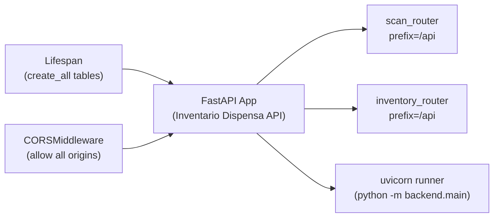

# Backend API

## Purpose

The `backend/main.py` module is the entry point of the FastAPI application — see [Architecture](../architecture.md) for the overall system design. It initializes the app, runs [database table creation](./backend-database.md) at startup, configures CORS middleware, mounts the [scan](./backend-routes-scan.md) and [inventory](./backend-routes-inventory.md) routers, and provides a `python -m backend.main` runner for local development.

## Key Files

| File | Role |
|------|------|
| `backend/main.py` | FastAPI app factory, lifespan, middleware, router registration, uvicorn runner |
| `backend/config.py` | [Configuration constants](../config/backend-config.md) used by the app |
| `backend/database.py` | [SQLAlchemy engine, session factory, and `Base`](./backend-database.md) used during startup |

## Structure



The diagram shows the app initialization flow: the lifespan handler and CORS middleware are attached to the FastAPI app, which then includes two routers and can be started via the uvicorn runner.

## App Initialization

```python
app = FastAPI(title="Inventario Dispensa API", lifespan=lifespan)
```

The `FastAPI` constructor receives:
- `title` — set to `"Inventario Dispensa API"`.
- `lifespan` — an async context manager that controls startup and shutdown behavior.

## Lifespan Events

The `lifespan` function is an `@asynccontextmanager` that runs on startup:

```python
@asynccontextmanager
async def lifespan(app: FastAPI):
    Base.metadata.create_all(bind=engine)
    yield
```

On startup it calls `Base.metadata.create_all(bind=engine)`, which creates all database tables defined on the `Base` declarative base (including the *[InventoryItem]* model). The `yield` suspends the context manager for the application's lifetime; after shutdown, cleanup code (currently none) would execute after the `yield`.

## CORS Middleware

```python
app.add_middleware(
    CORSMiddleware,
    allow_origins=CORS_ORIGINS,
    allow_methods=["*"],
    allow_headers=["*"],
)
```

CORS is configured via `CORSMiddleware` using the `CORS_ORIGINS` setting from `backend.config` (set to `["*"]`). All HTTP methods and headers are allowed. This is appropriate for development; a production deployment would restrict origins.

## Router Registration

Two routers are mounted via `app.include_router`, both at the `"/api"` prefix:

- **[scan_router](./backend-routes-scan.md)** — from `backend.routes.scan`, handles barcode scanning against *[OFF]* (Open Food Facts).
- **[inventory_router](./backend-routes-inventory.md)** — from `backend.routes.inventory`, provides CRUD operations on *[InventoryItem]* records and a Markdown export endpoint.

| Router | Prefix | Key Endpoints |
|--------|--------|---------------|
| `scan_router` | `/api` | `POST /scan` |
| `inventory_router` | `/api` | `POST /inventory`, `POST /inventory/manual`, `PATCH /inventory/{id}`, `GET /inventory`, `GET /inventory/export`, `DELETE /inventory/{id}` |

## Uvicorn Runner

When the module is executed directly, it starts uvicorn on `0.0.0.0:8000` with hot-reload enabled:

```python
if __name__ == "__main__":
    import uvicorn

    uvicorn.run("backend.main:app", host="0.0.0.0", port=8000, reload=True)
```

This allows the developer to launch the API with:

```bash
python -m backend.main
```

See [Getting Started](../getting-started.md) for the full development setup guide. The `reload=True` flag enables automatic restarts on file changes during development.
