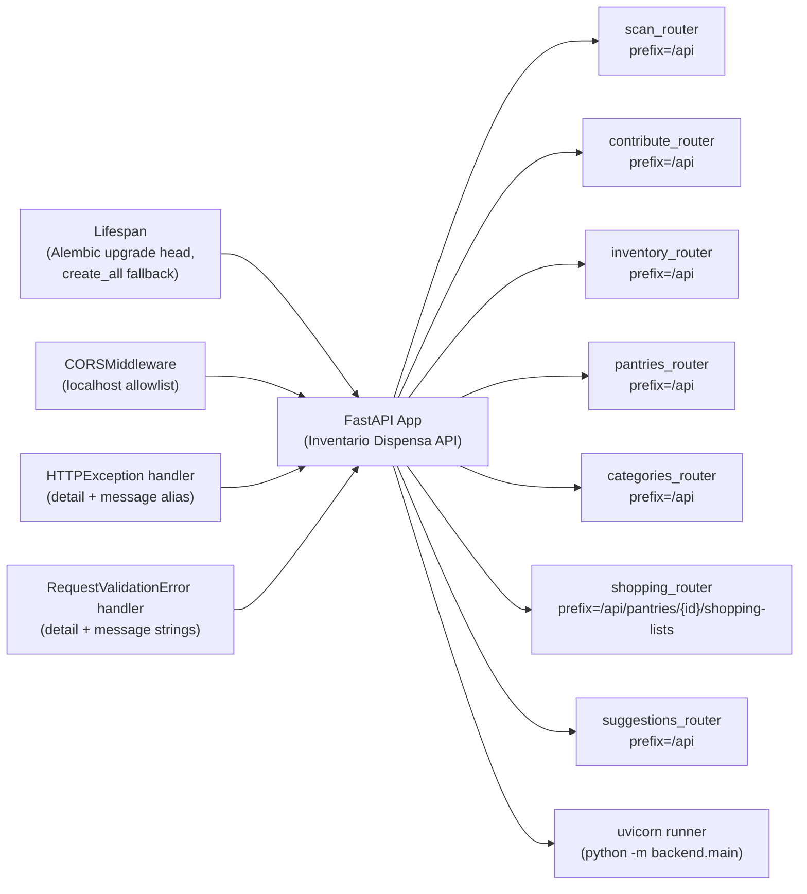

# Backend API

## Purpose

The `backend/main.py` module is the entry point of the FastAPI application — see [Architecture](../architecture.md) for the overall system design. It initializes the app, runs [Alembic migrations with a create_all fallback](./backend-database.md) at startup, configures CORS middleware, normalizes HTTP errors, mounts the [scan](./backend-routes-scan.md), [contribute](../api/contribute.md), [inventory](./backend-routes-inventory.md), [pantries](./backend-routes-pantries.md), [categories](../concepts/category-registry.md), [shopping](./backend-routes-shopping.md), and [suggestions](../api/suggestions.md) routers, and provides a `python -m backend.main` runner for local development.

## Key Files

| File | Role |
|------|------|
| `backend/main.py` | FastAPI app factory, lifespan, middleware, router registration, uvicorn runner |
| `backend/config.py` | [Configuration constants](../config/backend-config.md) used by the app |
| `backend/database.py` | [SQLAlchemy engine, session factory, and `Base`](./backend-database.md) used during startup |

## Structure


```mermaid
graph LR
    App["FastAPI App<br/>(Inventario Dispensa API)"]
    LS["Lifespan<br/>(Alembic upgrade head,<br/>create_all fallback)"]
    CORS["CORSMiddleware<br/>(localhost allowlist)"]
    ERR["HTTPException handler<br/>(detail + message alias)"]
    VAL["RequestValidationError handler<br/>(detail + message strings)"]
    Scan["scan_router<br/>prefix=/api"]
    Contrib["contribute_router<br/>prefix=/api"]
    Inventory["inventory_router<br/>prefix=/api"]
    Pantries["pantries_router<br/>prefix=/api"]
    Categ["categories_router<br/>prefix=/api"]
    Shop["shopping_router<br/>prefix=/api/pantries/{id}/shopping-lists"]
    Sugg["suggestions_router<br/>prefix=/api"]

    LS --> App
    CORS --> App
    ERR --> App
    VAL --> App
    App --> Scan
    App --> Contrib
    App --> Inventory
    App --> Pantries
    App --> Categ
    App --> Shop
    App --> Sugg
    App --> Uvicorn["uvicorn runner<br/>(python -m backend.main)"]
```

The diagram shows the app initialization flow: the lifespan handler, CORS middleware, and exception handlers are attached to the FastAPI app, which then includes seven routers and can be started via the uvicorn runner.

## App Initialization

```python
app = FastAPI(title="Inventario Dispensa API", lifespan=lifespan)
```

The `FastAPI` constructor receives:
- `title` — set to `"Inventario Dispensa API"`.
- `lifespan` — an async context manager that controls startup and shutdown behavior.

## Lifespan Events

The `lifespan` function is an `@asynccontextmanager` that runs on startup:

```python
@asynccontextmanager
async def lifespan(app: FastAPI):
    # Alembic upgrade head; create_all solo come fallback
    ...
    yield
```

On startup it runs `alembic upgrade head` against `DATABASE_URL` (see [Backend Database](./backend-database.md) for the migration chain). `Base.metadata.create_all(bind=engine)` is only a fallback when `alembic.ini` is missing or the upgrade fails (e.g. lightweight test envs); failures are logged as warnings, never fatal. The `yield` suspends the context manager for the application's lifetime.

## CORS Middleware

```python
app.add_middleware(
    CORSMiddleware,
    allow_origins=CORS_ORIGINS,
    allow_credentials=False,
    allow_methods=["GET", "POST", "PATCH", "DELETE", "OPTIONS"],
    allow_headers=["Content-Type", "Authorization", "Accept", "X-Pantry-Token"],
)
```

CORS is configured via `CORSMiddleware` using the `CORS_ORIGINS` setting from `backend.config`. `CORS_ORIGINS` is a localhost allowlist for development plus extra domains from the `CORS_ORIGINS` env var, never `"*"` (see `backend/tests/test_cors.py`).

## Router Registration

Seven routers are mounted via `app.include_router`:

- **[scan_router](./backend-routes-scan.md)** — from `backend.routes.scan`, handles barcode scanning against *[OFF]* (Open Food Facts).
- **[contribute_router](../api/contribute.md)** — from `backend.routes.contribute`, proxies OFF metadata/photo contributions.
- **[inventory_router](./backend-routes-inventory.md)** — from `backend.routes.inventory`, provides pantry-scoped CRUD operations on *[InventoryItem]* records, atomic consume, history, and a Markdown export endpoint.
- **[pantries_router](./backend-routes-pantries.md)** — from `backend.routes.pantries`, pantry lifecycle, invites, and members.
- **[categories_router](../concepts/category-registry.md)** — from `backend.routes.categories`, serves the server-driven category/compartment taxonomy.
- **[shopping_router](./backend-routes-shopping.md)** — from `backend.routes.shopping`, shopping lists scoped as `/api/pantries/{pantry_id}/shopping-lists`.
- **[suggestions_router](../api/suggestions.md)** — from `backend.routes.suggestions`, scan-history autocomplete.

| Router | Prefix | Key Endpoints |
|--------|--------|---------------|
| `scan_router` | `/api` | `POST /scan` |
| `contribute_router` | `/api` | `POST /scan/contribute`, `POST /scan/contribute/photo` |
| `inventory_router` | `/api` | `POST /inventory`, `POST /inventory/manual`, `PATCH /inventory/{id}`, `GET /inventory`, `POST /inventory/{id}/consume`, `GET /inventory/{id}/history`, `GET /inventory/export`, `DELETE /inventory/{id}` |
| `pantries_router` | `/api` | `/pantries`, `/pantries/.../invites`, `/pantries/.../members` (see [Pantries routes](./backend-routes-pantries.md)) |
| `categories_router` | `/api` | `GET /categories` |
| `shopping_router` | `/api/pantries/{pantry_id}/shopping-lists` | list/item CRUD, check/uncheck, markdown export |
| `suggestions_router` | `/api` | `GET /suggestions` |

## Error Handler

An `HTTPException` handler normalizes all errors to `{"detail": ...}` while keeping a `"message"` alias for legacy/test compatibility:

```python
@app.exception_handler(HTTPException)
async def http_exception_handler(request: Request, exc: HTTPException):
    content: dict = {"detail": exc.detail}
    if isinstance(exc.detail, str):
        content["message"] = exc.detail
    return JSONResponse(status_code=exc.status_code, content=content)
```

### Validation Errors

A `RequestValidationError` handler normalizes all request-validation failures to a uniform `422` body with string fields:

```python
@app.exception_handler(RequestValidationError)
async def validation_exception_handler(request: Request, exc: RequestValidationError):
    # uniforma errori di validazione a {"detail": str, "message": str} per compatibilità iOS [String:String]
    parts = []
    for err in exc.errors():
        loc = ".".join(str(p) for p in err.get("loc", []) if p != "body")
        msg = err.get("msg", "")
        parts.append(f"{loc}: {msg}" if loc else msg)
    detail = "; ".join(parts) if parts else "Errore di validazione"
    return JSONResponse(status_code=422, content={"detail": detail, "message": detail})
```

Each entry in `exc.errors()` contributes `"<loc>: <msg>"` (location parts joined with `.`, excluding `"body"`), joined with `"; "`. The result is always `{"detail": str, "message": str}` with identical values, so iOS clients can decode error bodies as `[String: String]`. Without it FastAPI returns the default `{"detail": [{loc, msg, type}, ...]}` array shape, which loses the message on iOS (see `backend/tests/test_validation_errors.py`, which triggers a `422` via `POST /api/scan` with an invalid barcode).

**Source**: `backend/main.py:71-80`

## Uvicorn Runner

When the module is executed directly, it starts uvicorn on `0.0.0.0:8000` with hot-reload enabled:

```python
if __name__ == "__main__":
    import uvicorn

    uvicorn.run("backend.main:app", host="0.0.0.0", port=8000, reload=True)
```

This allows the developer to launch the API with:

```bash
python -m backend.main
```

See [Getting Started](../getting-started.md) for the full development setup guide. The `reload=True` flag enables automatic restarts on file changes during development.
