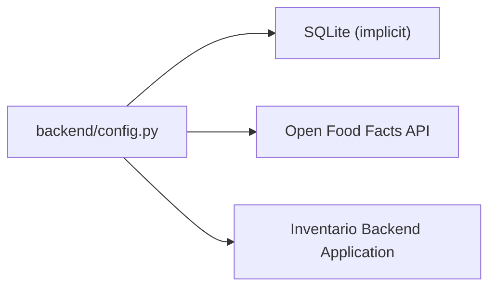

# Backend Config

## Purpose

Provides a single source of truth for shared configuration values used across the Inventario backend, including database connection, shelf-life defaults, Open Food Facts API endpoint, CORS settings, and expiration-related constants. See [Backend Configuration](../config/backend-config.md) for a config-oriented overview.

## Key Files

| File | Role |
|------|------|
| `backend/config.py` | Define all configuration constants |

## Configuration Reference

| Constant | Value | Description |
|----------|-------|-------------|
| `DEFAULT_SHELLF_LIFE` | `{"yogurts": 14, "fresh-milk": 7, "pasta": 365, "canned-vegetables": 730, "rice": 365, "cheeses": 30, "eggs": 21, "fresh-fruits": 7, "fresh-vegetables": 7, "frozen-foods": 90, "default": 30}` | Maps product category keys to their estimated shelf life in days. Used when a product lacks a real expiration date for [expiration date estimation](../concepts/expiration-estimation.md). The `default` key applies to unmatched categories. |
| `DATABASE_URL` | `"sqlite:///./inventory.db"` | SQLAlchemy-compatible connection string for the local SQLite database. |
| `OFF_BASE_URL` | `"https://world.openfoodfacts.org/api/v0/product"` | Base URL for the [Open Food Facts](../concepts/off-integration.md) product API, used to enrich scanned barcodes with product data. |
| `CORS_ORIGINS` | `["*"]` | Permitted CORS origins for cross-origin requests — currently open to all origins during development. |
| `EXPIRING_SOON_DAYS` | `3` | Number of days before a product's expiration date to flag it as "expiring soon" — used in [expiration date estimation](../concepts/expiration-estimation.md) and [item status](../concepts/item-status.md) computation. |
| `ESTIMATED_NOTE` | `"⚠️ Scadenza stimata, potrebbe scadere prima"` | Warning text (Italian) attached to products whose expiration date was estimated from `DEFAULT_SHELLF_LIFE` rather than read from a barcode scan. |

## Dependencies



The config module has no runtime imports — it is consumed by other backend modules that import these constants directly.

## Usage Example

```python
from backend.config import (
    DEFAULT_SHELLF_LIFE,
    DATABASE_URL,
    OFF_BASE_URL,
    CORS_ORIGINS,
    EXPIRING_SOON_DAYS,
    ESTIMATED_NOTE,
)

# Calculate estimated expiration date for a yogurt
from datetime import datetime, timedelta
estimated_days = DEFAULT_SHELLF_LIFE.get("yogurts", DEFAULT_SHELLF_LIFE["default"])
estimated_expiry = datetime.now() + timedelta(days=estimated_days)

# Construct Open Food Facts lookup URL
product_url = f"{OFF_BASE_URL}/{barcode}.json"
```

All constants are plain module-level variables defined in `backend/config.py` and can be imported individually. No class or factory wraps them. The [scan API](../api/scan.md) and [expiration estimation](../concepts/expiration-estimation.md) are the primary consumers of these values.
