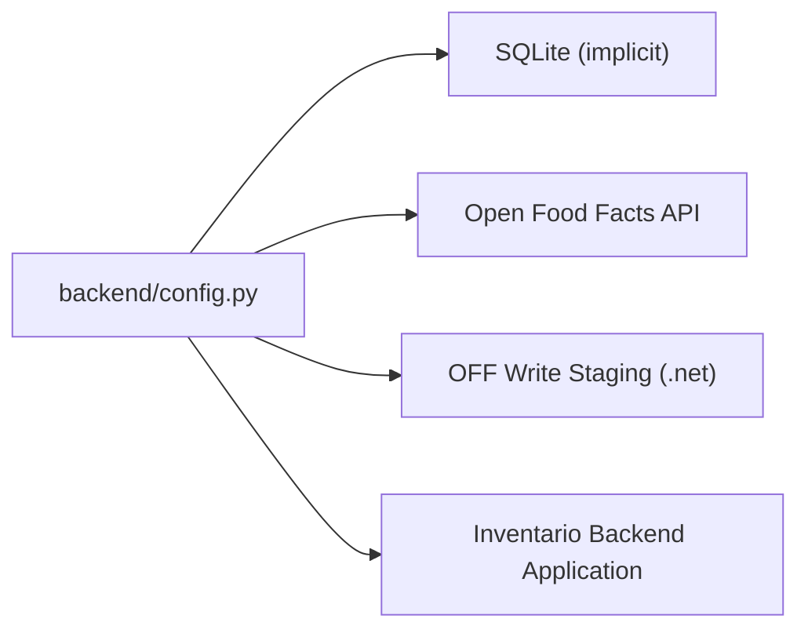

# Backend Config

## Purpose

Single source of truth for shared backend constants: shelf-life defaults, category normalization, supermarket compartments, database URL, Open Food Facts endpoints, OFF write gating, staging basic auth, user-agent builder, CORS allowlist, and expiration constants. See [Backend Configuration](../config/backend-config.md) for the environment-variable-oriented reference.

## Key Files

| File | Role |
|------|------|
| `backend/config.py` | Define all configuration constants and small config helpers |
| `.env.example` | Documents supported env vars and safe defaults |

## Constants Reference

| Constant | Type | Value / Default | Description |
|----------|------|-----------------|-------------|
| `DEFAULT_SHELF_LIFE` | `dict[str, int]` | 26 categories + `default: 30` | Estimated shelf life in days per canonical category. Used when a product lacks a real expiration date for [expiration date estimation](../concepts/expiration-estimation.md). See full table in [Backend Configuration](../config/backend-config.md). |
| `CATEGORY_LABELS` | `dict[str, str]` | Italian labels, keys = `DEFAULT_SHELF_LIFE` minus `default` | UI labels aligned with iOS `CategoryRegistry`. E.g. `yogurts -> "Yogurt"`, `uht-milk -> "Latte UHT"`. |
| `CATEGORY_ALIASES` | `dict[str, str]` | legacy/singular -> canonical | Normalization of legacy or singular forms, e.g. `yogurt -> yogurts`, `milk -> fresh-milk`, `coffee/tea -> coffee-tea`. |
| `OFF_TO_INTERNAL` | `dict[str, str]` | OFF tag -> canonical category | Broad OFF tag normalization (plurals, synonyms, e.g. `tuna/sardines -> canned-fish`, `wines/beers/spirits -> alcoholic-beverages`, `detergents/cosmetics/shampoos/soaps/toothpastes -> cleaning-hygiene`). |
| `SUPER_MARKET_COMPARTMENTS` | `list[str]` | 10 aisle names | Supermarket aisle walk order (`Ortofrutta` … `Igiene e Casa`). |
| `COMPARTMENT_MAP` | `dict[str, str]` | category -> compartment | Maps each canonical category to its compartment (e.g. `canned-fish -> Dispensa Secca`, `alcoholic-beverages -> Cantina`). |
| `DATABASE_URL` | `str` | `sqlite:///<repo>/inventory.db` (via `DATABASE_URL` env) | SQLAlchemy connection string. Default resolved as absolute path relative to the file, not CWD. |
| `OFF_V3_BASE_URL` | `str` | `"https://world.openfoodfacts.org/api/v3/product"` (via `OFF_V3_BASE_URL` env) | Universal read-only base URL for the [OFF service](./backend-service-off.md) (food + twin projects via `product_type`). Only `https` with host in `world.openfoodfacts.org` / `world.openbeautyfacts.org` / `world.openpetfoodfacts.org` / `world.openproductsfacts.org`; otherwise falls back to default with a warning. |
| `OFF_PRODUCT_TYPE_DEFAULT` | `str` | `"all"` (via `OFF_PRODUCT_TYPE_DEFAULT` env) | Default `product_type` for v3 reads (`all` queries every project). |
| `OFF_V3_HOSTS` | `dict[str, str]` | `food`/`beauty`/`petfood`/`product` -> world hosts | Per-`product_type` fallback hosts used by the [OFF service](./backend-service-off.md) when the first v3 `GET` fails with an explicit type. Not env-configurable. |
| `OFF_WRITE_BASE_URL` | `str` | `"https://world.openfoodfacts.net/cgi"` (via `OFF_WRITE_BASE_URL` env) | OFF write endpoint (`product_jqm2.pl`, `product_image_upload.pl`). Defaults to staging `.net`; production `.org` only via explicit env. Invalid host (outside `openfoodfacts.org`/`.net` plus the `openbeautyfacts`/`openpetfoodfacts`/`openproductsfacts` twins and subdomains) or scheme falls back to staging default with a warning. |
| `OFF_USER` / `OFF_PASS` | `str` | `""` (env) | Personal OFF account for writes. Never logged. On staging use a staging-created account, not the production one. |
| `OFF_APP_NAME` / `OFF_APP_VERSION` | `str` | `"DispensApp"` / `"0.1.0"` (env) | Client name/version sent in `comment`, `app_name`, `app_version`, and `User-Agent`. |
| `OFF_CONTACT_EMAIL` | `str` | `""` (env) | Optional contact appended to the user agent as `Name/Version (email)`. |
| `OFF_STAGING_BASIC_USER` / `OFF_STAGING_BASIC_PASS` | `str` | `"off"` / `"off"` (env) | HTTP Basic auth for the protected staging host `world.openfoodfacts.net`. Separate from `OFF_USER`/`OFF_PASS`; sent only on staging hosts. |
| `OFF_WRITE_ENABLED` | `bool` | `false` unless requested + credentials + valid URL | Write gate: `OFF_WRITE_ENABLED` env truthy (`1/true/yes/on`) AND `OFF_USER`/`OFF_PASS` set AND write base URL valid/secure. Missing credentials or insecure URL logs a warning and disables writes. Gates `POST /api/scan/contribute` and `/photo`. |
| `CORS_ORIGINS` | `list[str]` | 6 localhost dev origins + `CORS_ORIGINS` env | Restricted allowlist (no wildcard). Defaults are `http://localhost|127.0.0.1:3000|5173|8000`; extra origins come from comma-separated `CORS_ORIGINS` env. Passed to FastAPI `CORSMiddleware`. |
| `EXPIRING_SOON_DAYS` | `int` | `3` | Days before expiry to flag "expiring soon" — used in [expiration estimation](../concepts/expiration-estimation.md) and [item status](../concepts/item-status.md). |
| `ESTIMATED_NOTE` | `str` | `"⚠️ Scadenza stimata, potrebbe scadere prima"` | Warning text (Italian) for products with estimated expiry. |

## Functions

| Function | Signature | Description |
|----------|-----------|-------------|
| `normalize_category` | `(key: str \| None) -> str \| None` | Lowercases, strips language prefix (`en:yogurt` -> `yogurt`), then applies `OFF_TO_INTERNAL` followed by `CATEGORY_ALIASES`. Returns `None` for empty input. |
| `is_off_staging_base_url` | `(url: str \| None = None) -> bool` | `True` when the host is `openfoodfacts.net` or `*.openfoodfacts.net`. Defaults to `OFF_WRITE_BASE_URL`. |
| `off_basic_auth` | `(url: str \| None = None) -> tuple[str, str] \| None` | Returns `(OFF_STAGING_BASIC_USER, OFF_STAGING_BASIC_PASS)` only on staging hosts with both set; otherwise `None`. |
| `off_user_agent` | `() -> str` | Builds `OFF_APP_NAME/OFF_APP_VERSION` plus optional `(OFF_CONTACT_EMAIL)`. |

## Validation Rules

- Read base URL (`OFF_V3_BASE_URL`) must be `https` with host in `world.openfoodfacts.org` / `world.openbeautyfacts.org` / `world.openpetfoodfacts.org` / `world.openproductsfacts.org`; otherwise fallback to the default with `logger.warning`.
- Write host must be `openfoodfacts.org`, `openfoodfacts.net`, `openbeautyfacts.org`, `openpetfoodfacts.org`, `openproductsfacts.org`, or a subdomain thereof; otherwise fallback to staging default with `logger.warning`.
- Scheme must be `https`, except `http` allowed only for `localhost` / `127.0.0.1`.
- `OFF_WRITE_ENABLED` is `False` when the URL was invalid (insecure flag), even if env requested `true`.

## Dependencies


```mermaid
graph LR
    Config["backend/config.py"] --> Database["SQLite (implicit)"]
    Config --> OFF["Open Food Facts API"]
    Config --> OFFWrite["OFF Write Staging (.net)"]
    Config --> App["Inventario Backend Application"]
```

The config module has no runtime imports beyond stdlib (`os`, `logging`, `pathlib`, `urllib.parse`) — it is consumed by other backend modules that import these constants directly.

## Usage Example

```python
from backend.config import (
    DEFAULT_SHELF_LIFE,
    normalize_category,
    OFF_V3_BASE_URL,
    OFF_PRODUCT_TYPE_DEFAULT,
    OFF_WRITE_ENABLED,
    CORS_ORIGINS,
    off_user_agent,
    off_basic_auth,
)

# Normalize then estimate expiry
from datetime import datetime, timedelta
canonical = normalize_category("en:yogurt")  # -> "yogurts"
days = DEFAULT_SHELF_LIFE.get(canonical, DEFAULT_SHELF_LIFE["default"])
estimated_expiry = datetime.now() + timedelta(days=days)

# Read lookup (API v3, via the OFF service)
product_url = f"{OFF_V3_BASE_URL}/{barcode}.json?product_type={OFF_PRODUCT_TYPE_DEFAULT}"

# Write path (gated)
if OFF_WRITE_ENABLED:
    headers = {"User-Agent": off_user_agent()}
    auth = off_basic_auth()  # only set on staging
```
