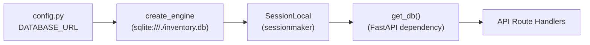

# Backend Database

## Purpose

The `backend/database.py` module establishes the SQLAlchemy database layer for the Inventario backend — part of the [system architecture](../architecture.md). It creates the SQLite engine, provides a session factory, defines the declarative ORM base, and exposes a FastAPI-compatible dependency generator that yields a per-request database session.

## Key Files

| File | Role |
|------|------|
| `backend/database.py` | Engine creation, session factory, declarative base, `get_db` dependency |
| `backend/config.py` | Provides the `DATABASE_URL` constant (`"sqlite:///./inventory.db"`) |

## Public API

### `engine`

A SQLAlchemy `Engine` instance created via `create_engine(DATABASE_URL, connect_args={"check_same_thread": False})`. The `DATABASE_URL` constant is [configured in `backend/config.py`](../config/backend-config.md). The `connect_args` parameter is required when using SQLite with FastAPI (see [SQLite Considerations](#sqlite-considerations)).

```python
engine = create_engine(DATABASE_URL, connect_args={"check_same_thread": False})
```

### `SessionLocal`

A `sessionmaker` factory bound to `engine`, configured with `autocommit=False` and `autoflush=False`:

```python
SessionLocal = sessionmaker(autocommit=False, autoflush=False, bind=engine)
```

Calling `SessionLocal()` returns a new `Session` instance. The defaults prevent automatic transaction commits and flushes, giving the caller explicit control over the unit of work.

### `Base`

A `declarative_base()` instance that all [ORM models](./backend-models.md) inherit from. At startup, `Base.metadata.create_all(bind=engine)` is called inside the [FastAPI app lifespan](./backend-api.md) to create any missing tables.

### `get_db()`

A generator function used as a FastAPI `Depends` dependency:

```python
def get_db():
    db = SessionLocal()
    try:
        yield db
    finally:
        db.close()
```

Each request receives a fresh session; the session is closed in the `finally` block when the request completes, even if an exception occurs.

## Dependencies



The diagram shows the dependency chain: `config.py` provides the connection string to the engine, the engine is bound to the session factory, the factory produces sessions via the `get_db` dependency, and route handlers receive those sessions.

## SQLite Considerations

### `check_same_thread = False`

SQLite by default allows a connection to be used only by the thread that created it. FastAPI runs on a thread pool (one thread per request), so without `check_same_thread=False`, a session opened on one thread would fail if accessed by another. Setting this flag disables the check, which is safe for single-process, single-file SQLite usage behind SQLAlchemy's connection pooling.

### File-based Database

The database file is `inventory.db` in the working directory, relative to `"sqlite:///./inventory.db"`. All tables are created automatically on startup via `Base.metadata.create_all(bind=engine)`.

### No Migration Tooling

The project uses `create_all` for schema creation and does not yet employ Alembic or another migration framework. Schema changes require dropping the database file manually.

## Usage Example

Route handlers inject a session by declaring `get_db` as a dependency. See [Architecture](../architecture.md) for the full request lifecycle:

```python
from fastapi import Depends
from sqlalchemy.orm import Session

from backend.database import get_db

@app.get("/items")
def list_items(db: Session = Depends(get_db)):
    return db.query(InventoryItem).all()
```

The session is automatically opened before the handler runs and closed after the response is sent, regardless of success or failure.
