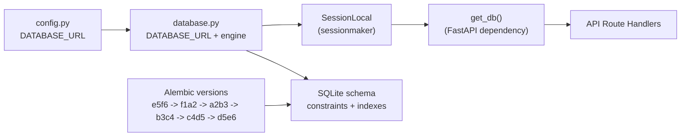

# Backend Database

## Purpose

The `backend/database.py` module establishes the SQLAlchemy database layer for the Inventario backend — part of the [system architecture](../architecture.md). It creates the SQLite engine (env-aware), provides a session factory, defines the declarative ORM base, and exposes a FastAPI-compatible dependency generator that yields a per-request database session. Schema evolution is managed via Alembic; key constraints live in [ORM models](./backend-models.md).

## Key Files

| File | Role |
|------|------|
| `backend/database.py` | Engine creation, session factory, declarative base, `get_db` dependency |
| `backend/alembic/versions/e5f6a7b8c9d0_consumption_events.py` | Creates `consumption_events`, adds `quantity CHECK >= 0` on `inventory_items` |
| `backend/alembic/versions/f1a2b3c4d5e6_invite_token_64_backfill_null.py` | Widens `invites.token` to `String(64)`, backfills `inventory_items.pantry_id NULL` |
| `backend/alembic/versions/a2b3c4d5e6f7_remove_actor_token.py` | Drops `consumption_events.actor_token` (privacy) |
| `backend/alembic/versions/b3c4d5e6f7a8_add_storage_location.py` | Adds `inventory_items.storage_location String(16)` nullable, no backfill |
| `backend/alembic/versions/c4d5e6f7a8b9_scan_history_source_product_type.py` | Adds `scan_history.source` + `product_type` nullable, no backfill |
| `backend/alembic/versions/d5e6f7a8b9c0_inventory_item_source_product_type.py` | Adds `inventory_items.source` + `product_type` nullable, no backfill |
| `.github/workflows/alembic-heads.yml` | CI gate enforcing a single Alembic head |

## Public API

### `DATABASE_URL`

Resolved as `os.getenv("DATABASE_URL", _fallback_url)`, where `_fallback_url` comes from `backend.config.DATABASE_URL` (already env-aware). If config still holds the legacy relative value `"sqlite:///./inventory.db"`, the fallback is rewritten to an absolute path anchored at the repo root (`Path(__file__).parent.parent / "inventory.db"`).

### `engine`

A SQLAlchemy `Engine` instance created via `create_engine(DATABASE_URL, connect_args=_connect_args)`, where `_connect_args = {"check_same_thread": False}` only for SQLite URLs (empty dict otherwise):

```python
engine = create_engine(DATABASE_URL, connect_args=_connect_args)
```

### `SessionLocal`

A `sessionmaker` factory bound to `engine`, configured with `autocommit=False` and `autoflush=False`:

```python
SessionLocal = sessionmaker(autocommit=False, autoflush=False, bind=engine)
```

Calling `SessionLocal()` returns a new `Session` instance. The defaults prevent automatic transaction commits and flushes, giving the caller explicit control over the unit of work.

### `Base`

A `declarative_base()` instance that all [ORM models](./backend-models.md) inherit from. At startup, `Base.metadata.create_all(bind=engine)` is called inside the [FastAPI app lifespan](./backend-api.md) to create any missing tables; Alembic migrations handle subsequent evolution.

### `get_db()`

A generator function used as a FastAPI `Depends` dependency:

```python
def get_db():
    db = SessionLocal()
    try:
        yield db
    finally:
        db.close()
```

Each request receives a fresh session; the session is closed in the `finally` block when the request completes, even if an exception occurs.

## Constraints

Enforced in `backend/models.py` and applied idempotently by migration `e5f6a7b8c9d0`:

- `inventory_items.quantity`: `CheckConstraint("quantity >= 0", name="ck_inventory_items_quantity_nonnegative")` with `default=1` / `server_default="1"`.
- `invites.token`: `String(64)`, `unique=True`, `index=True`, `nullable=False` — sized for `secrets.token_urlsafe(32)` (~43 chars); previous `String(36)` truncated valid tokens.
- `consumption_events`: append-only ledger — `pantry_id FK CASCADE NOT NULL`, `item_id FK SET NULL nullable`, `name_snapshot String(200) NOT NULL`, `delta Integer NOT NULL`, `reason Text nullable`, no `actor_token` column (privacy: never persisted, API type `ConsumptionEventOut` never exposed it). Index `ix_consumption_events_pantry_created (pantry_id, created_at)`.
- `inventory_items.storage_location String(16)` and `source` / `product_type` on `inventory_items` and `scan_history`: all `nullable=True` with no backfill — legacy rows stay `NULL`. Column definitions live in [Backend Models](./backend-models.md).

## Migrations

Linear head chain (all upgrades idempotent, best-effort `try/except` so partial state never blocks upgrade):

| Revision | Revises | Change |
|----------|---------|--------|
| `e5f6a7b8c9d0` | `b2c3d4e5f6a7` | Create `consumption_events` (+ `actor_token(36)` at the time) with indexes `ix_consumption_events_pantry_id`, `ix_consumption_events_pantry_created`, `ix_consumption_events_id`; ensure `ix_inventory_items_pantry_id` and `CHECK ck_inventory_items_quantity_nonnegative` |
| `f1a2b3c4d5e6` | `e5f6a7b8c9d0` | `invites.token String(36) -> String(64)` (only if length < 64); backfill `inventory_items.pantry_id IS NULL` to `MIN(pantries.id)` or a newly created `"La mia dispensa"` pantry; downgrade only narrows the column when no token exceeds 36 chars, backfill is not reversed |
| `a2b3c4d5e6f7` | `f1a2b3c4d5e6` | Drop `consumption_events.actor_token` via `batch_alter_table` if present (write path in `_consume_scoped_item` already stopped persisting the token); downgrade re-adds it as nullable `String(36)` |
| `b3c4d5e6f7a8` | `a2b3c4d5e6f7` | Add `inventory_items.storage_location String(16)` nullable via `batch_alter_table` if missing; no backfill — `NULL` means derived from category; downgrade drops the column if present |
| `c4d5e6f7a8b9` | `b3c4d5e6f7a8` | Add `scan_history.source` + `product_type` (`String`, nullable) via `batch_alter_table` if missing; no backfill for legacy rows; downgrade drops `product_type` then `source` if present |
| `d5e6f7a8b9c0` | `c4d5e6f7a8b9` | Add `inventory_items.source` + `product_type` (`String`, nullable) via `batch_alter_table` if missing; no backfill (see [Backend Models](./backend-models.md)); downgrade drops `product_type` then `source` if present |

Current head: `d5e6f7a8b9c0`.

## CI

The `alembic-heads` workflow (`.github/workflows/alembic-heads.yml`) enforces a single-head migration chain on every push and pull request:

- Job `single-head` runs on `ubuntu-latest` with Python `3.11`, installs `alembic` + `sqlalchemy`, then runs `python -m alembic heads` from `backend/`.
- It counts heads and fails when the count is not exactly 1 (`Multiple alembic heads, merge required`), so branched heads must be merged before landing.

## Dependencies


```mermaid
graph LR
    Config["config.py<br/>DATABASE_URL"] --> DbMod["database.py<br/>DATABASE_URL + engine"]
    DbMod --> Session["SessionLocal<br/>(sessionmaker)"]
    Session --> get_db["get_db()<br/>(FastAPI dependency)"]
    get_db --> Routes["API Route Handlers"]
    Mig["Alembic versions<br/>e5f6 -> f1a2 -> a2b3 -> b3c4 -> c4d5 -> d5e6"] --> Schema["SQLite schema<br/>constraints + indexes"]
    DbMod --> Schema
```

The diagram shows the dependency chain: config plus `DATABASE_URL` env override feed the engine, the engine is bound to the session factory, the factory produces sessions via the `get_db` dependency, and route handlers receive those sessions. Alembic migrations evolve the SQLite schema (constraints and indexes) underneath the same engine.

## SQLite Considerations

### `check_same_thread = False`

SQLite by default allows a connection to be used only by the thread that created it. FastAPI runs on a thread pool (one thread per request), so without `check_same_thread=False`, a session opened on one thread would fail if accessed by another. The flag is applied only when `DATABASE_URL` starts with `"sqlite"`, which is safe for single-process, single-file SQLite usage behind SQLAlchemy's connection pooling.

### File-based Database

The default database file is `inventory.db` at the repo root (absolute URL built from `Path(__file__)`), overridable via the `DATABASE_URL` environment variable. All tables are created automatically on startup via `Base.metadata.create_all(bind=engine)`.

### Migration Tooling

The project uses `create_all` for initial schema creation plus Alembic for evolution. Migrations are idempotent (inspector checks `has_table` / `has_column` / `has_index` / `has_check` before acting) and use `batch_alter_table` for SQLite-compatible `ALTER` operations.

## Usage Example

Route handlers inject a session by declaring `get_db` as a dependency. See [Architecture](../architecture.md) for the full request lifecycle:

```python
from fastapi import Depends
from sqlalchemy.orm import Session

from backend.database import get_db

@app.get("/items")
def list_items(db: Session = Depends(get_db)):
    return db.query(InventoryItem).all()
```

The session is automatically opened before the handler runs and closed after the response is sent, regardless of success or failure.
