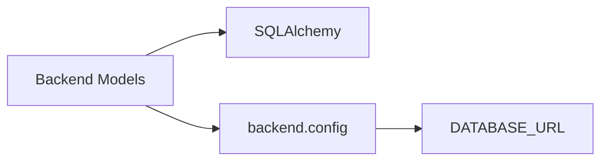

# Backend Models

## Purpose

Defines the SQLAlchemy ORM models and database session infrastructure for the Inventario app. The module provides the `InventoryItem` model that represents a tracked pantry item, along with the engine, session factory, and dependency-injection helper for FastAPI. The [database module](./backend-database.md) provides the engine and session factory these models depend on.

## Key Files

| File | Role |
|------|------|
| `backend/database.py` | Engine creation, `SessionLocal` factory, declarative `Base`, and FastAPI-compatible `get_db` generator |
| `backend/models.py` | `InventoryItem` ORM model with column definitions |

## Public API

### `backend.database`

- **`engine`** — SQLAlchemy `Engine` instance bound to `DATABASE_URL` (SQLite with `check_same_thread=False`).
- **`SessionLocal`** — `sessionmaker` factory producing `sqlalchemy.orm.Session` instances.
- **`Base`** — `declarative_base()` used by all models.
- **`get_db()`** — Generator function that yields a `SessionLocal` instance and ensures cleanup via `finally`. Intended as a FastAPI `Depends` target.

### `backend.models`

- **`InventoryItem`** — SQLAlchemy model mapped to the `inventory_items` table.

## Table: `inventory_items`

| Column | Type | Constraints | Default | Description |
|--------|------|-------------|---------|-------------|
| `id` | `Integer` | `primary_key=True`, `index=True` | auto-increment | Surrogate primary key |
| `barcode` | `String` | `nullable=True`, `index=True` | `NULL` | UPC/EAN barcode of the product |
| `name` | `String` | `nullable=False` | — | Display name of the item |
| `brand` | `String` | `nullable=True` | `NULL` | Brand name |
| `expiration_date` | `Date` | `nullable=True` | `NULL` | Best-before or expiry date — drives the [item status](../concepts/item-status.md) computation |
| `is_estimated` | `Boolean` | — | `False` | Flag indicating the [expiration date was auto-calculated](../concepts/expiration-estimation.md) rather than scanned/entered by the user |
| `category` | `String` | `nullable=True` | `NULL` | Product category (e.g. "Dairy", "Canned") |
| `image_url` | `String` | `nullable=True` | `NULL` | URL pointing to a photo of the item or label |
| `created_at` | `DateTime` | — | `lambda: datetime.now(timezone.utc)` | Timestamp of row creation (UTC) |
| `quantity` | `Integer` | `nullable=False` | `1` (Python), `"1"` (server-default) | Number of units in stock |

## Indexing Strategy

- **Primary key** on `id` — automatically indexed by SQLAlchemy (via `index=True` on the PK column; SQLite also creates a rowid index).
- **Explicit index** on `barcode` — the `index=True` flag creates a non-unique B-tree index on the barcode column to accelerate lookups by barcode without scanning the full table.
- All other columns are unindexed.

## Defaults

- **`created_at`** uses a Python-side callable default (`lambda: datetime.now(timezone.utc)`), evaluated once per row insertion at the application layer.
- **`quantity`** has a dual default: a Python-side default of `1` and a server-side default of `"1"`. This ensures new rows receive a quantity even when the column is omitted at the SQL level (server default) and when the ORM inserts without explicit value (Python default).
- **`is_estimated`** defaults to `False` at the Python level; the database column has no server default, so explicit `False` is always sent on insert unless overridden.

## Dependencies



- **Internal**: depends on `backend.config` for `DATABASE_URL`.
- **External**: depends on `sqlalchemy` (engine, ORM, column types).

## Relationship to Schemas

The `InventoryItem` ORM model maps to [Pydantic schemas](./backend-schemas.md) for API serialization. The `InventoryOut` schema uses `from_attributes=True` to read ORM fields, and computes the `status` field at read time (see [item status](../concepts/item-status.md)).

## Usage Example

```python
from backend.database import SessionLocal, engine, Base
from backend.models import InventoryItem

# Create tables (typically run via Alembic migrations)
Base.metadata.create_all(bind=engine)

# Insert a new item
db = SessionLocal()
item = InventoryItem(
    barcode="8000500310427",
    name="Pomodori Pelati",
    brand="Mutti",
    category="Canned",
    quantity=3,
)
db.add(item)
db.commit()
db.refresh(item)
print(item.id)  # auto-assigned

# Query by barcode (uses the explicit index)
item = db.query(InventoryItem).filter(
    InventoryItem.barcode == "8000500310427"
).first()
```

## Glossary

- *is_estimated*: Boolean flag indicating the [expiration date was auto-calculated](../concepts/expiration-estimation.md) (e.g., from average shelf life) rather than manually entered or scanned from the product label.
