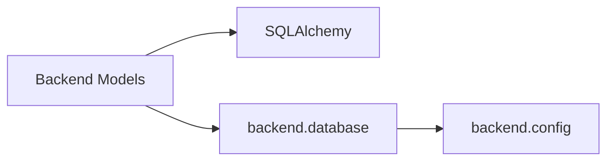

# Backend Models

## Purpose

Defines all SQLAlchemy ORM models for the Inventario app: multi-pantry scoping (`Pantry`, `PantryMember`, `Invite`), pantry-scoped inventory (`InventoryItem`), shopping lists (`ShoppingList`, `ShoppingListItem`), barcode cache (`ScanHistory`), and the append-only consumption ledger (`ConsumptionEvent`). The declarative `Base` and session factory live in the [database module](./backend-database.md).

## Key Files

| File | Role |
|------|------|
| `backend/models.py` | All ORM model classes and table-level constraints/indexes |

## Public API

- **`Pantry`** — `pantries` table. Owns all pantry-scoped rows via `pantry_id` foreign keys.
- **`PantryMember`** — `pantry_members` table. Composite primary key (`pantry_id`, `member_token`); `role` is `'owner'` or `'editor'`.
- **`Invite`** — `invites` table. Single-use join token (`String(64)`, unique) scoped to one pantry.
- **`ShoppingList`** — `shopping_lists` table. Pantry-scoped list header.
- **`ShoppingListItem`** — `shopping_list_items` table. Item belonging to one `ShoppingList`.
- **`InventoryItem`** — `inventory_items` table. Tracked pantry item with optional `pantry_id` for legacy rows.
- **`ScanHistory`** — `scan_history` table. Global barcode cache keyed by unique `barcode`.
- **`ConsumptionEvent`** — `consumption_events` table. Append-only ledger; stores no actor token for privacy (see [Inventory Consume & History](../concepts/inventory-consume-history.md)).

## Table: `pantries`

| Column | Type | Constraints | Default | Description |
|--------|------|-------------|---------|-------------|
| `id` | `Integer` | `primary_key=True`, `index=True` | auto-increment | Surrogate primary key |
| `name` | `String(100)` | `nullable=False` | — | Pantry display name |
| `owner_token` | `String(36)` | `nullable=False`, `index=True` | — | Creator token (owner) |
| `created_at` | `DateTime` | — | `lambda: datetime.now(timezone.utc)` | Row creation timestamp (UTC) |

## Table: `pantry_members`

| Column | Type | Constraints | Default | Description |
|--------|------|-------------|---------|-------------|
| `pantry_id` | `Integer` | `primary_key=True`, `ForeignKey("pantries.id", ondelete="CASCADE")` | — | Parent pantry; cascade delete |
| `member_token` | `String(36)` | `primary_key=True` | — | Member identity token |
| `role` | `String(10)` | `nullable=False` | — | `'owner'` or `'editor'` |
| `joined_at` | `DateTime` | — | `lambda: datetime.now(timezone.utc)` | Join timestamp (UTC) |

Index: `ix_pantry_members_member_token` on `member_token` for reverse lookup (all pantries of a token).

## Table: `invites`

| Column | Type | Constraints | Default | Description |
|--------|------|-------------|---------|-------------|
| `id` | `Integer` | `primary_key=True`, `index=True` | auto-increment | Surrogate primary key |
| `pantry_id` | `Integer` | `ForeignKey("pantries.id", ondelete="CASCADE")`, `nullable=False`, `index=True` | — | Invited pantry; cascade delete |
| `token` | `String(64)` | `nullable=False`, `unique=True`, `index=True` | — | Opaque single-use invite token |
| `created_by_token` | `String(36)` | `nullable=False` | — | Inviter token |
| `status` | `String(10)` | `nullable=False` | `"pending"` (Python + `server_default`) | `pending`, `accepted`, `expired`, or `revoked` |
| `expires_at` | `DateTime` | `nullable=False` | `now + timedelta(days=7)` | Expiry timestamp (UTC) |
| `created_at` | `DateTime` | — | `lambda: datetime.now(timezone.utc)` | Creation timestamp (UTC) |
| `accepted_by_token` | `String(36)` | `nullable=True` | `NULL` | Token that redeemed the invite |

## Table: `shopping_lists`

| Column | Type | Constraints | Default | Description |
|--------|------|-------------|---------|-------------|
| `id` | `Integer` | `primary_key=True`, `index=True` | auto-increment | Surrogate primary key |
| `pantry_id` | `Integer` | `ForeignKey("pantries.id", ondelete="CASCADE")`, `nullable=False`, `index=True` | — | Owning pantry; cascade delete |
| `name` | `String(100)` | `nullable=False` | `"Spesa"` (Python + `server_default`) | List display name |
| `created_by_token` | `String(36)` | `nullable=False` | — | Creator token |
| `created_at` | `DateTime` | — | `lambda: datetime.now(timezone.utc)` | Creation timestamp (UTC) |

## Table: `shopping_list_items`

| Column | Type | Constraints | Default | Description |
|--------|------|-------------|---------|-------------|
| `id` | `Integer` | `primary_key=True`, `index=True` | auto-increment | Surrogate primary key |
| `shopping_list_id` | `Integer` | `ForeignKey("shopping_lists.id", ondelete="CASCADE")`, `nullable=False`, `index=True` | — | Parent list; cascade delete |
| `name` | `String(200)` | `nullable=False` | — | Item display name |
| `quantity` | `Integer` | `nullable=False` | `1` (Python + `server_default`) | Requested units |
| `checked` | `Boolean` | `nullable=False` | `False` (Python, `server_default="0"`) | Checked-off flag |
| `compartment` | `String(32)` | `nullable=True` | `NULL` | Storage compartment hint |
| `added_by_token` | `String(36)` | `nullable=True` | `NULL` | Adder token |
| `created_at` | `DateTime` | — | `lambda: datetime.now(timezone.utc)` | Creation timestamp (UTC) |

## Table: `inventory_items`

| Column | Type | Constraints | Default | Description |
|--------|------|-------------|---------|-------------|
| `id` | `Integer` | `primary_key=True`, `index=True` | auto-increment | Surrogate primary key |
| `barcode` | `String` | `nullable=True`, `index=True` | `NULL` | UPC/EAN barcode |
| `name` | `String` | `nullable=False` | — | Display name |
| `brand` | `String` | `nullable=True` | `NULL` | Brand name |
| `expiration_date` | `Date` | `nullable=True` | `NULL` | Expiry date — drives the [item status](../concepts/item-status.md) computation |
| `is_estimated` | `Boolean` | — | `False` | Flag indicating the [expiration date was auto-calculated](../concepts/expiration-estimation.md) |
| `category` | `String` | `nullable=True` | `NULL` | Product category |
| `image_url` | `String` | `nullable=True` | `NULL` | Item or label photo URL |
| `created_at` | `DateTime` | — | `lambda: datetime.now(timezone.utc)` | Creation timestamp (UTC) |
| `quantity` | `Integer` | `nullable=False`, `CheckConstraint("quantity >= 0")` | `1` (Python + `server_default`) | Units in stock; never negative |
| `pantry_id` | `Integer` | `ForeignKey("pantries.id", ondelete="CASCADE")`, `nullable=True`, `index=True` | `NULL` | Owning pantry; nullable for legacy rows |
| `created_by_token` | `String(36)` | `nullable=True` | `NULL` | Creator token |
| `compartment` | `String(32)` | `nullable=True` | `NULL` | Storage compartment |

Indexes: `ix_inventory_items_pantry_expiration` on (`pantry_id`, `expiration_date`); `ix_inventory_items_pantry_created` on (`pantry_id`, `created_at`).

## Table: `scan_history`

| Column | Type | Constraints | Default | Description |
|--------|------|-------------|---------|-------------|
| `id` | `Integer` | `primary_key=True`, `index=True` | auto-increment | Surrogate primary key |
| `barcode` | `String` | `nullable=False`, `unique=True`, `index=True` | — | Cache key |
| `name` | `String` | `nullable=False` | — | Last resolved product name |
| `category` | `String` | `nullable=True` | `NULL` | Last resolved category |
| `times_scanned` | `Integer` | `nullable=False` | `1` (Python + `server_default`) | Hit counter |
| `last_scanned_at` | `DateTime` | `nullable=False` | `lambda: datetime.now(timezone.utc)` | Last hit timestamp (UTC) |

Indexes: `ix_scan_history_times_scanned` on `times_scanned`; `ix_scan_history_name` on `name`. This table is global (no `pantry_id`).

## Table: `consumption_events`

| Column | Type | Constraints | Default | Description |
|--------|------|-------------|---------|-------------|
| `id` | `Integer` | `primary_key=True`, `index=True` | auto-increment | Surrogate primary key |
| `pantry_id` | `Integer` | `ForeignKey("pantries.id", ondelete="CASCADE")`, `nullable=False`, `index=True` | — | Owning pantry; cascade delete |
| `item_id` | `Integer` | `ForeignKey("inventory_items.id", ondelete="SET NULL")`, `nullable=True` | `NULL` | Source item; nulled when the item is deleted |
| `name_snapshot` | `String(200)` | `nullable=False` | — | Item name at consumption time |
| `barcode` | `String` | `nullable=True` | `NULL` | Barcode snapshot |
| `delta` | `Integer` | `nullable=False` | — | Quantity change (negative for consumption) |
| `reason` | `Text` | `nullable=True` | `NULL` | Free-text reason |
| `created_at` | `DateTime` | — | `lambda: datetime.now(timezone.utc)` | Event timestamp (UTC) |

Index: `ix_consumption_events_pantry_created` on (`pantry_id`, `created_at`). No `actor_token` column is persisted — consumption writes must not store the caller token, by privacy design. There is no update/delete API; the ledger is append-only.

## Constraints and Pantry Scoping

- **`quantity >= 0`**: `ck_inventory_items_quantity_nonnegative` rejects negative stock at the database level.
- **`pantry_id` foreign keys**: `PantryMember`, `Invite`, `ShoppingList`, `InventoryItem`, and `ConsumptionEvent` all reference `pantries.id` with `ondelete="CASCADE"`, so deleting a pantry removes its memberships, invites, lists, items, and events.
- **`item_id` nulling**: `ConsumptionEvent.item_id` uses `ondelete="SET NULL"` so history survives item deletion via `name_snapshot`/`barcode`.
- **Nullable `InventoryItem.pantry_id`**: left nullable only for pre-multi-pantry legacy rows; all new writes set it.
- **Pydantic schemas**: the `InventoryItem` ORM model maps to [Pydantic schemas](./backend-schemas.md) with `from_attributes=True` and computed status at read time.

## Dependencies


```mermaid
graph LR
    BackendModels["Backend Models"] --> SQLAlchemy["SQLAlchemy"]
    BackendModels --> BackendDatabase["backend.database"]
    BackendDatabase --> Config["backend.config"]
```

- Internal: depends on backend.database for `Base`.
- External: depends on `sqlalchemy` (column types, `ForeignKey`, `CheckConstraint`, `Index`).

## Usage Example

```python
from backend.database import SessionLocal, engine, Base
from backend.models import ConsumptionEvent, InventoryItem, Pantry

# Create tables (typically run via Alembic migrations)
Base.metadata.create_all(bind=engine)

# Insert a pantry-scoped item
db = SessionLocal()
pantry = Pantry(name="Casa", owner_token="11111111-1111-1111-1111-111111111111")
db.add(pantry)
db.commit()
db.refresh(pantry)

item = InventoryItem(
    name="Pomodori Pelati",
    brand="Mutti",
    category="Canned",
    quantity=3,
    pantry_id=pantry.id,
)
db.add(item)
db.commit()

# Append a consumption event (no actor token stored)
db.add(ConsumptionEvent(
    pantry_id=pantry.id,
    item_id=item.id,
    name_snapshot=item.name,
    delta=-1,
    reason="used",
))
db.commit()
```
