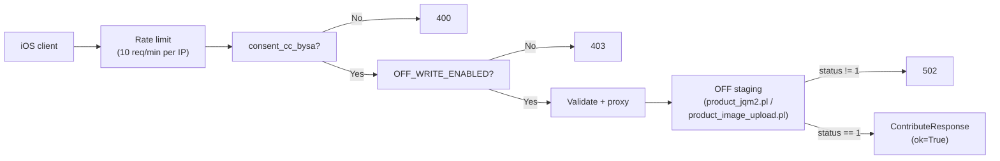

# Backend Routes — Contribute

## Purpose

Opt-in write proxy toward Open Facts staging: `POST /api/scan/contribute` forwards product metadata corrections and `POST /api/scan/contribute/photo` forwards product photos. Both endpoints enforce CC BY-SA consent, an in-memory per-IP rate limit, and server-side write gating before any traffic reaches OFF. Write host is resolved per `product_type` via `resolve_write_url()`. See [Contribute API](../api/contribute.md) for the client contract, [OFF service](../modules/backend-service-off.md) for the write clients, and [OFF Integration](../concepts/off-integration.md) for the read/write patterns.

## Key Files

| File | Role |
|------|------|
| `backend/routes/contribute.py` | Request models, validation, rate limit, photo sniffing, route handlers |
| `backend/services/off.py` | `contribute_product()` / `upload_product_image()` OFF staging clients |
| `backend/config.py` | `OFF_WRITE_ENABLED`, staging base URL, basic-auth, app identity |

## Flow

Both handlers share the same prefix (rate limit (429) → consent (400) → write gate (403) → OFF proxy), but payload-validation placement differs: metadata validates `ContributeRequest` via Pydantic before the handler runs, while the photo endpoint validates `product_type` (422) only AFTER the fail-fast `Content-Length` pre-check (413) so oversize bodies are rejected without reading them.

## Metadata Endpoint

`POST /scan/contribute` binds `ContributeRequest`:

- `code` must match `BARCODE_PATTERN`; optional fields carry `max_length` caps (200/500/64 chars).
- `lang` defaults to `"it"`, is normalized (`it` → `it`, `it-it` → `it-IT`) and validated against `^[a-z]{2}(-[A-Z]{2})?$`.
- `product_type` defaults to `"food"` via `_normalize_product_type` allowlist `food|beauty|petfood|product` (trimmed, lowercased; blank/`None` → `food`); invalid strings fail Pydantic validation with 422 and non-string values fail strict with 422 (no Form-sentinel tolerance). The normalized value is forwarded to `contribute_product()` for per-twin `resolve_write_url()` routing. iOS forwards `scanResult?.productType ?? source` via `APIClient.contribute(productType:)` (omitted when `nil`).
- Whitespace-only optionals are coerced to `None`; a model validator requires at least one real product field (`product_name`, `generic_name`, `brands`, `quantity`, `categories`, `labels`) — comment/`app_uuid` alone are rejected with 422.

## Photo Endpoint

`POST /scan/contribute/photo` takes multipart form fields (`code`, `imagefield`, `consent_cc_bysa`, `image`, `product_type`) and applies fail-closed checks in order:

1. **Content-Length pre-check** — declared length over `MAX_PHOTO_BYTES + 1024` is rejected with 413 before the body is read. Runs BEFORE `product_type` validation by design.
2. **`product_type` allowlist** — `_normalize_product_type` (`food|beauty|petfood|product`, default `food`; blank/`None` → `food`, non-string → 422 strict with no Form-sentinel tolerance), else 422 `product_type non valido`. Forwarded to `upload_product_image()` for `resolve_write_url()` host routing. iOS forwards `scanResult?.productType ?? source` via `APIClient.uploadPhoto(productType:)` (field omitted when `nil`).
3. **Consent + write gate** — `consent_cc_bysa` must be `true` (400) and `OFF_WRITE_ENABLED` must hold (403), with Open Facts detail strings.
4. **Size cap** — actual bytes over 5 MB → 413.
5. **Type sniffing** — magic-byte detection (`_detect_photo_kind`) must agree with the declared content type; JPEG/PNG/HEIC only, else 415. HEIC brands are restrictive (`heic/heix/hevc/...`; generic `mif1/msf1` containers rejected, including up to 8 compatible-brand entries).
6. **Dimensions** — JPEG/PNG parsed for real dimensions (SOF markers / IHDR); under 640×160 px → 422. HEIC skips dimension checks (no external deps).
7. **`imagefield` allowlist** — `front|ingredients|nutrition|packaging|other` plus optional `_xx` language suffix, else 422.
8. **Filename sanitization** — `_safe_filename` strips control chars/quotes, allows `[A-Za-z0-9._-]`, truncates to 128 chars.

Transport errors and staging refusals map to 502 with Italian detail messages; barcode/token values are never logged in full.

## Rate Limit

`_RATE_LIMIT` is a process-local `dict[ip, list[timestamps]]` with a 60 s sliding window and 10-request cap (`_check_rate_limit`, 429 with Italian message). Documented as a lightweight H1 mitigation: replace with slowapi/persistent auth (Redis) before production go-live.

## Error Codes

| Code | Meaning |
|------|---------|
| 400 | Missing CC BY-SA consent |
| 403 | `OFF_WRITE_ENABLED=false` (default without `OFF_USER`/`OFF_PASS`) |
| 413 | Photo over 5 MB (declared or actual) |
| 415 | Not a genuine JPEG/PNG/HEIC |
| 422 | Invalid barcode, imagefield, dimensions, empty contribute payload, or `product_type` outside `food\|beauty\|petfood\|product` (including non-string values — strict 422, no sentinel fallback) |
| 429 | Per-IP rate limit exceeded |
| 502 | OFF transport error or staging refusal |
