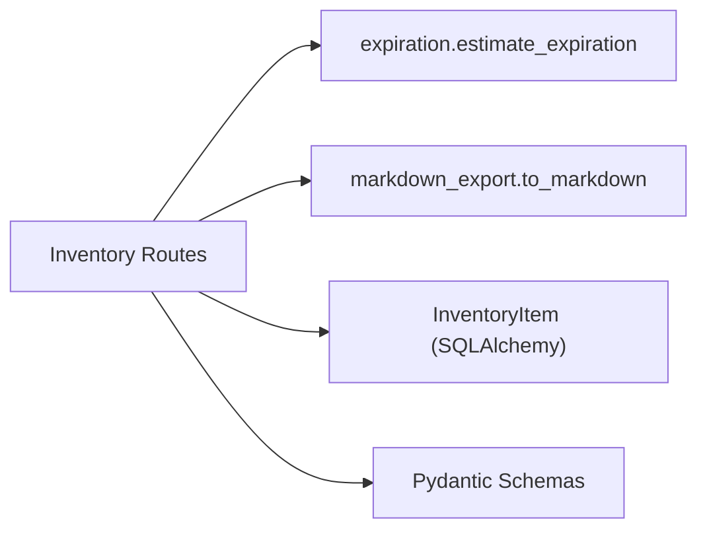

# Backend Routes — Inventory

## Purpose

This module provides the HTTP API for managing pantry inventory items — creating items from barcode scans or manual entry, updating, listing, exporting, and deleting them. See the [Inventory API](../api/inventory.md) page for endpoint reference. It delegates [expiration-date estimation](./backend-service-expiration.md) and [markdown export](./backend-service-markdown-export.md) to dedicated services.

## Key Files

| File | Role |
|------|------|
| `backend/routes/inventory.py` | Route definitions (FastAPI APIRouter under `/api`) |
| `backend/schemas.py` | [Pydantic request/response schemas](./backend-schemas.md) |
| `backend/services/expiration.py` | `estimate_expiration()` — computes expiration date from category |
| `backend/services/markdown_export.py` | `to_markdown()` — formats inventory as a markdown table |

## Public API

| Method | Path | Status | Description |
|--------|------|--------|-------------|
| POST | `/api/inventory` | 201 | Create an item from a barcode scan |
| POST | `/api/inventory/manual` | 201 | Create an item with manual entry (no barcode required) |
| PATCH | `/api/inventory/{item_id}` | 200 | Update selected fields of an item |
| GET | `/api/inventory` | 200 | List all items, ordered by expiration ascending (nulls last) |
| GET | `/api/inventory/export` | 200 | Export inventory as a markdown table |
| DELETE | `/api/inventory/{item_id}` | 204 | Delete an item |

## Dependencies



- **Internal**: `backend.database.get_db` (session), `backend.models.InventoryItem` ([ORM model](./backend-models.md))
- **External**: FastAPI, SQLAlchemy, Pydantic

## Endpoints

### POST /api/inventory

Creates an item from a barcode scan. Accepts `InventoryCreate` body:

```python
class InventoryCreate(BaseModel):
    barcode: str
    name: str
    brand: Optional[str] = None
    expiration_date: Optional[date] = None
    category: Optional[str] = None
    image_url: Optional[str] = None
    quantity: int = 1
```

**Expiration logic** (line 22–28 of `inventory.py`):

- If `expiration_date` is provided by the caller, it is used directly and `is_estimated` is set to `False`.
- Otherwise, `estimate_expiration()` is called with `category_tags=[body.category]` (or `None` if category is empty) and `is_estimated` is set to `True`.

**Response**: `InventoryOut` (201).

**Source**: `backend/routes/inventory.py:20-43`

### POST /api/inventory/manual

Creates an item manually (no barcode). Accepts `InventoryCreateManual` body:

```python
class InventoryCreateManual(BaseModel):
    name: str
    brand: Optional[str] = None
    expiration_date: Optional[date] = None
    category: Optional[str] = None
    quantity: int = 1
```

**Expiration logic** (line 50–58 of `inventory.py`):

- If `expiration_date` is provided → use it, `is_estimated=False`.
- If `expiration_date` is null but `category` is set → call `estimate_expiration()`, `is_estimated=True`.
- If both are null → `expiration_date=None`, `is_estimated=False` (no estimation possible).

The `barcode` field on the created `InventoryItem` is always set to `None`.

**Response**: `InventoryOut` (201).

**Source**: `backend/routes/inventory.py:46-72`

### PATCH /api/inventory/{item_id}

Updates one or more fields on an existing item. Accepts `InventoryUpdate` body:

```python
class InventoryUpdate(BaseModel):
    name: Optional[str] = None
    brand: Optional[str] = None
    expiration_date: Optional[date] = None
    category: Optional[str] = None
    image_url: Optional[str] = None
    quantity: Optional[int] = None
```

The schema enforces that at least one field must be set via a `model_validator` (line 76–80 of `schemas.py`):

```python
@model_validator(mode="after")
def at_least_one_field(self):
    if not self.model_fields_set:
        raise ValueError("Almeno un campo da aggiornare")
    return self
```

**Update logic** (line 80–82 of `inventory.py`):

- `body.model_dump(exclude_unset=True)` extracts only the fields the client explicitly provided.
- Each key-value pair is set on the ORM model via `setattr()`.

**Error handling**: Returns 404 with `{"detail": "Elemento non trovato"}` if `item_id` does not exist.

**Response**: `InventoryOut` (200).

**Source**: `backend/routes/inventory.py:75-85`

### GET /api/inventory

Returns the full inventory list, ordered by `expiration_date` ascending (nulls last):

```python
db.query(InventoryItem).order_by(InventoryItem.expiration_date.asc().nulls_last()).all()
```

**Response**: `list[InventoryOut]` (200). Each item includes a computed `status` field derived from the expiration date:

```python
@computed_field
@property
def status(self) -> str:
    if self.expiration_date is None:
        return "ok"
    today = date.today()
    if self.expiration_date < today:
        return "expired"
    if self.expiration_date <= today + timedelta(days=EXPIRING_SOON_DAYS):
        return "expiring_soon"
    return "ok"
```

Where `EXPIRING_SOON_DAYS = 3` (from `backend/config.py`). See [expiration date estimation](../concepts/expiration-estimation.md) for the full algorithm.

**Source**: `backend/routes/inventory.py:88-95`, `backend/schemas.py:55-65`

### GET /api/inventory/export

Exports the inventory as a markdown table. Queries all items with the same ordering as the list endpoint, then passes them to `to_markdown()`:

```python
md = to_markdown(items)
return PlainTextResponse(content=md, media_type="text/markdown")
```

The export table includes five columns: Prodotto, Brand, Quantità, Scadenza, Stato, Note. Items with `is_estimated=True` receive a note: `"⚠️ Scadenza stimata, potrebbe scadere prima"`.

**Response**: `text/markdown` (200).

**Source**: `backend/routes/inventory.py:98-106`, `backend/services/markdown_export.py:6-32`

### DELETE /api/inventory/{item_id}

Deletes an item by ID.

**Error handling**: If the item is not found, returns a 404 JSON response with `MessageResponse(message="Elemento non trovato")`:

```python
return JSONResponse(
    status_code=404,
    content=MessageResponse(message="Elemento non trovato").model_dump(),
)
```

**Response**: 204 (no content) on success.

**Source**: `backend/routes/inventory.py:109-119`

## Schemas

| Schema | Fields | Notes |
|--------|--------|-------|
| `InventoryCreate` | barcode, name, brand?, expiration_date?, category?, image_url?, quantity (default 1) | Scan-based creation |
| `InventoryCreateManual` | name, brand?, expiration_date?, category?, quantity (default 1) | Manual creation, no barcode |
| `InventoryOut` | id, barcode?, name, brand?, expiration_date?, is_estimated, category?, image_url?, created_at, quantity, status (computed) | Response model with `from_attributes=True` |
| `InventoryUpdate` | name?, brand?, expiration_date?, category?, image_url?, quantity? | All optional; validator requires at least one field |
| `MessageResponse` | message | Used in 404 error responses |

## Services

### estimate_expiration

```python
def estimate_expiration(
    category_tags: Optional[list[str]] = None,
    reference_date: Optional[date] = None,
) -> date:
```

- If `reference_date` is omitted, defaults to `date.today()`.
- Matches category tags (e.g. `"en:pasta"`) against keys in `DEFAULT_SHELF_LIFE` dictionary.
- Strips language prefix (`"en:pasta"` → `"pasta"`) before matching.
- Falls back to `DEFAULT_SHELF_LIFE["default"]` if no match is found.
- Returns `reference_date + timedelta(days=matched_days)`.

**Source**: `backend/services/expiration.py:7-29`

### to_markdown

```python
def to_markdown(items: list) -> str:
```

- Generates a header row followed by a pipe-delimited table row per item.
- Each row shows product name, brand, quantity, formatted expiration date, status emoji/text, and a note if the date was estimated.
- Status determination: past today → "🔴 Scaduto", within `EXPIRING_SOON_DAYS` (3) → "🟡 In scadenza", otherwise → "🟢 OK".
- Missing expiration dates display "-" and "🟢 OK".

**Source**: `backend/services/markdown_export.py:6-32`
