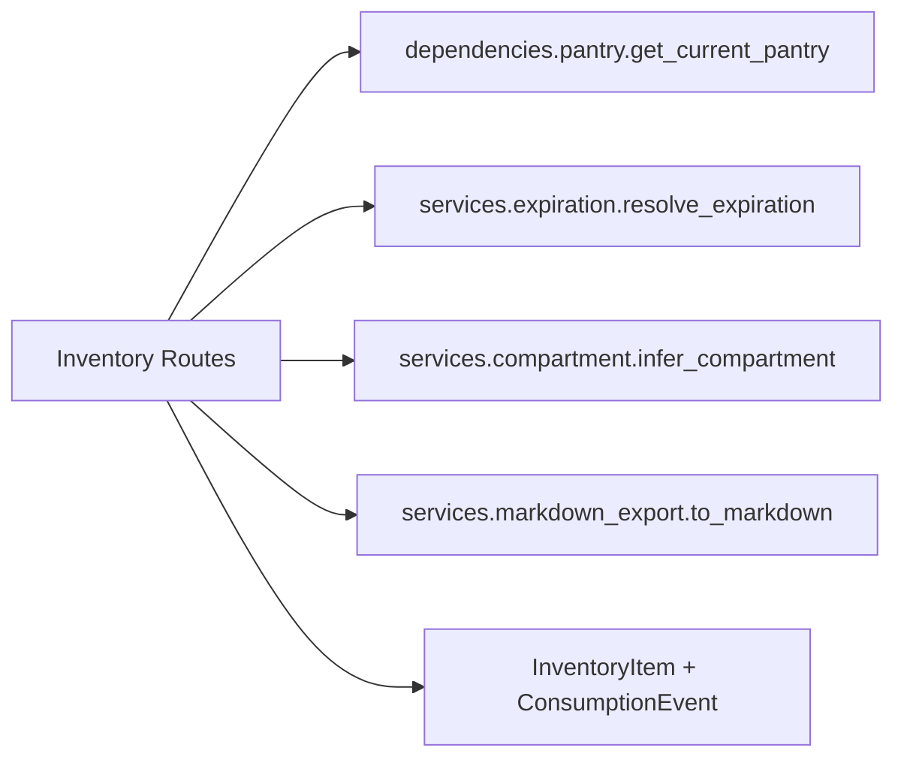

# Backend Routes — Inventory

## Purpose

Pantry-scoped CRUD for inventory items plus atomic quantity consumption and a consumption history ledger (see [Inventory Consume & History](../concepts/inventory-consume-history.md)). All new clients use `/api/pantries/{pantry_id}/inventory*`; the legacy `/api/inventory*` shims target the default pantry (`DEFAULT_PANTRY_ID = 1`) and are deprecated. See the [Inventory API](../api/inventory.md) page for the endpoint reference. Expiration resolution and markdown export are delegated to the [expiration service](./backend-service-expiration.md) and the [markdown export service](./backend-service-markdown-export.md).

## Key Files

| File | Role |
|------|------|
| `backend/routes/inventory.py` | Route definitions (scoped routes + legacy shims + consume/history) |

Auth is enforced per request by `get_current_pantry` (`X-Pantry-Token` header; see [Pantry Sharing](../concepts/pantry-sharing.md)). Item shape and validation live in the [Pydantic schemas](./backend-schemas.md); persistence uses the [ORM model](./backend-models.md) `InventoryItem` plus `ConsumptionEvent` for the ledger.

## Public API

Scoped routes (current contract):

| Method | Path | Status | Description |
|--------|------|--------|-------------|
| GET | `/api/pantries/{pantry_id}/inventory` | 200 | List items with `quantity > 0`, paginated, expiry ascending (nulls last) |
| POST | `/api/pantries/{pantry_id}/inventory` | 201 | Create item from barcode scan |
| POST | `/api/pantries/{pantry_id}/inventory/manual` | 201 | Create item manually (no barcode, expiry may be null) |
| GET | `/api/pantries/{pantry_id}/inventory/export` | 200 | Export pantry inventory as markdown (`text/markdown`) |
| GET | `/api/pantries/{pantry_id}/inventory/{item_id}` | 200 | Get one item |
| PATCH | `/api/pantries/{pantry_id}/inventory/{item_id}` | 200 | Update selected fields |
| DELETE | `/api/pantries/{pantry_id}/inventory/{item_id}` | 204 | Delete item |
| POST | `/api/pantries/{pantry_id}/inventory/{item_id}/consume` | 200 | Atomically decrement quantity; deletes row at zero |
| GET | `/api/pantries/{pantry_id}/inventory/{item_id}/history` | 200 | List consumption events, newest first, paginated |

Legacy shims (deprecated, same handlers on the default pantry):

| Method | Path | Notes |
|--------|------|-------|
| POST / POST / GET / GET / GET / PATCH / DELETE / POST / GET | `/api/inventory`, `/api/inventory/manual`, `/api/inventory`, `/api/inventory/export`, `/api/inventory/{item_id}`, `/api/inventory/{item_id}`, `/api/inventory/{item_id}`, `/api/inventory/{item_id}/consume`, `/api/inventory/{item_id}/history` | Auth via `_default_pantry_ctx` against `DEFAULT_PANTRY_ID = 1`; queries pass `allow_null=True` so pre-scoping rows with `pantry_id NULL` remain visible. Scoped routes use `allow_null=False`. |

Creation shares `_create_scoped_item`: `resolve_expiration()` computes `expiration_date`/`is_estimated` (`allow_none=True` for manual), missing `compartment` is inferred via `infer_compartment()`, `category` is normalized, and failures return 500. Listing shares `_list_scoped_items`: `quantity > 0` filter, `limit` default 50 (`ge=1, le=100`), `offset` default 0 (`ge=0`). History shares `_history_scoped_items` with the same pagination, ordered by `created_at DESC, id DESC`.

Consume (`_consume_scoped_item`) is a single conditional `UPDATE ... WHERE id AND pantry AND quantity >= delta`. On zero matched rows it rolls back and returns 404 when the item does not exist in the pantry, otherwise 409 `Quantità insufficiente`. Each success appends a `ConsumptionEvent` (`pantry_id`, `item_id`, `name_snapshot`, `barcode`, `delta=-delta`, `reason`); no actor token is persisted. Contract A: when quantity reaches zero the item row is deleted and a zero-quantity snapshot is returned, while history stays queryable on `pantry_id + item_id` without requiring the row.

Errors: 401 missing/malformed `X-Pantry-Token`; 404 unknown pantry or item outside the pantry (`Elemento non trovato` / `Pantry non trovata`); 403 valid token that is not owner/member of the pantry (`Non membro della pantry`) — 403 vs 404 is intentional, not anti-enumeration; 409 insufficient quantity on consume; 500 on DB failure during create/update/delete/consume.

## Dependencies


```mermaid
graph LR
    InventoryRoutes["Inventory Routes"] --> PantryDep["dependencies.pantry.get_current_pantry"]
    InventoryRoutes --> ExpirationSvc["services.expiration.resolve_expiration"]
    InventoryRoutes --> CompartmentSvc["services.compartment.infer_compartment"]
    InventoryRoutes --> MarkdownSvc["services.markdown_export.to_markdown"]
    InventoryRoutes --> ORM["InventoryItem + ConsumptionEvent"]
```

- Internal: `backend.database.get_db`, `backend.config.normalize_category`
- External: FastAPI, SQLAlchemy, Pydantic

## Usage Example

```python
# List first page of a pantry (auth header required)
GET /api/pantries/2/inventory?limit=50&offset=0
# X-Pantry-Token: <uuid>

# Atomic consume of 2 units with a reason
POST /api/pantries/2/inventory/10/consume
{"delta": 2, "reason": "cooked"}

# History survives zero-quantity deletion (Contract A)
GET /api/pantries/2/inventory/10/history?limit=50&offset=0

# Deprecated shim (default pantry only, includes pantry_id NULL rows)
GET /api/inventory?limit=50&offset=0
```
