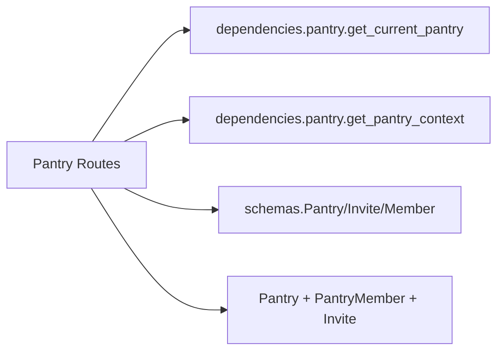

# Backend Routes — Pantries

## Purpose

Pantry lifecycle and sharing for the multi-pantry model: create and list pantries owned or joined by the caller, fetch or delete a single pantry, issue single-use invites, accept invites via body or path token, and list or remove members. All routes live in a 302-line `APIRouter(prefix="/api", tags=["pantries"])` in `backend/routes/pantries.py`. See the [Pantries API](../api/pantries.md) page for the endpoint reference. Validation shapes live in the [Pydantic schemas](./backend-schemas.md); auth and membership checks come from `backend/dependencies/pantry.py`.

## Key Files

| File | Role |
|------|------|
| `backend/routes/pantries.py` | Route definitions, `_is_owner` helper, atomic `_claim_invite` helper |
| `backend/schemas.py` | `PantryCreate`, `PantryOut`, `InviteCreate`, `InviteOut`, `MemberOut` validation |
| `backend/dependencies/pantry.py` | `get_pantry_context`, `get_current_pantry`, `PantryContext` (X-Pantry-Token auth) |

Auth is per request via the `X-Pantry-Token` header (UUID v4). `GET/POST /pantries` and both accept endpoints use `get_pantry_context` (any well-formed token may create a pantry or claim an invite); all `/{pantry_id}`-scoped routes use `get_current_pantry`, which returns 404 for an unknown pantry and 403 for a valid token that is not owner/member.

## Public API

| Method | Path | Status | Description |
|--------|------|--------|-------------|
| GET | `/api/pantries` | 200 | List pantries where token is owner or member |
| POST | `/api/pantries` | 201 / 200 | Create pantry; idempotent retry returns existing with 200 |
| GET | `/api/pantries/{pantry_id}` | 200 | Get one pantry (members only) |
| DELETE | `/api/pantries/{pantry_id}` | 204 | Delete pantry (owner only) |
| POST | `/api/pantries/{pantry_id}/invites` | 201 | Create pending invite, 7-day expiry (owner only) |
| POST | `/api/invites/accept` | 200 | Accept invite via body `{token}` |
| POST | `/api/invites/{token}/accept` | 200 | Accept invite via path token (body wins if both) |
| GET | `/api/pantries/{pantry_id}/members` | 200 | List members ordered by `joined_at` |
| DELETE | `/api/pantries/{pantry_id}/members/{member_token}` | 204 | Remove member (owner only, never the owner) |

Owner-vs-member rules: any member can read the pantry and list members; only `_is_owner` (owner token or `PantryMember role == "owner"`) can delete the pantry, create invites, or remove members. The owner row itself can never be removed (403 for self-removal or owner-role removal). Invite acceptance grants the `editor` role and is a no-op for existing members.

Idempotency: `POST /pantries` reuses an existing pantry with the same `name + owner_token`, returning 200 instead of 201, with an `IntegrityError` retry for concurrent double-POST. Invite claiming is an atomic conditional `UPDATE ... WHERE status == "pending" AND expires_at > now`; only one accept wins, losers see 404.

Privacy: invite tokens are never logged (`_claim_invite` logs no token value), and consumption-style actor tokens are not persisted — `accepted_by_token` is the only actor field, scoped to the invite claim.

Errors: 401 missing/malformed `X-Pantry-Token` (also 422 `token mancante` when the accept body has no token); 403 valid non-member token or non-owner attempting an owner-only action; 404 unknown pantry, consumed/expired invite, or unknown member; 500 on DB failure during create/delete/invite/member operations.

## Dependencies



- Internal: `backend.database.get_db`, `backend.models.Pantry`, `backend.models.PantryMember`, `backend.models.Invite`
- External: FastAPI, SQLAlchemy, Pydantic

## Usage Example

```python
# Create a pantry (idempotent on name + owner token)
POST /api/pantries
# X-Pantry-Token: <uuid>
{"name": "Home"}
# -> 201 {"id": 2, "name": "Home", ...}; retry -> 200 same row

# Owner issues an invite, guest accepts via body form
POST /api/pantries/2/invites
# X-Pantry-Token: <owner-uuid> -> 201 {"token": "<secret>", "status": "pending", ...}

POST /api/invites/accept
# X-Pantry-Token: <guest-uuid>
{"token": "<secret>"}
# -> 200 accepted; guest becomes editor. Path form also works:
# POST /api/invites/<secret>/accept
```
