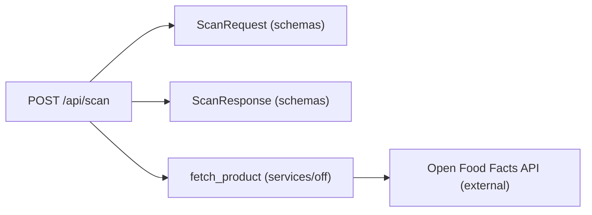
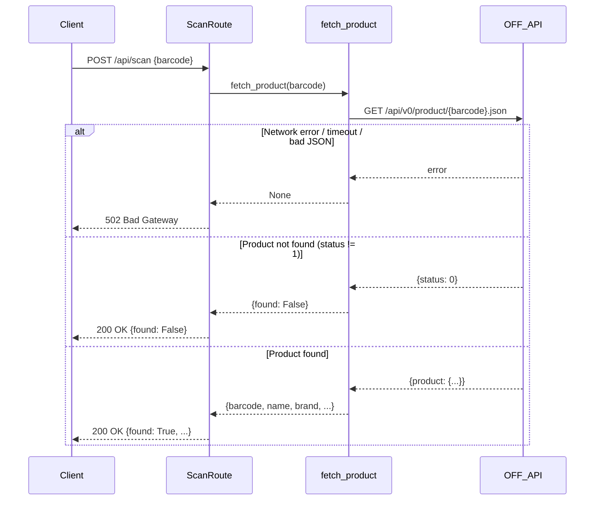

# Barcode Scan Route

## Purpose

Handles barcode scanning requests from the mobile or web client. Accepts a barcode string, queries the [Open Food Facts API](../concepts/off-integration.md) through the internal [`fetch_product` service](./backend-service-off.md), and returns either the matched product details or a not-found indicator. This is the entry point for the "scan to add" feature in the pantry management flow. See the [Scan API](../api/scan.md) page for endpoint reference.

## Key Files

| File | Role |
|------|------|
| `backend/routes/scan.py` | FastAPI route handler defining the endpoint |
| `backend/schemas.py` | [Pydantic models](./backend-schemas.md) for request/response serialization |
| `backend/services/off.py` | Async HTTP client that queries the Open Food Facts API |

## Public API

### `POST /api/scan`

**Request body** (`ScanRequest`):

| Field | Type | Description |
|-------|------|-------------|
| `barcode` | `str` | The scanned barcode number |

**Response** (`ScanResponse`):

| Field | Type | Description |
|-------|------|-------------|
| `barcode` | `str` | The barcode (echoed from request or returned by OFF) |
| `found` | `bool` | Whether a product was found |
| `name` | `Optional[str]` | Product name (present when `found=True`) |
| `brand` | `Optional[str]` | Product brand (present when `found=True`) |
| `categories` | `list[str]` | Category tags (present when `found=True`) |
| `image_url` | `Optional[str]` | URL to the front product image (present when `found=True`) |
| `message` | `Optional[str]` | Human-readable status message |

### `fetch_product(barcode: str) -> Optional[dict]`

Async function in `backend/services/off.py`. Makes an HTTP GET to `{OFF_BASE_URL}/{barcode}.json` using `httpx`. Returns a dictionary on success or `None` on any network / parse error.

## Dependencies



- **Internal**: `backend/schemas.py` (ScanRequest, ScanResponse, MessageResponse), `backend/services/off.py` (fetch_product)
- **External**: `httpx` (async HTTP client), Open Food Facts public API

## Error Handling

The endpoint covers three distinct response states:

1. **Network / service error** — `fetch_product` returns `None` (e.g. HTTP error, timeout, or invalid JSON). The route responds with HTTP **502 Bad Gateway** and a JSON body containing `{"message": "Errore durante la comunicazione con Open Food Facts"}`.

2. **Product not found** — Open Food Facts responded successfully but returned `status != 1` or no `product` object. The route responds with HTTP **200 OK** and `ScanResponse` with `found=False` and message `"Prodotto non trovato nel database Open Food Facts"`.

3. **Product found** — Open Food Facts returned valid product data. The route responds with HTTP **200 OK** and `ScanResponse` with `found=True` and all product fields populated.

## Usage Example

```python
# Request
POST /api/scan
Content-Type: application/json

{"barcode": "8000500310426"}

# Success response (200)
{
  "barcode": "8000500310426",
  "found": true,
  "name": "Pasta Barilla N.5",
  "brand": "Barilla",
  "categories": ["Pasta", "Alimenti secchi"],
  "image_url": "https://images.openfoodfacts.org/images/products/800/050/031/0426/front_small.jpg",
  "message": null
}

# Product not found (200)
{
  "barcode": "0000000000000",
  "found": false,
  "name": null,
  "brand": null,
  "categories": [],
  "image_url": null,
  "message": "Prodotto non trovato nel database Open Food Facts"
}

# Network error (502)
{
  "message": "Errore durante la comunicazione con Open Food Facts"
}
```

## Response Flow


