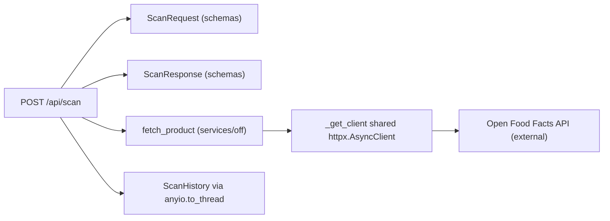
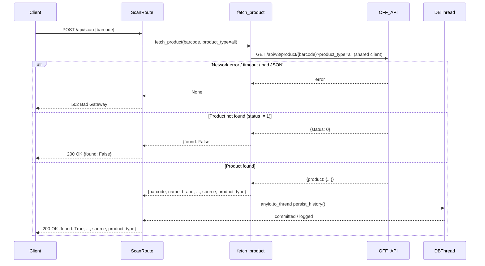

# Barcode Scan Route

## Purpose

Handles barcode scanning requests from the mobile or web client. Accepts a barcode string, queries the [Open Food Facts API](../concepts/off-integration.md) through the internal `fetch_product` service (see [OFF service](./backend-service-off.md)), and returns either the matched product details or a not-found indicator. Missing or incomplete products can be enriched via [Contribute](../api/contribute.md). On a successful lookup it also records the scan in `ScanHistory` without blocking the event loop. Provenance fields (`source` / `product_type`) are surfaced to clients following [iOS Models](../concepts/ios-models.md). See the [Scan API](../api/scan.md) page for endpoint reference.

## Key Files

| File | Role |
|------|------|
| `backend/routes/scan.py` | FastAPI route handler defining the endpoint plus `ScanHistory` persistence |
| `backend/services/off.py` | Async OFF client (`fetch_product`) with a shared `httpx.AsyncClient` |

## Public API

### `POST /api/scan`

**Request body** (`ScanRequest`):

| Field | Type | Description |
|-------|------|-------------|
| `barcode` | `str` | The scanned barcode number |

**Response** (`ScanResponse`):

| Field | Type | Description |
|-------|------|-------------|
| `barcode` | `str` | The barcode (echoed from request or returned by OFF) |
| `found` | `bool` | Whether a product was found |
| `name` | `Optional[str]` | Product name (present when `found=True`) |
| `brand` | `Optional[str]` | Product brand (present when `found=True`) |
| `categories` | `list[str]` | Category tags (present when `found=True`) |
| `image_url` | `Optional[str]` | URL to the front product image (present when `found=True`) |
| `suggested_category` | `Optional[str]` | Internal category suggestion from OFF tags + PNNS group |
| `source` | `Optional[str]` | Resolved OFF twin (`food` / `beauty` / `petfood` / `product`) |
| `product_type` | `Optional[str]` | Mirrors `source`; persisted to `ScanHistory` |
| `message` | `Optional[str]` | Human-readable status message |

### `fetch_product(barcode: str, product_type: str = OFF_PRODUCT_TYPE_DEFAULT) -> Optional[dict]`

Async function in `backend/services/off.py` (see [OFF service](./backend-service-off.md)). Performs a universal v3 read — a single GET to `{OFF_V3_BASE_URL}/{barcode}` with `product_type=all` by default — using the shared client from `_get_client()`. Per-host fallback via `OFF_V3_HOSTS` applies only for an explicit non-`all` type on transport/5xx failure, never on 404 or `found=False`. Returns a product dict including `source` and `product_type` on success, `{"found": False}` when OFF reports `status != 1` or no `product` object, or `None` on any network / parse error.

## Dependencies


```mermaid
graph LR
    ScanRoute["POST /api/scan"] --> ScanRequest["ScanRequest (schemas)"]
    ScanRoute --> ScanResponse["ScanResponse (schemas)"]
    ScanRoute --> fetch_product["fetch_product (services/off)"]
    fetch_product --> SharedClient["_get_client shared httpx.AsyncClient"]
    SharedClient --> OFF["Open Food Facts API (external)"]
    ScanRoute --> ScanHistory["ScanHistory via anyio.to_thread"]
```

- **Internal**: `backend/schemas.py` (`ScanRequest`, `ScanResponse`), `backend/models.py` (`ScanHistory`), `backend/database.py` (`get_db`)
- **External**: `httpx` (shared async client, 10s timeout), `anyio.to_thread`, Open Food Facts public API

## ScanHistory Persistence

On a found product the route upserts a `ScanHistory` row inside a `persist_history()` closure run via `await anyio.to_thread.run_sync(persist_history)` (`backend/routes/scan.py:37-82`):

- The sync SQLAlchemy `Session` stays off the event loop; no ORM objects leave the worker thread.
- Lookup is by `barcode`; an existing row increments `times_scanned` and refreshes `name` / `category` (first category tag), `source` / `product_type` (when provided by the OFF result), and `last_scanned_at` (UTC now).
- A missing row is created with `times_scanned=1` plus `source` / `product_type` from the OFF result, falling back to the barcode when the OFF name is empty (NOT NULL constraint).
- Failures never block the scan: on exception the transaction is rolled back and logged via `logger.exception`.

Not-found (`found=False`) and OFF-error (`None`) paths return early and write no history.

## Shared OFF Client

`backend/services/off.py:50-58` keeps a module-level `_read_client: Optional[httpx.AsyncClient]` created lazily by `_get_client()` and reused by every `fetch_product` call (`timeout=10.0`). Write paths (`contribute_product`, `upload_product_image`) still use short-lived per-request clients.

## Error Handling

The endpoint covers three distinct response states:

1. **Network / service error** — `fetch_product` returns `None` (e.g. HTTP error, timeout, or invalid JSON). The route responds with HTTP **502 Bad Gateway** and a JSON body containing `{"detail": "Errore durante la comunicazione con i database Open* Facts"}`.

2. **Product not found** — Open Food Facts responded successfully but returned `status != 1` or no `product` object. The route responds with HTTP **200 OK** and `ScanResponse` with `found=False` and message `"Prodotto non trovato nei database Open* Facts"`.

3. **Product found** — Open Food Facts returned valid product data. History is persisted in a worker thread, then the route responds with HTTP **200 OK** and `ScanResponse` with `found=True` and all product fields populated.

## Usage Example

```python
# Request
POST /api/scan
Content-Type: application/json

{"barcode": "8000500310426"}

# Success response (200)
{
  "barcode": "8000500310426",
  "found": true,
  "name": "Pasta Barilla N.5",
  "brand": "Barilla",
  "categories": ["Pasta", "Alimenti secchi"],
  "image_url": "https://images.openfoodfacts.org/images/products/800/050/031/0426/front_small.jpg",
  "suggested_category": "pasta",
  "message": null,
  "source": "food",
  "product_type": "food"
}

# Product not found (200)
{
  "barcode": "0000000000000",
  "found": false,
  "name": null,
  "brand": null,
  "categories": [],
  "image_url": null,
  "message": "Prodotto non trovato nei database Open* Facts"
}

# Network error (502)
{
  "detail": "Errore durante la comunicazione con i database Open* Facts"
}
```

## Response Flow


```mermaid
sequenceDiagram
    participant Client
    participant ScanRoute
    participant fetch_product
    participant OFF_API
    participant DBThread

    Client->>ScanRoute: POST /api/scan {barcode}
    ScanRoute->>fetch_product: fetch_product(barcode, product_type=all)
    fetch_product->>OFF_API: GET /api/v3/product/{barcode}?product_type=all (shared client)
    alt Network error / timeout / bad JSON
        OFF_API-->>fetch_product: error
        fetch_product-->>ScanRoute: None
        ScanRoute-->>Client: 502 Bad Gateway
    else Product not found (status != 1)
        OFF_API-->>fetch_product: {status: 0}
        fetch_product-->>ScanRoute: {found: False}
        ScanRoute-->>Client: 200 OK {found: False}
    else Product found
        OFF_API-->>fetch_product: {product: {...}}
        fetch_product-->>ScanRoute: {barcode, name, brand, ..., source, product_type}
        ScanRoute->>DBThread: anyio.to_thread persist_history()
        DBThread-->>ScanRoute: committed / logged
        ScanRoute-->>Client: 200 OK {found: True, ..., source, product_type}
    end
```
