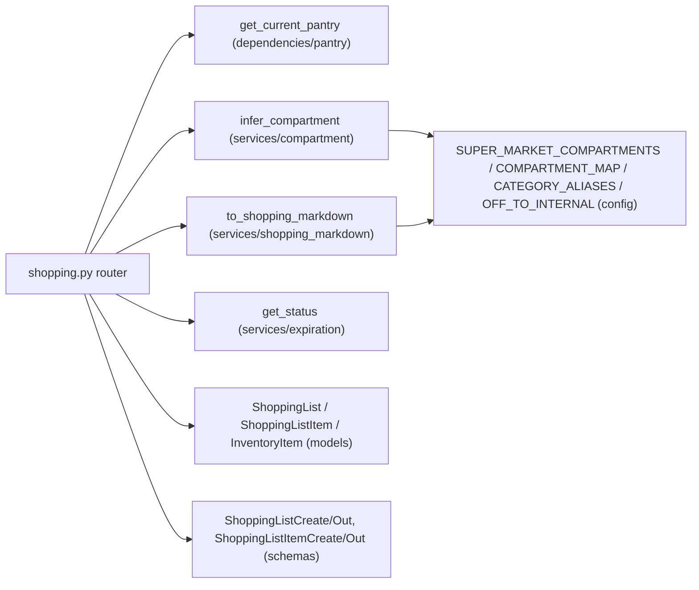

# Shopping Routes

## Purpose

Pantry-scoped shopping lists (`/api/pantries/{pantry_id}/shopping-lists`). CRUD for lists and items, single-field check/uncheck patch, a pantry cross-check (`GET .../{list_id}/check`) that reports `inPantry` + expiration `status` per item, and a sheet-only markdown export (`GET .../{list_id}/export`) grouped by supermarket compartment. See [Shopping Departments](../concepts/shopping-departments.md) for the compartment model.

## Key Files

| File | Role |
|------|------|
| `backend/routes/shopping.py` | FastAPI router: list/item CRUD, check, export |
| `backend/services/compartment.py` | `infer_compartment()` — OFF tags → category → name keywords → default |
| `backend/services/shopping_markdown.py` | `to_shopping_markdown()` — compartment-grouped markdown with collapsible sections |

## Public API

All endpoints depend on `get_current_pantry` (401 bad token → 404 unknown pantry → 403 non-member).

| Method | Path | Body | Response |
|--------|------|------|----------|
| `POST` | `/api/pantries/{pantry_id}/shopping-lists` | `ShoppingListCreate{name}` | `201 ShoppingListOut` (empty items) |
| `GET` | `.../shopping-lists` | — | `list[ShoppingListOut]` |
| `GET` | `.../shopping-lists/{list_id}` | — | `ShoppingListOut` (404 "Shopping list non trovata") |
| `DELETE` | `.../shopping-lists/{list_id}` | — | `204` |
| `POST` | `.../{list_id}/items` | `ShoppingListItemCreate{name, quantity, compartment?}` | `201 ShoppingListItemOut` |
| `PATCH` | `.../{list_id}/items/{item_id}` | `ShoppingListItemCheckedUpdate{checked}` | `ShoppingListItemOut` (404 "Item non trovato") |
| `DELETE` | `.../{list_id}/items/{item_id}` | — | `204` |
| `GET` | `.../{list_id}/export` | — | `text/markdown` via `PlainTextResponse` |
| `GET` | `.../{list_id}/check` | — | `{items: [{id, name, inPantry, status}]}` |

Item creation (`shopping.py:123-147`): when `body.compartment` is empty, falls back to `infer_compartment(name, category)`; `checked=False` and `added_by_token=ctx.token` are server-set. Patch touches only `checked`.

## Dependencies



- **Internal**: `backend/database.py` (`get_db`), `backend/dependencies/pantry.py`, `backend/config.py`, `backend/services/expiration.py`
- **External**: FastAPI `APIRouter` / `PlainTextResponse`, SQLAlchemy `Session`; no external HTTP calls

## Compartment Inference

`infer_compartment(name, category, off_category_tags)` cascade (`compartment.py:43-79`):

1. OFF tags — each tag normalized via `_normalize_tag` (`split(":")[-1]`, `OFF_TO_INTERNAL`, then `CATEGORY_ALIASES`) and looked up in `COMPARTMENT_MAP`.
2. Explicit `category` — same normalization → `COMPARTMENT_MAP`.
3. Name keywords — `_KEYWORD_MAP` substring match on lowercased name (e.g. `mela/pomodoro` → Ortofrutta, `surgelat/gelato` → Surgelati, `detersivo/puliz` → Igiene e Casa).
4. Default `"Dispensa Secca"`.

`SUPERMARKET_ORDER = list(SUPER_MARKET_COMPARTMENTS)` defines the 10-aisle traversal order used by the exporter.

## Markdown Export

`to_shopping_markdown(lst, items)` (`shopping_markdown.py:46-106`):

- Title `# 🛒 {name}` (fallback `"Spesa"`); empty list → `_Nessun articolo_`.
- Groups items per `SUPER_MARKET_COMPARTMENTS` order with per-compartment emoji headings (`## 🥬 Ortofrutta`, …) inside `<details open>` blocks; checklist `- [ ]` / `- [x]` plus `x{qty}`.
- `_normalize_compartment` maps legacy `frigo/cantina/dispensa/altro` and case-insensitive names to canonical compartments; unknown non-empty strings fall into a trailing `## 📦 Altro` section.
- `_escape` replaces `|` with `\|` and CR/LF with spaces (markdown-injection guard).

## Pantry Check

`GET .../{list_id}/check` (`shopping.py:213-253`) builds a first-match `normalized-name → InventoryItem` map (`strip().lower()`), then per shopping item returns `inPantry` plus `status`: `get_status(expiration_date)` when present, `"missing"` otherwise. Name matching is exact-normalized, not fuzzy.

## Error Handling

- Unknown list or item → `404` with Italian detail (`"Shopping list non trovata"` / `"Item non trovato"`).
- Auth failures come from `get_current_pantry` before any handler logic (401/403/404 semantics, see [Pantry Sharing](../concepts/pantry-sharing.md)).
- Export on an empty list is not an error — returns the `_Nessun articolo_` document.

## Usage Example

```python
# Create list + add item (compartment inferred from name)
POST /api/pantries/1/shopping-lists
{"name": "Spesa"}
# -> 201 {"id": 3, "pantry_id": 1, "name": "Spesa", "created_at": "...", "items": []}

POST /api/pantries/1/shopping-lists/3/items
{"name": "Mozzarella", "quantity": 2}
# -> 201 {"id": 7, ..., "compartment": "Salumi e Formaggi", "checked": false}

# Export
GET /api/pantries/1/shopping-lists/3/export
# -> text/markdown:
# # 🛒 Spesa
# <details open>
# <summary>## 🧀 Salumi e Formaggi</summary>
# - [ ] Mozzarella x2
# </details>
```
