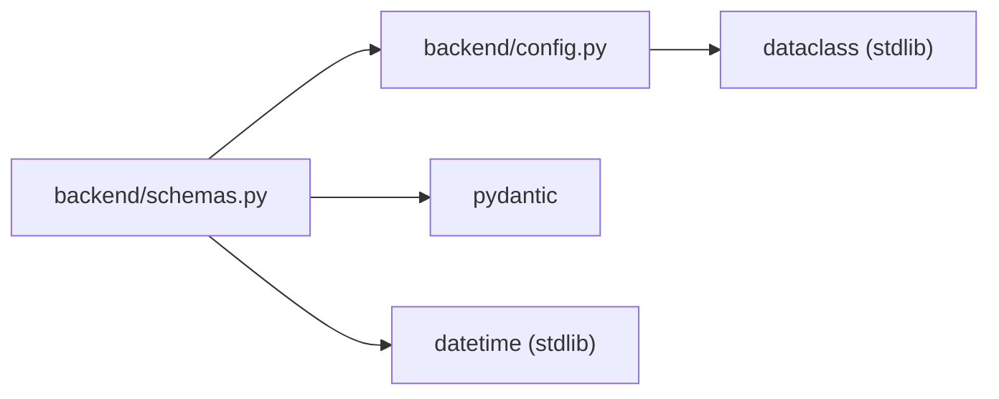

# Backend Schemas

## Purpose

Defines all Pydantic v2 models used for request validation, response serialization, and ORM mapping — from [backend ORM models](./backend-models.md) — in the FastAPI application. These schemas govern the shape of data flowing between the API layer, the service layer, and the database.

## Key Files

| File | Role |
|------|------|
| `backend/schemas.py` | All Pydantic model definitions |
| `backend/config.py` | `EXPIRING_SOON_DAYS` constant consumed by `InventoryOut.status` |

## Schemas

### ScanRequest

Used in the [scan API](../api/scan.md). Request body for barcode lookup via Open Food Facts.

| Field | Type | Default | Description |
|-------|------|---------|-------------|
| `barcode` | `str` | — | The scanned barcode string |

### ScanResponse

Response returned after a barcode lookup.

| Field | Type | Default | Description |
|-------|------|---------|-------------|
| `barcode` | `str` | — | The scanned barcode |
| `name` | `Optional[str]` | `None` | Product name from Open Food Facts |
| `brand` | `Optional[str]` | `None` | Product brand |
| `categories` | `list[str]` | `[]` | Product category tags |
| `image_url` | `Optional[str]` | `None` | Product image URL |
| `found` | `bool` | — | Whether a product was found |
| `message` | `Optional[str]` | `None` | Additional context (e.g. error message) |

### InventoryCreate

Request body when adding an item from a barcode scan — used in the [inventory API](../api/inventory.md).

| Field | Type | Default | Description |
|-------|------|---------|-------------|
| `barcode` | `str` | — | Item barcode |
| `name` | `str` | — | Item display name |
| `brand` | `Optional[str]` | `None` | Brand name |
| `expiration_date` | `Optional[date]` | `None` | Expiration date (may be estimated later) |
| `category` | `Optional[str]` | `None` | Product category |
| `image_url` | `Optional[str]` | `None` | Product image URL |
| `quantity` | `int` | `1` | Item count |

### InventoryCreateManual

Request body when adding an item manually (no barcode scan).

| Field | Type | Default | Description |
|-------|------|---------|-------------|
| `name` | `str` | — | Item display name |
| `brand` | `Optional[str]` | `None` | Brand name |
| `expiration_date` | `Optional[date]` | `None` | Expiration date |
| `category` | `Optional[str]` | `None` | Product category |
| `quantity` | `int` | `1` | Item count |

### InventoryOut

Response model for inventory items. Configured with `ConfigDict(from_attributes=True)` to support ORM mapping from SQLAlchemy models.

| Field | Type | Default | Description |
|-------|------|---------|-------------|
| `id` | `int` | — | Database primary key |
| `barcode` | `Optional[str]` | `None` | Item barcode |
| `name` | `str` | — | Item display name |
| `brand` | `Optional[str]` | `None` | Brand name |
| `expiration_date` | `Optional[date]` | `None` | Expiration date |
| `is_estimated` | `bool` | `False` | Whether the expiration was auto-calculated |
| `category` | `Optional[str]` | `None` | Product category |
| `image_url` | `Optional[str]` | `None` | Product image URL |
| `created_at` | `datetime` | — | Timestamp of when the item was added |
| `quantity` | `int` | `1` | Item count |
| `status` | `str` | *(computed)* | `"ok"`, `"expiring_soon"`, or `"expired"` — see [item status](../concepts/item-status.md) |

#### Status computation

The `status` field is a `@computed_field` backed by a property. Logic:

1. If `expiration_date` is `None` → `"ok"`
2. If `expiration_date < today` → `"expired"`
3. If `expiration_date <= today + 3 days` → `"expiring_soon"`
4. Otherwise → `"ok"`

The threshold is controlled by the `EXPIRING_SOON_DAYS` constant in `backend/config.py` (default: 3). When no expiration date is provided during item creation, the [expiration estimation](../concepts/expiration-estimation.md) service computes one from the product category.

### InventoryUpdate

Request body for partial updates to an inventory item. All fields are optional.

| Field | Type | Default | Description |
|-------|------|---------|-------------|
| `name` | `Optional[str]` | `None` | Item display name |
| `brand` | `Optional[str]` | `None` | Brand name |
| `expiration_date` | `Optional[date]` | `None` | Expiration date |
| `category` | `Optional[str]` | `None` | Product category |
| `image_url` | `Optional[str]` | `None` | Product image URL |
| `quantity` | `Optional[int]` | `None` | Item count |

#### Validation

Uses a `@model_validator(mode="after")` named `at_least_one_field` that raises `ValueError` (with message `"Almeno un campo da aggiornare"`) when no fields are provided, preventing empty update requests.

### MessageResponse

Simple string message wrapper used for status/error responses.

| Field | Type | Default | Description |
|-------|------|---------|-------------|
| `message` | `str` | — | Response message text |

## Dependencies



- **Internal**: imports `EXPIRING_SOON_DAYS` from [backend-config](./backend-config.md)
- **External**: Pydantic v2 (`BaseModel`, `ConfigDict`, `computed_field`, `model_validator`); Python standard library (`datetime`, `date`, `Optional`)

## Usage Examples

**Deserializing a scan request:**
```python
req = ScanRequest(barcode="8076800195057")
```

**Building an inventory response with computed status:**
```python
item = InventoryOut(
    id=1, name="Latte Fresco", expiration_date=date(2026, 6, 27),
    created_at=datetime.now(),
)
assert item.status == "expiring_soon"  # within 3-day threshold
```

**Validating an update requires at least one field:**
```python
try:
    InventoryUpdate()
except ValueError as e:
    print(e)  # "Almeno un campo da aggiornare"
```
