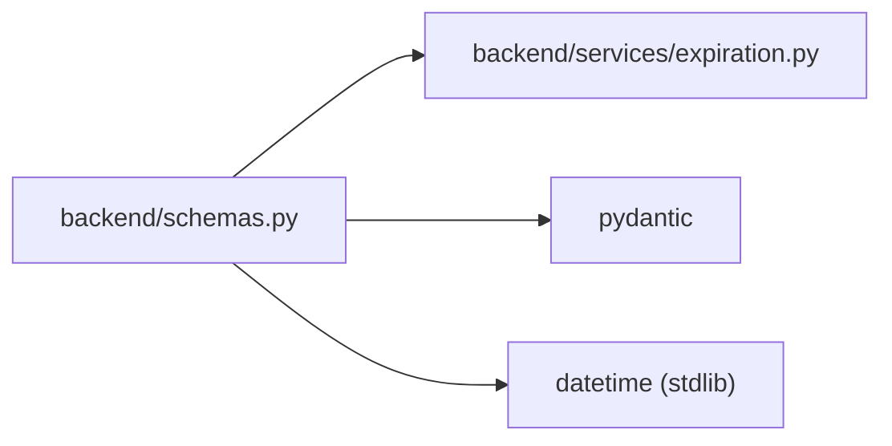

# Backend Schemas

## Purpose

Defines all Pydantic v2 models used for request validation, response serialization, and ORM mapping — from [backend ORM models](./backend-models.md) — in the FastAPI application. Covers scan, inventory, consumption events, pantry / invites / members, shopping lists, and shared message wrappers.

## Key Files

| File | Role |
|------|------|
| `backend/schemas.py` | All Pydantic model definitions, field validators, and computed `status` |

Shared validation: `BARCODE_PATTERN` (`^\d{8,14}$`, EAN-8/UPC-A/EAN-13/EAN-14), `_validate_expiration` (rejects dates >2 years in the past or >10 years in the future), and strip-to-`None` helpers for optional strings.

## Datetime Serialization

All output timestamps use the `UtcDatetime` alias (`backend/schemas.py:14-20`): an `Annotated[datetime, PlainSerializer(...)]` that formats with `isoformat()` and attaches `timezone.utc` when the value is naive. Storage stays UTC naive; serialization appends the `+00:00` suffix required by the iOS decoder (Pydantic 2 would otherwise emit `Z` for aware UTC datetimes in JSON).

The serializer's `return_type` is `Annotated[str, Field(json_schema_extra={"format": "date-time"})]` so the OpenAPI schema keeps `type: string, format: date-time`. Covered by `backend/tests/test_datetime_serialization.py`: naive `datetime(2026, 9, 6, 10, 2, 0)` must serialize to `"2026-09-06T10:02:00+00:00"`, and each field's serialization schema must keep `format: date-time`.

Applied to 8 fields: `InventoryOut.created_at`, `ConsumptionEventOut.created_at`, `PantryOut.created_at`, `InviteOut.expires_at`, `InviteOut.created_at`, `MemberOut.joined_at`, `ShoppingListItemOut.created_at`, `ShoppingListOut.created_at`.

## Schemas

### ScanRequest

Used in the [scan API](../api/scan.md). Request body for barcode lookup via Open Food Facts.

| Field | Type | Default | Description |
|-------|------|---------|-------------|
| `barcode` | `str` | — | Barcode matching `BARCODE_PATTERN` |

### ScanResponse

Response returned after a barcode lookup.

| Field | Type | Default | Description |
|-------|------|---------|-------------|
| `barcode` | `str` | — | The scanned barcode |
| `name` | `Optional[str]` | `None` | Product name from Open Food Facts |
| `brand` | `Optional[str]` | `None` | Product brand |
| `categories` | `list[str]` | `[]` | Product category tags |
| `image_url` | `Optional[HttpUrl]` | `None` | Product image URL |
| `found` | `bool` | — | Whether a product was found |
| `message` | `Optional[str]` | `None` | Additional context (e.g. error message) |
| `source` | `Optional[str]` | `None` | Product source (`food`/`beauty`), propagated from `fetch_product` — see [Scan API](../api/scan.md) |
| `product_type` | `Optional[str]` | `None` | Product type (`food`/`beauty`), propagated from `fetch_product` |
| `pnns_group` | `Optional[str]` | `None` | PNNS group, `max_length=64` |

### InventoryCreate

Request body when adding an item from a barcode scan — used in the [inventory API](../api/inventory.md).

| Field | Type | Default | Description |
|-------|------|---------|-------------|
| `barcode` | `str` | — | Item barcode, must match `BARCODE_PATTERN` |
| `name` | `str` | — | Item display name, stripped, non-empty |
| `brand` | `Optional[str]` | `None` | Brand name, blank stripped to `None` |
| `expiration_date` | `Optional[date]` | `None` | Expiration date, range-validated |
| `category` | `Optional[str]` | `None` | Product category |
| `image_url` | `Optional[HttpUrl]` | `None` | Product image URL |
| `quantity` | `int` | `1` | Item count, `ge=1, le=999` |
| `compartment` | `Optional[str]` | `None` | Storage compartment, `max_length=32` |
| `source` | `Optional[str]` | `None` | Product source, `max_length=32`, blank stripped to `None` via `strip_optional` |
| `product_type` | `Optional[str]` | `None` | Product type, `max_length=32`, blank stripped to `None` via `strip_optional` |
| `pnns_group` | `Optional[str]` | `None` | PNNS group, `max_length=64`, blank stripped to `None` via `strip_optional` |

`strip_optional` covers `brand`, `category`, `compartment`, `storage_location`, `source`, `product_type`, `pnns_group` (`backend/schemas.py:95-101`).

### InventoryCreateManual

Request body when adding an item manually (no barcode scan). Same validation as `InventoryCreate` minus `barcode` — used in the [Inventory API](../api/inventory.md).

| Field | Type | Default | Description |
|-------|------|---------|-------------|
| `name` | `str` | — | Item display name, stripped, non-empty |
| `brand` | `Optional[str]` | `None` | Brand name |
| `expiration_date` | `Optional[date]` | `None` | Expiration date, range-validated |
| `category` | `Optional[str]` | `None` | Product category |
| `quantity` | `int` | `1` | Item count, `ge=1, le=999` |
| `image_url` | `Optional[HttpUrl]` | `None` | Product image URL |
| `compartment` | `Optional[str]` | `None` | Storage compartment, `max_length=32` |
| `source` | `Optional[str]` | `None` | Product source, `max_length=32`, blank stripped to `None` via `strip_optional` |
| `product_type` | `Optional[str]` | `None` | Product type, `max_length=32`, blank stripped to `None` via `strip_optional` |
| `pnns_group` | `Optional[str]` | `None` | PNNS group, `max_length=64`, blank stripped to `None` via `strip_optional` |

`strip_optional` covers `brand`, `category`, `compartment`, `storage_location`, `source`, `product_type`, `pnns_group` (`backend/schemas.py:136-142`).

### InventoryOut

Response model for inventory items. Configured with `ConfigDict(from_attributes=True)` for ORM mapping — used in the [Inventory API](../api/inventory.md).

| Field | Type | Default | Description |
|-------|------|---------|-------------|
| `id` | `int` | — | Database primary key |
| `barcode` | `Optional[str]` | `None` | Item barcode |
| `name` | `str` | — | Item display name |
| `brand` | `Optional[str]` | `None` | Brand name |
| `expiration_date` | `Optional[date]` | `None` | Expiration date |
| `is_estimated` | `bool` | `False` | Whether the expiration was auto-calculated |
| `category` | `Optional[str]` | `None` | Product category |
| `image_url` | `Optional[HttpUrl]` | `None` | Product image URL |
| `created_at` | `UtcDatetime` | — | Timestamp of when the item was added, serialized with `+00:00` suffix |
| `quantity` | `int` | `1` | Item count |
| `compartment` | `Optional[str]` | `None` | Storage compartment |
| `pantry_id` | `Optional[int]` | `None` | Owning pantry ID (multi-pantry support) |
| `source` | `Optional[str]` | `None` | Product source |
| `product_type` | `Optional[str]` | `None` | Product type |
| `status` | `str` | *(computed)* | `"ok"`, `"expiring_soon"`, or `"expired"` — see [item status](../concepts/item-status.md) |

#### Status computation

The `status` field is a `@computed_field` delegating to `get_status(expiration_date)` from `backend.services.expiration`. When no expiration date is provided, the [expiration estimation](../concepts/expiration-estimation.md) service computes one from the product category.

### InventoryUpdate

Request body for partial updates to an inventory item. All fields optional.

| Field | Type | Default | Description |
|-------|------|---------|-------------|
| `name` | `Optional[str]` | `None` | Item display name, `min_length=1` |
| `brand` | `Optional[str]` | `None` | Brand name |
| `expiration_date` | `Optional[date]` | `None` | Expiration date, range-validated |
| `category` | `Optional[str]` | `None` | Product category |
| `image_url` | `Optional[HttpUrl]` | `None` | Product image URL |
| `quantity` | `Optional[int]` | `None` | Item count, `ge=1, le=999` |
| `compartment` | `Optional[str]` | `None` | Storage compartment, `max_length=32` |

#### Validation

- `@field_validator("name", "brand", "category", "compartment")` strips whitespace and rejects empty/whitespace-only strings.
- `@model_validator(mode="after")` named `at_least_one_field` raises `ValueError` (`"Almeno un campo da aggiornare"`) when no fields are set, preventing empty updates.

### InventoryConsume

Request body for consuming/decrementing an item's quantity.

| Field | Type | Default | Description |
|-------|------|---------|-------------|
| `delta` | `int` | — | Units to consume, `ge=1, le=999` |
| `reason` | `Optional[str]` | `None` | Free-text reason, `max_length=500`, blank stripped to `None` |

### ConsumptionEventOut

Response model for a consumption audit event. `ConfigDict(from_attributes=True)`.

| Field | Type | Default | Description |
|-------|------|---------|-------------|
| `id` | `int` | — | Event primary key |
| `pantry_id` | `int` | — | Owning pantry ID |
| `item_id` | `Optional[int]` | `None` | Consumed item ID (`None` if item deleted) |
| `name_snapshot` | `str` | — | Item name at consumption time |
| `barcode` | `Optional[str]` | `None` | Item barcode snapshot |
| `delta` | `int` | — | Units consumed |
| `reason` | `Optional[str]` | `None` | Consumption reason |
| `created_at` | `UtcDatetime` | — | Event timestamp, serialized with `+00:00` suffix |

### PantryCreate

Request body for creating a pantry (see [Pantries API](../api/pantries.md)).

| Field | Type | Default | Description |
|-------|------|---------|-------------|
| `name` | `str` | — | Pantry name, `min_length=1, max_length=100`, stripped, non-empty |

### PantryOut

Response model for a pantry. `ConfigDict(from_attributes=True)`.

| Field | Type | Default | Description |
|-------|------|---------|-------------|
| `id` | `int` | — | Pantry primary key |
| `name` | `str` | — | Pantry name |
| `created_at` | `UtcDatetime` | — | Creation timestamp, serialized with `+00:00` suffix |

### InviteCreate

Dual-purpose body for invites. `token` is ignored on create (server generates it) and used only for accept-by-body `POST /invites/accept {token}`.

| Field | Type | Default | Description |
|-------|------|---------|-------------|
| `token` | `Optional[str]` | `None` | Invite token, `max_length=64`, blank stripped to `None` |

### InviteOut

Response model for a pantry invite. `ConfigDict(from_attributes=True)`.

| Field | Type | Default | Description |
|-------|------|---------|-------------|
| `id` | `int` | — | Invite primary key |
| `pantry_id` | `int` | — | Inviting pantry ID |
| `token` | `str` | — | Opaque invite token |
| `status` | `str` | — | Invite status (e.g. pending/accepted/expired) |
| `expires_at` | `UtcDatetime` | — | Expiration timestamp, serialized with `+00:00` suffix |
| `created_at` | `UtcDatetime` | — | Creation timestamp, serialized with `+00:00` suffix |

### MemberOut

Response model for a pantry membership. `ConfigDict(from_attributes=True)`.

| Field | Type | Default | Description |
|-------|------|---------|-------------|
| `pantry_id` | `int` | — | Pantry ID |
| `role` | `str` | — | Member role |
| `joined_at` | `UtcDatetime` | — | Join timestamp, serialized with `+00:00` suffix |

### ShoppingListCreate

| Field | Type | Default | Description |
|-------|------|---------|-------------|
| `name` | `str` | — | List name, `min_length=1, max_length=100`, stripped |

### ShoppingListItemCreate

| Field | Type | Default | Description |
|-------|------|---------|-------------|
| `name` | `str` | — | Item name, `min_length=1, max_length=200`, stripped |
| `quantity` | `int` | `1` | Item count, `ge=1, le=999` |
| `compartment` | `Optional[str]` | `None` | Storage compartment, `max_length=32` |

### ShoppingListItemCheckedUpdate

| Field | Type | Default | Description |
|-------|------|---------|-------------|
| `checked` | `bool` | — | Checked-off flag |

### ShoppingListItemOut

`ConfigDict(from_attributes=True)`. Fields: `id: int`, `shopping_list_id: int`, `name: str`, `quantity: int`, `checked: bool`, `compartment: Optional[str]`, `created_at: UtcDatetime` (serialized with `+00:00` suffix).

### ShoppingListOut

`ConfigDict(from_attributes=True)`. Fields: `id: int`, `pantry_id: int`, `name: str`, `created_at: UtcDatetime` (serialized with `+00:00` suffix), `items: list[ShoppingListItemOut] = []`.

### MessageResponse

Simple string message wrapper used for status/error responses.

| Field | Type | Default | Description |
|-------|------|---------|-------------|
| `message` | `str` | — | Response message text |

## Dependencies


```mermaid
graph LR
    Schemas["backend/schemas.py"] --> Expiration["backend/services/expiration.py"]
    Schemas --> Pydantic["pydantic"]
    Schemas --> Stdlib["datetime (stdlib)"]
```

- **Internal**: `get_status` from expiration service for `InventoryOut.status`
- **External**: Pydantic v2 (`BaseModel`, `ConfigDict`, `Field`, `HttpUrl`, `PlainSerializer`, `computed_field`, `field_validator`, `model_validator`); Python standard library (`date`, `datetime`, `timezone`, `timedelta`, `Annotated`, `Optional`)

## Usage Examples

**Consuming stock with a reason:**

```python
req = InventoryConsume(delta=2, reason="cena")
```

**Creating a pantry and accepting an invite by body token:**

```python
pantry = PantryCreate(name="Casa")
accept = InviteCreate(token="opaque-token-123")
```

**Building an inventory response with computed status and pantry link:**

```python
item = InventoryOut(
    id=1, name="Latte Fresco", expiration_date=date(2026, 9, 7),
    created_at=datetime.now(), pantry_id=3,
)
assert item.status in ("ok", "expiring_soon", "expired")
```
