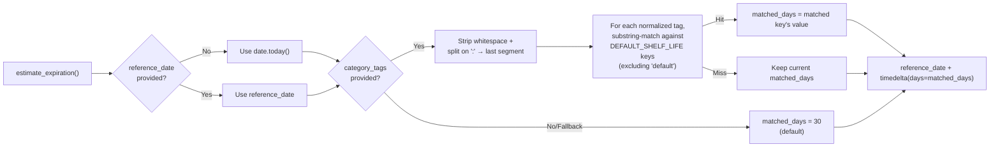

# Backend Service — Expiration

## Purpose

Estimates a reasonable expiration date for a product when the actual date is unknown. Consumers without a scanned barcode or without explicit expiry metadata receive a computed date based on the product's category tags, falling back to a generic default shelf life. This is part of the [expiration date estimation](../concepts/expiration-estimation.md) concept. The [inventory routes](./backend-routes-inventory.md) call this service during item creation.

## Key Files

| File | Role |
|------|------|
| `backend/services/expiration.py` | Core estimation function |
| `backend/config.py` | [`DEFAULT_SHELF_LIFE` mapping](../config/backend-config.md) |

## Public API

```python
def estimate_expiration(
    category_tags: Optional[list[str]] = None,
    reference_date: Optional[date] = None,
) -> date:
```

- **category_tags** — List of Open Food Facts category tags (e.g. `["en:pasta", "en:yogurts"]`). When `None` or empty, the fallback shelf life is used.
- **reference_date** — Base date for the calculation. When `None`, defaults to `date.today()`. Accepting this as a parameter makes the function testable without mocking `date.today()`.

## Decision Flow



## Matching Algorithm

1. If `category_tags` is provided and non-empty, each tag is cleaned and normalized:
   - Whitespace is stripped; empty or whitespace-only entries are discarded.
   - The tag is split on `:` and the **last segment** is kept (e.g. `"en:pasta"` → `"pasta"`).
2. Each normalized tag is checked against the keys of `DEFAULT_SHELF_LIFE` (excluding the `"default"` sentinel) using **Python's `in` operator** (substring match).
3. On the first match, the corresponding shelf-life value is adopted and iteration stops immediately.

### Example Matches

| Input Tag | Normalized | Matches Key | Days |
|-----------|------------|-------------|------|
| `"en:pasta"` | `"pasta"` | `"pasta"` | 365 |
| `"en:yogurts"` | `"yogurts"` | `"yogurts"` | 14 |
| `"it:riso"` | `"riso"` | `"rice"` | **no** (substring `"riso"` not in `"rice"`) |
| `"en:eggs"` | `"eggs"` | `"eggs"` | 21 |
| `"en:fresh-vegetables"` | `"fresh-vegetables"` | `"fresh-vegetables"` | 7 |
| `"en:fresh-fruits"` | `"fresh-fruits"` | `"fresh-fruits"` | 7 |
| `"en:unknown-category"` | `"unknown-category"` | none | 30 (fallback) |

## Fallback Behavior

When no `category_tags` are given, or when none of the normalized tags match a key, `matched_days` remains at `DEFAULT_SHELF_LIFE["default"]` (30 days). The result is always `reference_date + matched_days`, never earlier than the reference date.

## Testing Support

The `reference_date` parameter decouples the function from `date.today()`, allowing deterministic assertions in tests:

```python
# Always returns 2026-07-24 regardless of when the test runs
estimate_expiration(
    category_tags=["en:pasta"],
    reference_date=date(2026, 6, 24),
)
# → date(2026, 6, 24) + 365 days = date(2027, 6, 24)
```

Without `reference_date`, the function reads the real clock:

```python
# Result depends on the current date
estimate_expiration(category_tags=["en:pasta"])
```

## Constants

The `DEFAULT_SHELF_LIFE` dictionary in `backend/config.py` defines estimated shelf lives in days:

| Category | Days |
|----------|------|
| `yogurts` | 14 |
| `fresh-milk` | 7 |
| `pasta` | 365 |
| `canned-vegetables` | 730 |
| `rice` | 365 |
| `cheeses` | 30 |
| `eggs` | 21 |
| `fresh-fruits` | 7 |
| `fresh-vegetables` | 7 |
| `frozen-foods` | 90 |
| `default` | 30 |

The `"default"` entry serves as both the fallback value and the sentinel that is excluded from tag matching.

## Notes

- The substring match (`key in normalized`) is intentionally loose: a tag like `"en:cheeses"` matches the key `"cheeses"`, but `"en:cheese"` would not match `"cheeses"` because substring matching is directional — the key must appear inside the normalized tag.
- The function does not store or persist the estimated date; it returns a `date` value. The caller is responsible for setting `is_estimated` on the product record if needed — see the [Pydantic schemas](./backend-schemas.md) for how `is_estimated` flows through the API.
