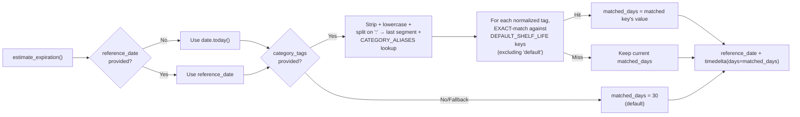

# Backend Service — Expiration

## Purpose

Estimates a reasonable expiration date for a product when the actual date is unknown, and centralizes status/expiration logic for the whole backend. Consumers without a scanned barcode or without explicit expiry metadata receive a computed date based on the product's category tags, falling back to a generic default shelf life. This is part of the [expiration date estimation](../concepts/expiration-estimation.md) concept. The [inventory routes](./backend-routes-inventory.md) call this service during item creation.

The module exports three functions: `get_status` (single status computation shared by schemas and [markdown export](./backend-service-markdown-export.md)), `estimate_expiration` (tag → date), and `resolve_expiration` (full create-path decision: explicit date vs estimated vs none).

## Key Files

| File | Role |
|------|------|
| `backend/services/expiration.py` | `get_status`, `estimate_expiration`, `resolve_expiration` |
| `backend/config.py` | [`DEFAULT_SHELF_LIFE` mapping, `CATEGORY_ALIASES`, `EXPIRING_SOON_DAYS`](../config/backend-config.md) |

## Public API

```python
def get_status(expiration_date: Optional[date]) -> str:
    """Ritorna status centrale: ok | expiring_soon | expired."""

def estimate_expiration(
    category_tags: Optional[list[str]] = None,
    reference_date: Optional[date] = None,
) -> date:

def resolve_expiration(
    expiration_date: Optional[date] = None,
    category: Optional[str] = None,
    off_category_tags: Optional[list[str]] = None,
    reference_date: Optional[date] = None,
    allow_none: bool = False,
) -> tuple[Optional[date], bool]:
```

- **get_status** — Central status computation (`None` → `ok`; past → `expired`; within `EXPIRING_SOON_DAYS` → `expiring_soon`; else `ok`). Used by schemas and the markdown export so the rule lives in one place.
- **estimate_expiration / category_tags** — List of Open Food Facts category tags (e.g. `["en:pasta", "en:yogurts"]`). When `None` or empty, the fallback shelf life is used.
- **estimate_expiration / reference_date** — Base date for the calculation. When `None`, defaults to `date.today()`. Accepting this as a parameter makes the function testable without mocking `date.today()`.
- **resolve_expiration** — Full create-path helper used by create-inventory/create-manual: an explicit `expiration_date` wins `(date, False)`; otherwise the `category` string and `off_category_tags` are merged, normalized (lowercase, strip, split on `:`, alias, dedup preserving order), and estimated `(estimated, True)`; with no usable tags and `allow_none=True` (manual entry without category) it returns `(None, False)` instead of a fallback estimate.

## Decision Flow


```mermaid
graph LR
    Start["estimate_expiration()"] --> RefDate{"reference_date<br>provided?"}
    RefDate -- No --> Today["Use date.today()"]
    RefDate -- Yes --> UseRef["Use reference_date"]
    Today --> Tags{"category_tags<br>provided?"}
    UseRef --> Tags
    Tags -- No/Fallback --> Default["matched_days = 30<br>(default)"]
    Tags -- Yes --> Normalize["Strip + lowercase +<br>split on ':' → last segment +<br>CATEGORY_ALIASES lookup"]
    Normalize --> Match["For each normalized tag,<br>EXACT-match against<br>DEFAULT_SHELF_LIFE keys<br/>(excluding 'default')"]
    Match -- Hit --> Override["matched_days = matched key's value"]
    Match -- Miss --> KeepDefault["Keep current matched_days"]
    Override --> Result["reference_date + timedelta(days=matched_days)"]
    KeepDefault --> Result
    Default --> Result
```

## Matching Algorithm

1. If `category_tags` is provided and non-empty, each tag is cleaned and normalized:
   - Whitespace is stripped; empty or whitespace-only entries are discarded.
   - The tag is lowercased, split on `:` and the **last segment** is kept (e.g. `"en:Pasta"` → `"pasta"`).
   - `CATEGORY_ALIASES` is applied (e.g. `"yogurt"` → `"yogurts"`, `"milk"` → `"fresh-milk"`, `"bread"` → `"bread-bakery"`).
2. Each normalized tag is checked against the keys of `DEFAULT_SHELF_LIFE` (excluding the `"default"` sentinel) using **exact equality** (`key == normalized`), not substring matching.
3. On the first match, the corresponding shelf-life value is adopted and iteration stops immediately.

### Example Matches

| Input Tag | Normalized | Matches Key | Days |
|-----------|------------|-------------|------|
| `"en:pasta"` | `"pasta"` | `"pasta"` | 365 |
| `"en:yogurts"` | `"yogurts"` | `"yogurts"` | 14 |
| `"en:yogurt"` | `"yogurts"` (alias) | `"yogurts"` | 14 |
| `"it:riso"` | `"riso"` | none | 30 (fallback) |
| `"en:eggs"` | `"eggs"` | `"eggs"` | 21 |
| `"en:fresh-vegetables"` | `"fresh-vegetables"` | `"fresh-vegetables"` | 7 |
| `"en:fresh-milk"` | `"fresh-milk"` | `"fresh-milk"` | 7 |
| `"en:milk"` | `"fresh-milk"` (alias) | `"fresh-milk"` | 7 |
| `"en:cheese"` | `"cheeses"` (alias) | `"cheeses"` | 30 |
| `"en:unknown-category"` | `"unknown-category"` | none | 30 (fallback) |

## Fallback Behavior

When no `category_tags` are given, or when none of the normalized tags match a key, `matched_days` remains at `DEFAULT_SHELF_LIFE["default"]` (30 days). The result is always `reference_date + matched_days`, never earlier than the reference date.

## Testing Support

The `reference_date` parameter decouples the function from `date.today()`, allowing deterministic assertions in tests:

```python
# Always returns 2026-07-24 regardless of when the test runs
estimate_expiration(
    category_tags=["en:pasta"],
    reference_date=date(2026, 6, 24),
)
# → date(2026, 6, 24) + 365 days = date(2027, 6, 24)
```

Without `reference_date`, the function reads the real clock:

```python
# Result depends on the current date
estimate_expiration(category_tags=["en:pasta"])
```

## Constants

The `DEFAULT_SHELF_LIFE` dictionary in `backend/config.py` defines estimated shelf lives in days (26 categories plus fallback, extended to align with OFF taxonomy):

| Category | Days | Category | Days |
|----------|------|----------|------|
| `yogurts` | 14 | `legumes` | 365 |
| `fresh-milk` | 7 | `uht-milk` | 90 |
| `pasta` | 365 | `cold-cuts` | 14 |
| `canned-vegetables` | 730 | `meat` | 4 |
| `rice` | 365 | `fish` | 2 |
| `cheeses` | 30 | `canned-fish` | 730 |
| `eggs` | 21 | `bread-bakery` | 5 |
| `fresh-fruits` | 7 | `flours` | 180 |
| `fresh-vegetables` | 7 | `sauces-condiments` | 365 |
| `frozen-foods` | 90 | `oils-vinegars` | 540 |
| `sweets-snacks` | 180 | `beverages-water` | 365 |
| `beverages-juices` | 30 | `coffee-tea` | 365 |
| `alcoholic-beverages` | 1095 | `cleaning-hygiene` | 730 |
| `default` | 30 | | |

The `"default"` entry serves as both the fallback value and the sentinel that is excluded from tag matching. Common singular/plural variants are covered by `CATEGORY_ALIASES` (`yogurt`, `cheese`, `milk`, `uht-milks`, `legume`, `cold-cut`, `bread`, `flour`, `sauce`, `oil`, `sweet`/`snack`, `water`, `juice`, `coffee`/`tea`, `alcohol`, …).

## Notes

- Matching is **exact and case-insensitive** (tags are lowercased before comparison): `"en:cheese"` matches via the alias → `"cheeses"`, but an unknown tag like `"en:cheddar"` matches nothing and falls back to 30 days.
- `resolve_expiration` callers: scan-based creation passes `off_category_tags` from the OFF record; manual creation passes the user-chosen `category` with `allow_none=True` so a category-less manual item keeps `expiration_date=None` instead of a fabricated estimate.
- The function does not store or persist the estimated date; it returns a `date` value. The caller is responsible for setting `is_estimated` on the product record if needed — see the [Pydantic schemas](./backend-schemas.md) for how `is_estimated` flows through the API.
