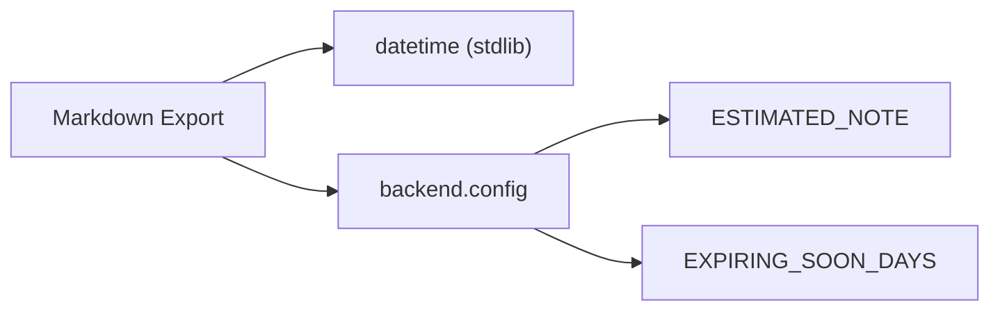

# Backend Service — Markdown Export

## Purpose

Converts a list of pantry items into a formatted markdown table for sharing or export purposes. The table includes product name, brand, quantity, expiration date, status, and notes — with status automatically derived from the item's expiration date. The [inventory route's export endpoint](./backend-routes-inventory.md) is the primary caller. See the [Inventory API](../api/inventory.md) for endpoint details.

## Key Files

| File | Role |
|------|------|
| `backend/services/markdown_export.py` | Exports the `to_markdown` function |
| `backend/config.py` | Provides [`ESTIMATED_NOTE` and `EXPIRING_SOON_DAYS` constants](../config/backend-config.md) |

## Public API

| Function | Signature | Description |
|----------|-----------|-------------|
| `to_markdown` | `(items: list) -> str` | Returns a markdown-formatted string with a header row and one table row per item |

## Table Format

The output is a fenced markdown table with columns:

| Prodotto | Brand | Quantità | Scadenza | Stato | Note |
| :--- | :--- | :--- | :--- | :--- | :--- |

The first line is a level-1 heading `# 🍲 Inventario Dispensa`.

## Status Logic

The status mirrors the [item status](../concepts/item-status.md) computation from the API schemas. For each item, the `Stato` column is determined as follows:

- **No expiration date** → `🟢 OK` — the item has no recorded expiry.
- **Expiration date is in the past** (`< today`) → `🔴 Scaduto` — the item is past its expiry.
- **Expiration date falls within `EXPIRING_SOON_DAYS`** (≤ `today + 3` days) → `🟡 In scadenza` — the item is about to expire.
- **Otherwise** → `🟢 OK` — the item is still good.

The comparison uses `datetime.date.today()` as the reference point.

## Estimated Note Behavior

If an item has `is_estimated` set to `True`, the `Note` column contains the `ESTIMATED_NOTE` string:

```
⚠️ Scadenza stimata, potrebbe scadere prima
```

Otherwise, the note column is left empty.

## Dependencies



- **Internal**: `backend.config` for `ESTIMATED_NOTE` and `EXPIRING_SOON_DAYS`
- **External**: `datetime.date` and `datetime.timedelta` from the Python standard library

## Usage Example

```python
from backend.services.markdown_export import to_markdown

items = [...]  # list of item objects with .name, .brand, .expiration_date, .quantity, .is_estimated
markdown_output = to_markdown(items)
# Returns a string suitable for writing to a .md file
```
