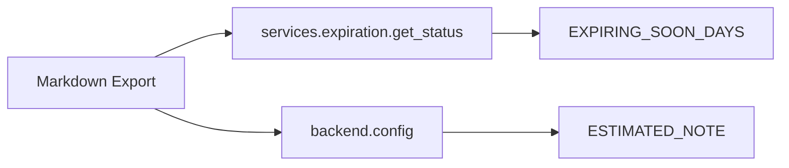

# Backend Service — Markdown Export

## Purpose

Converts a list of pantry items into a formatted markdown table for sharing or export purposes. The table includes product name, brand, quantity, expiration date, status, and notes — with status derived from the shared [`get_status`](./backend-service-expiration.md) helper so the rule lives in one place. The [inventory route's export endpoint](./backend-routes-inventory.md) is the primary caller. See the [Inventory API](../api/inventory.md) for endpoint details. Shopping-list export (grouped by supermarket compartment) lives in the sibling module `backend/services/shopping_markdown.py` — see [Shopping Routes](./backend-routes-shopping.md).

## Key Files

| File | Role |
|------|------|
| `backend/services/markdown_export.py` | Exports the `to_markdown` function for pantry inventory |
| `backend/services/shopping_markdown.py` | `to_shopping_markdown` — checklist grouped by compartment with collapsible sections |
| `backend/config.py` | Provides [`ESTIMATED_NOTE`](../config/backend-config.md); `EXPIRING_SOON_DAYS` is consumed indirectly via `get_status` |

## Public API

| Function | Signature | Description |
|----------|-----------|-------------|
| `to_markdown` | `(items: list) -> str` | Returns a markdown-formatted string with a header row and one table row per item |

## Table Format

The output is a fenced markdown table with columns:

| Prodotto | Brand | Quantità | Scadenza | Stato | Note |
| :--- | :--- | :--- | :--- | :--- | :--- |

The first line is a level-1 heading `# 🍲 Inventario Dispensa`.

## Status Logic

The status reuses the central [`get_status`](./backend-service-expiration.md) computation (same rule as the [item status](../concepts/item-status.md)). For each item, the `Stato` column is determined as follows:

- **No expiration date** → `🟢 OK` — the item has no recorded expiry (`Scadenza` shows `-`).
- **Expiration date is in the past** (`< today`) → `🔴 Scaduto` — the item is past its expiry.
- **Expiration date falls within `EXPIRING_SOON_DAYS`** (≤ `today + 3` days) → `🟡 In scadenza` — the item is about to expire.
- **Otherwise** → `🟢 OK` — the item is still good.

The comparison uses `datetime.date.today()` as the reference point inside `get_status`. Expiration dates render as `Scadenza` in `DD/MM/YYYY` format; a missing brand renders as `-`.

## Estimated Note Behavior

If an item has `is_estimated` set to `True`, the `Note` column contains the `ESTIMATED_NOTE` string:

```
⚠️ Scadenza stimata, potrebbe scadere prima
```

Otherwise, the note column is left empty.

## Dependencies


```mermaid
graph LR
    MarkdownExport["Markdown Export"] --> GetStatus["services.expiration.get_status"]
    MarkdownExport --> ConfigModule["backend.config"]
    ConfigModule --> ESTIMATED_NOTE
    GetStatus --> EXPIRING_SOON_DAYS
```

- **Internal**: `backend.services.expiration.get_status` for status, `backend.config` for `ESTIMATED_NOTE`
- **External**: none beyond stdlib (`datetime` via `get_status`)

## Injection Safety

Cell values pass through `_escape_cell`, which neutralizes markdown injection: `|` → `\|` (would break the table), carriage returns/newlines → spaces (would break the row). Name, brand (and category, if ever interpolated) are escaped — see `backend/tests/test_markdown_escape.py`.

## Usage Example

```python
from backend.services.markdown_export import to_markdown

items = [...]  # list of item objects with .name, .brand, .expiration_date, .quantity, .is_estimated
markdown_output = to_markdown(items)
# Returns a string suitable for writing to a .md file
```
