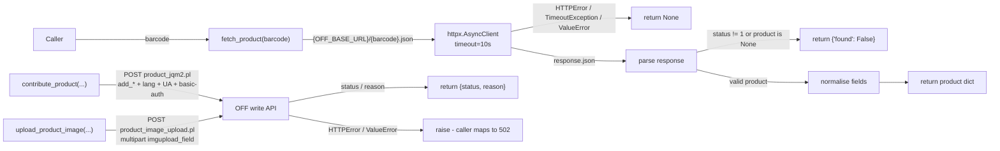

# Open Food Facts Client Service

## Purpose

Low-level async client for the Open Food Facts (OFF) API in `backend/services/off.py`. It exposes three functions — `fetch_product` (read), `contribute_product` (write metadata), and `upload_product_image` (write photo) — and owns all OFF wire details: endpoints, form fields, `User-Agent`, staging basic auth, and status parsing. Callers (the [scan route](./backend-routes-scan.md) and the [Contribute API](../api/contribute.md)) handle HTTP validation and map results to status codes; this module never raises for HTTP-layer concerns except transport errors on the write path. See [OFF integration](../concepts/off-integration.md) for the end-to-end pattern.

## Key Files

| File | Role |
|------|------|
| `backend/services/off.py` | The three client functions plus `_normalize_lang`, `_parse_off_status`, shared read client |
| `backend/config.py` | `OFF_BASE_URL`, `OFF_WRITE_BASE_URL`, `OFF_USER`/`OFF_PASS`, `off_user_agent()`, `off_basic_auth()` |

## Public API

### `fetch_product(barcode: str) -> Optional[dict]`

Read path. `GET {OFF_BASE_URL}/{barcode}.json` on a shared `httpx.AsyncClient` (10 s timeout, created once via `_get_client`).

Returns:

- `None` — network error, timeout, or non-JSON body (`httpx.HTTPError`, `httpx.TimeoutException`, `ValueError`).
- `{"found": False}` — HTTP success but `status != 1` or `product is None`.
- Product dict (`barcode`, `name`, `brand`, `categories`, `image_url`) — on success.

### `contribute_product(...) -> dict`

Write path for metadata. `POST {OFF_WRITE_BASE_URL}/product_jqm2.pl` with a 15 s timeout (fresh client per call).

```python
async def contribute_product(
    code: str,
    product_name: str | None = None,
    brands: str | None = None,
    categories: str | None = None,
    labels: str | None = None,
    quantity: str | None = None,
    generic_name: str | None = None,
    lang: str = "it",
    comment: str | None = None,
    app_uuid: str | None = None,
) -> dict:  # {"status": int, "reason": str | None}
```

Wire details:

- **Endpoint:** `product_jqm2.pl` only. Form always carries `code`, `user_id` (`OFF_USER`), `password` (`OFF_PASS`), `lc` + `lang` (both the normalised 2-letter code), `comment` (caller value or `Contributo via {APP} {VERSION}` default), `app_name`, `app_version`, and `app_uuid` when provided.
- **`add_*` only:** `brands`/`categories`/`labels` are sent as `add_brands`/`add_categories`/`add_labels`; the bare `brands`/`categories`/`labels` keys are never sent, so contributions append rather than overwrite OFF data. `product_name`/`generic_name` are sent language-suffixed (`product_name_{lang}`), `quantity` bare.
- **Lang normalisation:** `_normalize_lang` lowercases, converts `_` to `-`, and keeps the first 2-letter subtag (`it-IT` → `it`, empty → `it`).
- **User-Agent:** every POST carries `off_user_agent()` — `{OFF_APP_NAME}/{OFF_APP_VERSION}` plus `({OFF_CONTACT_EMAIL})` when a contact is configured.
- **Staging basic auth:** `off_basic_auth(OFF_WRITE_BASE_URL)` attaches the `OFF_STAGING_BASIC_USER`/`OFF_STAGING_BASIC_PASS` tuple (default `off`/`off`) only when the base URL host is `*.openfoodfacts.net`; production `.org` hosts get no basic auth (`None`).
- **Result:** `{"status": int, "reason": str | None}` where `reason` prefers `status_verbose` over `reason`. Raises `httpx.HTTPError`/`ValueError` on transport or malformed-response errors (the route maps these to 502). The password is never included in log output.

### `upload_product_image(code, image_bytes, filename, mime, imagefield) -> dict`

Write path for photos. `POST {OFF_WRITE_BASE_URL}/product_image_upload.pl` with a 30 s timeout (fresh client per call).

```python
async def upload_product_image(
    code: str,
    image_bytes: bytes,
    filename: str,
    mime: str,
    imagefield: str,
) -> dict:  # {"status": int, "reason": str | None}
```

Wire details:

- **Endpoint:** `product_image_upload.pl` only. Form carries `code`, `imagefield`, `user_id`, `password`; the file part is named `imgupload_{imagefield}` (e.g. `imgupload_front_it`) as `(filename, image_bytes, mime)`.
- **Same auth/identity as metadata:** `OFF_USER`/`OFF_PASS` credentials, app `User-Agent`, and staging-only basic auth via `off_basic_auth`.
- **Result and errors:** same `{"status", "reason"}` contract as `contribute_product`; raises `httpx.HTTPError`/`ValueError` on transport errors. Logs never contain the password or image bytes.
- **Caller-side guards (route, not this function):** the 5 MB limit (`MAX_PHOTO_BYTES`), the fail-fast `Content-Length` pre-check (both → 413), strict HEIC brand validation (→ 415), minimum dimensions 640×160 (→ 422), and filename sanitisation (`_safe_filename`) all live in `backend/routes/contribute.py` — this function forwards already-validated bytes. See [OFF integration](../concepts/off-integration.md) for the guard table.

## Helpers

| Helper | Behaviour |
|--------|-----------|
| `_normalize_lang(lang)` | `(lang or "it")` → lowercase, `_`→`-`, first subtag truncated to 2 chars; empty → `"it"` |
| `_parse_off_status(data)` | Accepts `status` as int or case-insensitive `"ok"`/`"status ok"` string (→ 1); unparseable → 0 |
| `_get_client()` | Lazily-created shared `httpx.AsyncClient(timeout=10.0)` for reads |

## Flow



## Error Handling Strategy

| Function | Exception | Behaviour |
|----------|-----------|-----------|
| `fetch_product` | `httpx.HTTPError`, `httpx.TimeoutException`, `ValueError` (bad JSON) | `return None` — caller cannot distinguish error types |
| `contribute_product` | `httpx.HTTPError`, `ValueError` (unexpected JSON shape) | Re-raised after a password-free warning log; caller maps to 502 |
| `upload_product_image` | `httpx.HTTPError`, `ValueError` (unexpected JSON shape) | Re-raised after a password/bytes-free warning log; caller maps to 502 |

OFF-level rejections (`status != 1`) are not exceptions: both write functions return them as `{"status": 0, "reason": ...}` and the route maps them to 502.

## Response Format

### `fetch_product` success

| Key | Source | Notes |
|-----|--------|-------|
| `barcode` | function parameter | Passed through unchanged |
| `name` | `product["product_name"]` | Defaults to `""` if missing |
| `brand` | `product["brands"]` | `None` if absent or empty string |
| `categories` | `product["categories_tags"]` | Each tag normalised via `c.split(":")[-1]` (`"en:yogurts"` → `"yogurts"`) |
| `image_url` | `product["image_front_small_url"]` | `None` if absent or empty string |

### `fetch_product` not found / error

```python
{"found": False}  # barcode not in OFF
None              # network or parse error
```

### Write functions

```python
{"status": 1, "reason": None}        # OFF accepted
{"status": 0, "reason": "..."}       # OFF rejected (status_verbose preferred)
```

## Testing

- Read path: `backend/tests/test_off.py` (mocked HTTP scenarios).
- Metadata write: `backend/tests/test_contribute.py` — asserts `add_*`-only form fields, `User-Agent` contents, and that the password never appears in logs.
- Photo write: `backend/tests/test_contribute_photo.py` and `test_off_upload_gap_red.py` — assert the `imgupload_{imagefield}` part name, size/type guards, and the 413/415/422 mappings.

## Usage Example

```python
from backend.services.off import contribute_product, fetch_product, upload_product_image

result = await fetch_product("8000500313273")
if result is None:
    ...  # network error — maybe retry later
elif not result.get("found", True):
    ...  # barcode not in OFF database

await contribute_product(code="8076809514381", product_name="Spaghetti", brands="Barilla", lang="it-IT")
await upload_product_image(
    code="8076809514381",
    image_bytes=data,           # already validated (<=5MB, JPEG/PNG/HEIC) by the route
    filename="8076809514381_front_it.jpg",
    mime="image/jpeg",
    imagefield="front_it",
)
```
