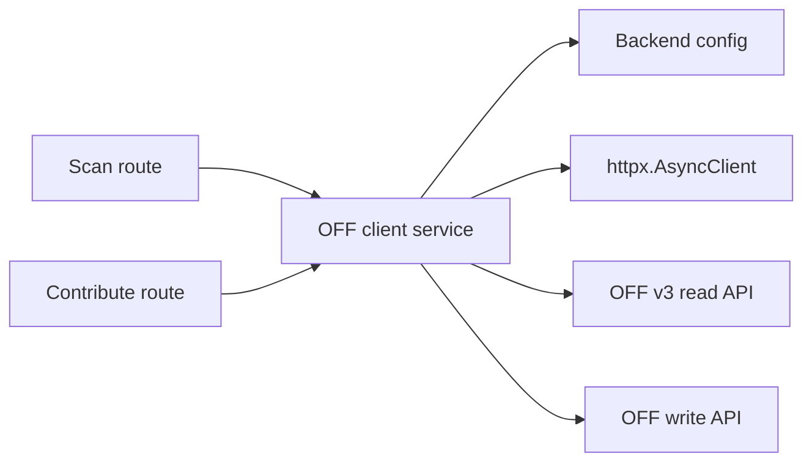
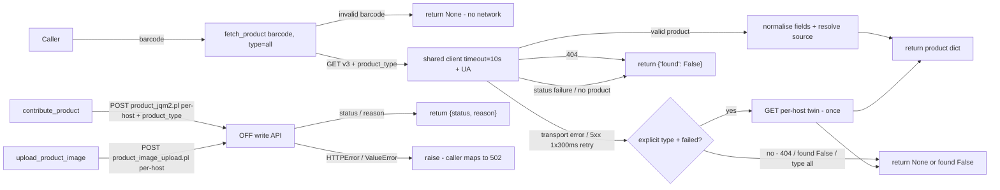

# Open Food Facts Client Service

## Purpose

Low-level async client for the Open Food Facts (OFF) API in `backend/services/off.py`. It exposes three functions — `fetch_product` (read), `contribute_product` (write metadata), and `upload_product_image` (write photo) — and owns all OFF wire details: v3 endpoints, `product_type` handling, form fields, `User-Agent`, staging basic auth, and status parsing. Callers (the scan route and the Contribute API) handle HTTP validation and map results to status codes; this module never raises for HTTP-layer concerns except transport errors on the write path. See [Open Food Facts Integration](../concepts/off-integration.md) for the end-to-end pattern and [Scan API](../api/scan.md) for the read-path caller.

## Key Files

| File | Role |
|------|------|
| `backend/services/off.py` | The three client functions plus `_normalize_lang`, `_parse_off_status`, `_fetch_single_v3`, `_resolve_product_source`, `resolve_write_url`, shared read client |
| `backend/config.py` | `OFF_V3_BASE_URL`, `OFF_V3_HOSTS`, `OFF_PRODUCT_TYPE_DEFAULT`, `OFF_WRITE_BASE_URL`, `OFF_USER`/`OFF_PASS`, `off_user_agent()`, `off_basic_auth()` — see [Backend Configuration](../config/backend-config.md) |

The legacy v0 read endpoint (`OFF_BASE_URL`, `/api/v0/product/{barcode}.json`) is deleted. All reads go through the v3 universal endpoint.

## Public API

### `fetch_product(barcode: str, product_type: str = OFF_PRODUCT_TYPE_DEFAULT) -> Optional[dict]`

Read path. Single `GET {OFF_V3_BASE_URL}/{barcode}?product_type={requested}` on a shared `httpx.AsyncClient` (10 s timeout, `User-Agent` header, created once via `_get_client`).

```python
async def fetch_product(
    barcode: str, product_type: str = OFF_PRODUCT_TYPE_DEFAULT
) -> Optional[dict]:
```

Behaviour:

- **Barcode gate:** `re.fullmatch(r"^\d{8,14}$", barcode or "")` fails → `None` with no network call.
- **Default universal read:** `requested` defaults to `OFF_PRODUCT_TYPE_DEFAULT` (`"all"`); params are always `{"product_type": requested}`.
- **Single GET + conditional per-host fallback:** `_fetch_single_v3(f"{OFF_V3_BASE_URL}/{barcode}", params, barcode)` runs first. Only when it returns `None` (persistent transport error or 5xx) **and** `requested != "all"` **and** `requested in OFF_V3_HOSTS`, a second `_fetch_single_v3` runs against `https://{OFF_V3_HOSTS[requested]}/api/v3/product/{barcode}`. Never on 404 or `found=False`, never parallel fan-out.
- **Retry:** `_fetch_single_v3` retries at most once (`~300 ms` sleep) on transport `httpx.HTTPError` or `status >= 500`; persistent failure logs a warning and returns `None`.
- **404:** returns `{"found": False}` immediately, no retry.
- **Success envelope:** `_parse_off_status(data) != 1` or `product` not a dict → `{"found": False}`.

Returns:

- `None` — invalid barcode, network error, timeout, persistent 5xx, or non-JSON body.
- `{"found": False}` — HTTP 404 or v3 `failure` / `status != 1` / missing product.
- Product dict (`barcode`, `name`, `brand`, `categories`, `pnns_group`, `image_url`, `source`, `product_type`) — on success.

### `contribute_product(...) -> dict`

Write path for metadata. `POST {resolve_write_url(product_type)}/product_jqm2.pl` with a 15 s timeout (fresh client per call).

```python
async def contribute_product(
    code: str,
    product_name: str | None = None,
    brands: str | None = None,
    categories: str | None = None,
    labels: str | None = None,
    quantity: str | None = None,
    generic_name: str | None = None,
    lang: str = "it",
    comment: str | None = None,
    app_uuid: str | None = None,
    product_type: str = "food",
) -> dict:  # {"status": int, "reason": str | None}
```

Wire details:

- **Per-host endpoint:** `resolve_write_url(product_type)` picks the target — staging (`*.openfoodfacts.net`) always maps to `https://world.openfoodfacts.net/cgi` (non-food logs a warning); production maps `food`/`beauty`/`petfood`/`product` to their `world.open*facts.org/cgi` twin. Endpoint is `product_jqm2.pl` only.
- **Form:** always carries `code`, `user_id` (`OFF_USER`), `password` (`OFF_PASS`), `lc` + `lang` (both the normalised 2-letter code), `product_type` (normalised `pt`), `comment` (caller value or `Contributo via {APP} {VERSION}` default), `app_name`, `app_version`, and `app_uuid` when provided.
- **`add_*` only:** `brands`/`categories`/`labels` are sent as `add_brands`/`add_categories`/`add_labels`; the bare keys are never sent. `product_name`/`generic_name` are sent language-suffixed (`product_name_{lang}`), `quantity` bare.
- **Lang normalisation:** `_normalize_lang` lowercases, converts `_` to `-`, and keeps the first 2-letter subtag (`it-IT` → `it`, empty → `it`).
- **User-Agent:** every POST carries `off_user_agent()` — `{OFF_APP_NAME}/{OFF_APP_VERSION}` plus `({OFF_CONTACT_EMAIL})` when configured.
- **Staging basic auth:** `off_basic_auth(base_url)` attaches the `OFF_STAGING_BASIC_USER`/`OFF_STAGING_BASIC_PASS` tuple (default `off`/`off`) only on staging hosts; production hosts get `None`.
- **Result:** `{"status": int, "reason": str | None}` where `reason` prefers `status_verbose` over `reason`. Raises `httpx.HTTPError`/`ValueError` on transport or malformed-response errors. The password is never included in log output.

### `upload_product_image(code, image_bytes, filename, mime, imagefield, product_type="food") -> dict`

Write path for photos. `POST {resolve_write_url(product_type)}/product_image_upload.pl` with a 30 s timeout (fresh client per call).

```python
async def upload_product_image(
    code: str,
    image_bytes: bytes,
    filename: str,
    mime: str,
    imagefield: str,
    product_type: str = "food",
) -> dict:  # {"status": int, "reason": str | None}
```

Wire details:

- **Per-host endpoint:** same `resolve_write_url(product_type)` routing as metadata; endpoint is `product_image_upload.pl` only. Form carries `code`, `imagefield`, `user_id`, `password`; the file part is named `imgupload_{imagefield}` (e.g. `imgupload_front_it`) as `(filename, image_bytes, mime)`.
- **Same auth/identity as metadata:** `OFF_USER`/`OFF_PASS` credentials, app `User-Agent`, and staging-only basic auth via `off_basic_auth`.
- **Result and errors:** same `{"status", "reason"}` contract as `contribute_product`; raises `httpx.HTTPError`/`ValueError` on transport errors. Logs never contain the password or image bytes.
- **Caller-side guards (route, not this function):** the 5 MB limit (`MAX_PHOTO_BYTES`), the fail-fast `Content-Length` pre-check (both → 413), strict HEIC brand validation (→ 415), minimum dimensions 640×160 (→ 422), and filename sanitisation (`_safe_filename`) all live in `backend/routes/contribute.py` — this function forwards already-validated bytes. See [Open Food Facts Integration](../concepts/off-integration.md) for the guard table.

## Helpers

| Helper | Behaviour |
|--------|-----------|
| `_normalize_lang(lang)` | `(lang or "it")` → lowercase, `_`→`-`, first subtag truncated to 2 chars; empty → `"it"` |
| `_parse_off_status(data)` | Int `status` passed through; string `"ok"`/`"status ok"`/`"success"` → 1, `"failure"` → 0, `result.id == "product_found"` → 1; unparseable → 0 |
| `_fetch_single_v3(url, params, barcode)` | One GET with max 1 retry (~300 ms) on transport error/5xx; maps 404 → `{"found": False}`, success → normalised product dict, `status != 1`/missing product → `{"found": False}`, transport/parse failure → `None` |
| `_resolve_product_source(data, requested)` | Scans `product_type`/`instance`/`source` (top-level and `product`); substring match `beauty`/`petfood`/`product`/`food`; falls back to `requested` when specific, else `"product"` (never `"all"`) |
| `resolve_write_url(product_type, base)` | Staging → `https://world.openfoodfacts.net/cgi`; production → per-type `world.open* facts.org/cgi` twin |
| `_get_client()` | Lazily-created shared `httpx.AsyncClient(timeout=10.0, headers={"User-Agent": off_user_agent()})` for reads |

## Dependencies



- Internal: [Scan API](../api/scan.md) and the Contribute API consume this service; [Backend Configuration](../config/backend-config.md) supplies `OFF_V3_BASE_URL`, `OFF_V3_HOSTS`, and write credentials.
- External: `httpx` (shared read client, per-call write clients), OFF v3 read API (`world.open* facts.org/api/v3/product`), OFF write API (`product_jqm2.pl`, `product_image_upload.pl`).

## Flow



## Error Handling Strategy

| Function | Exception | Behaviour |
|----------|-----------|-----------|
| `fetch_product` | Invalid barcode (regex) | `return None` before any network call |
| `fetch_product` | `httpx.HTTPError`, 5xx (persistent after 1 retry), `ValueError` (bad JSON) | `return None` — caller maps to 502 |
| `contribute_product` | `httpx.HTTPError`, `ValueError` (unexpected JSON shape) | Re-raised after a password-free warning log; caller maps to 502 |
| `upload_product_image` | `httpx.HTTPError`, `ValueError` (unexpected JSON shape) | Re-raised after a password/bytes-free warning log; caller maps to 502 |

OFF-level rejections (`status != 1`) are not exceptions: reads return `{"found": False}`, writes return `{"status": 0, "reason": ...}`.

## Response Format

### `fetch_product` success

| Key | Source | Notes |
|-----|--------|-------|
| `barcode` | function parameter | Passed through unchanged |
| `name` | `product["product_name"]` | Defaults to `""` if missing |
| `brand` | `product["brands"]` | `None` if absent or empty string |
| `categories` | `product["categories_tags"]` | Each tag normalised via `c.split(":")[-1]` (`"en:yogurts"` → `"yogurts"`); non-list → `[]`, non-string entries skipped |
| `pnns_group` | `product["pnns_groups_1"]` | Free text or `en:` tag slugified (`"Milk and dairy products"` → `"milk-and-dairy-products"`); `None` if absent |
| `image_url` | `product["image_front_small_url"]` | `None` if absent or empty string |
| `source` / `product_type` | `_resolve_product_source` | `food` / `beauty` / `petfood` / `product` (never `"all"`) |

### `fetch_product` not found / error

```python
{"found": False}  # 404 or status failure / missing product
None              # invalid barcode, network or parse error
```

### Write functions

```python
{"status": 1, "reason": None}        # OFF accepted
{"status": 0, "reason": "..."}       # OFF rejected (status_verbose preferred)
```

## Testing

- Read path: `backend/tests/test_off.py` — v3 URL + `product_type=all` params, no `v0` segment, barcode gate with no network call, shared-client reuse, 1-retry-then-`None` on 500/timeout, no retry on 404/`found=False`, `User-Agent` header, `success`/`product_found` vs `failure` envelopes, `source`/`product_type` propagation, pnns slug cases.
- Scan caller: `backend/tests/test_scan.py` — maps `None` → 502, `{"found": False}` → 200 `found: false`, propagates `source`/`product_type`/`pnns_group`.
- Metadata write: `backend/tests/test_contribute.py` — asserts `add_*`-only form fields, `User-Agent` contents, and that the password never appears in logs.
- Photo write: `backend/tests/test_contribute_photo.py` and `test_off_upload_gap_red.py` — assert the `imgupload_{imagefield}` part name, size/type guards, and the 413/415/422 mappings.

## Usage Example

```python
from backend.services.off import contribute_product, fetch_product, upload_product_image

result = await fetch_product("8000500313273")
if result is None:
    ...  # invalid barcode or network error — maybe retry later
elif not result.get("found", True):
    ...  # barcode not in OFF database

await contribute_product(code="8076809514381", product_name="Spaghetti", brands="Barilla", lang="it-IT")
await upload_product_image(
    code="8076809514381",
    image_bytes=data,           # already validated (<=5MB, JPEG/PNG/HEIC) by the route
    filename="8076809514381_front_it.jpg",
    mime="image/jpeg",
    imagefield="front_it",
)
```
