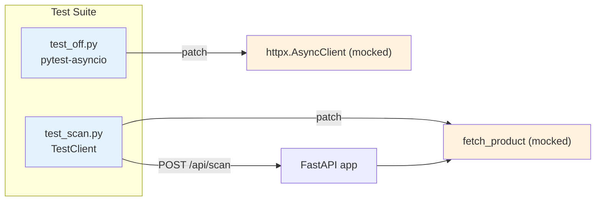

# Backend Tests

## Purpose

Validate the two backend layers — the HTTP scan endpoint (`POST /api/scan`) and the [Open Food Facts service](./backend-service-off.md) (`fetch_product`). Tests use mocked external calls so no real network requests are made.

## Test Framework

| Component | Tool |
|-----------|------|
| Test runner | [pytest](https://docs.pytest.org/) |
| Async support | `pytest-asyncio` |
| HTTP client mocking | `unittest.mock` (AsyncMock, patch) |
| API testing | FastAPI `TestClient` |

Both `pytest` and `pytest-asyncio` are declared in `requirements.txt` under `# dev / test` — see [Python dependencies](../dependencies/python-dependencies.md) for the full list.

## Key Files

| File | Role |
|------|------|
| `backend/tests/test_scan.py` | Integration tests for `POST /api/scan` via `TestClient` |
| `backend/tests/test_off.py` | Unit tests for `backend.services.off.fetch_product` |
| `requirements.txt` | Declares test dependencies |

## Test Categories

### Scan endpoint tests (`test_scan.py`)

Tests the [`POST /api/scan` endpoint](./backend-routes-scan.md). Uses FastAPI's `TestClient` to send real HTTP requests to the in-process app, with `fetch_product` patched out via `unittest.mock.patch`. All tests verify HTTP status codes and JSON response bodies consistent with the [scan API specification](../api/scan.md).

| Test | Description |
|------|-------------|
| `test_scan_found_all_fields` | Mocked `fetch_product` returns full product data → 200, `found: true`, all fields present in response |
| `test_scan_found_empty_name_but_has_brands` | Product has empty name but a brand → still returns `found: true` (not rejected) |
| `test_scan_not_found` | `fetch_product` returns `{"found": False}` → 200 with `found: false` and Italian message containing "non trovato" |
| `test_scan_network_error` | `fetch_product` returns `None` → 502 Bad Gateway with message mentioning "comunicazione" |
| `test_scan_category_normalization` | Categories arrive pre-normalized (no `en:` prefix) → 200, `found: true`, categories contain no `en:` strings |

### Open Food Facts service tests (`test_off.py`)

Uses `pytest.mark.asyncio` for async test functions. Mocks `httpx.AsyncClient` at the class level to control HTTP responses without real network access.

| Test | Description |
|------|-------------|
| `test_fetch_product_valid` | Valid OFF response → returns parsed dict with `barcode`, `name`, `brand`, `categories` (prefix stripped), `image_url` |
| `test_fetch_product_not_found` | OFF returns `status: 0` → returns `{"found": False}` |
| `test_fetch_product_not_found_no_product` | OFF returns `status: 1` but `product` is `None` → returns `{"found": False}` |
| `test_fetch_product_network_error` | `httpx.HTTPError` raised during request → returns `None` |
| `test_fetch_product_categories_normalization` | `en:` prefix is stripped from `categories_tags` → output categories are clean |

## Mocking Strategy

Two helper functions in `test_off.py` encapsulate the mocking logic:

- **`_mock_response(data, status_code)`** — creates a synchronous `Mock(spec=httpx.Response)` with the given JSON data and status code.
- **`_patch_client(resp)`** — returns a `patch` context manager that replaces `httpx.AsyncClient` with an `AsyncMock` whose `.get()` returns the given response. Handles the async context manager (`__aenter__` / `__aexit__`) protocol.

`test_scan.py` uses the simpler `patch("backend.routes.scan.fetch_product")` to control what the scan route receives from its service layer.

## Data Flow

The scan tests exercise the full request-response cycle (routing, validation, serialization) with the external dependency cut at the service boundary. The OFF tests isolate the service function itself, verifying each OFF API response shape is handled correctly.

## Key Test Scenarios

### Found product with all fields
The happy path: a valid barcode returns a complete product. Verifies that name, brand, categories, and image_url are all passed through to the response.

### Product not found
Two separate scenarios in the OFF layer — `status: 0` (product truly missing) and `status: 1` with no product data (edge case). Both converge to `{"found": False}`. The scan endpoint renders this as a 200 with an Italian "non trovato" message.

### Network error
When `httpx.HTTPError` is raised, `fetch_product` returns `None`. The scan layer translates this into a 502 Bad Gateway with a "comunicazione" error message. This distinguishes "product not in database" (200) from "backing service unreachable" (502).

### Category normalization
OFF returns categories with an `en:` prefix (e.g., `en:pasta`). The service strips this prefix before returning. Both `test_off.py` and `test_scan.py` assert that the `en:` prefix is absent from the final output.
