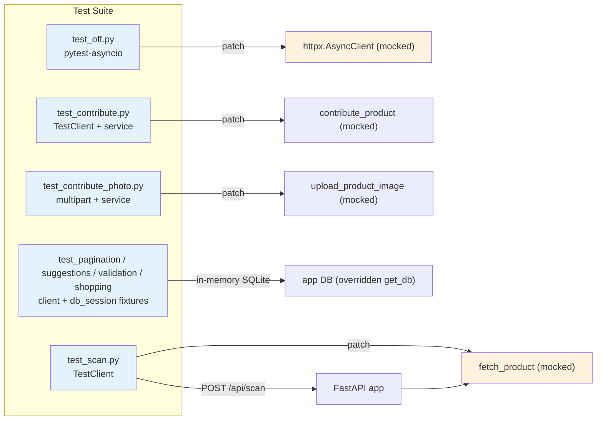

# Backend Tests

## Purpose

Validate the backend layers — HTTP endpoints (`/api/scan`, `/api/scan/contribute`, `/api/scan/contribute/photo`, `/api/inventory`, `/api/suggestions`, `/api/categories`, shopping lists, pantries) and the [Open Food Facts service](./backend-service-off.md) — with mocked external calls so no real network requests are made. Suite was green with **95 passed** at the previous watermark and has since grown with 8+ new/expanded suites (datetime serialization, pantry delete cleanup, validation-error shape, T9 compartments, scan source fields, OFF v3 twins/retry, contribute `product_type`, categories/storage/compartment/inventory-storage).

## Test Framework

| Component | Tool |
|-----------|------|
| Test runner | [pytest](https://docs.pytest.org/) |
| Async support | `pytest-asyncio` |
| HTTP client mocking | `unittest.mock` (AsyncMock, patch) |
| API testing | FastAPI `TestClient` |
| DB isolation | SQLite in-memory + `StaticPool` (`conftest.py`) |

Both `pytest` and `pytest-asyncio` are declared in `requirements.txt` under `# dev / test` — see [Python dependencies](../dependencies/python-dependencies.md) for the full list.

## How to Run

```bash
.venv/bin/pytest backend/tests/ -q        # full suite
.venv/bin/pytest backend/tests/test_scan.py -q   # single file
.venv/bin/pytest backend/tests/ -q -k contribute # subset by name
```

DB-backed suites (`test_pagination.py`, `test_suggestions.py`, `test_validation.py`, `test_shopping.py`, `test_expiration.py`, `test_categories.py`, `test_inventory_storage.py`, `test_pantry_delete_cleanup.py`, `test_t9_compartment_inventory.py`, `test_validation_errors.py`) use the `client` / `db_session` fixtures from `conftest.py`: each test gets a fresh in-memory SQLite DB with `get_db` overridden, so tests are isolated and need no external database.

## Key Files

| File | Role |
|------|------|
| `backend/tests/conftest.py` | Shared fixtures: in-memory DB engine, session, `TestClient` with `get_db` override |
| `backend/tests/test_scan.py` | Integration tests for `POST /api/scan` via `TestClient` |
| `backend/tests/test_off.py` | Unit tests for `backend.services.off.fetch_product` |
| `backend/tests/test_contribute.py` | Tests for `POST /api/scan/contribute` + `contribute_product` service |
| `backend/tests/test_contribute_photo.py` | Tests for `POST /api/scan/contribute/photo` + `upload_product_image` service |
| `backend/tests/test_off_upload_gap_red.py` | Regression guards for OFF upload gaps (multipart part name, lang truncation, string status) — formerly red-phase, now green |
| `backend/tests/test_datetime_serialization.py` | Naive-UTC serialization + `format: date-time` schema guards for all `*Out` models |
| `backend/tests/test_pantry_delete_cleanup.py` | `DELETE /api/pantries/{id}` orphan cleanup + recreate-after-delete |
| `backend/tests/test_validation_errors.py` | `RequestValidationError` `{"detail","message"}` string shape for iOS |
| `backend/tests/test_t9_compartment_inventory.py` | Non-food compartment inference + `source`/`product_type` persistence |
| `backend/tests/test_categories.py` | `GET /api/categories` storage-location fields |
| `backend/tests/test_compartment_suggestion.py` | Pure `storage_for_category` / `suggest_category` unit tests |
| `backend/tests/test_inventory_storage.py` | Inventory create/patch: category auto-assign, `storage_location` echo, `off_category_tags` limits |
| `backend/tests/test_pagination.py` | `GET /api/inventory` limit/offset pagination |
| `backend/tests/test_suggestions.py` | `GET /api/suggestions` auth, prefix search, ordering, limits |
| `backend/tests/test_validation.py` | Pydantic/endpoint validation: quantity, barcode, name |
| `backend/tests/test_shopping.py` | Shopping-list CRUD, toggle, markdown export, auth |
| `backend/tests/test_expiration.py` | Expiration-date resolution and category-based estimation |
| `backend/tests/test_cors.py` | CORS allowlist, preflight, credentials |
| `backend/tests/test_markdown_escape.py` | Markdown table escaping for shopping export |

## Test Categories

### Scan endpoint tests (`test_scan.py`)

Tests the [`POST /api/scan` endpoint](./backend-routes-scan.md). Uses FastAPI's `TestClient` with `fetch_product` patched out via `unittest.mock.patch`. All tests verify HTTP status codes and JSON response bodies consistent with the [scan API specification](../api/scan.md).

| Test | Description |
|------|-------------|
| `test_scan_found_all_fields` | Mocked `fetch_product` returns full product data → 200, `found: true`, all fields present |
| `test_scan_found_empty_name_but_has_brands` | Product has empty name but a brand → still `found: true` (not rejected) |
| `test_scan_not_found` | `fetch_product` returns `{"found": False}` → 200 with `found: false` and Italian "non trovato" message |
| `test_scan_network_error` | `fetch_product` returns `None` → 502 with "comunicazione" message |
| `test_scan_category_normalization` | Categories arrive pre-normalized (no `en:` prefix) → 200, `found: true` |
| `test_scan_suggested_category_from_pnns_group` | Unmappable tags + `pnns_group` milk-and-dairy → `suggested_category: fresh-milk` |
| `test_scan_suggested_category_null_when_nothing_maps` | No mappable tag and no `pnns_group` → `suggested_category: null` |
| `test_scan_not_found_suggested_category_null` | `found: false` branch still carries `suggested_category: null` |
| `test_scan_propagates_source_product_type` | `source`/`product_type` from `fetch_product` echoed in `ScanResponse` (e.g. beauty) |
| `test_scan_non_food_without_pnns` | Non-food without `pnns_group` → `found: true`, no crash |
| `test_scan_makeup_beauty_suggests_cleaning_hygiene` | `source: beauty` + `makeup` → `suggested_category: cleaning-hygiene` (source-aware suggest) |
| `test_scan_tuna_petfood_defers_none` | `source: petfood` + `tuna` → `suggested_category: null` (food `canned-fish` mapping suppressed) |
| `test_scan_propagates_pnns_group` | `pnns_group` from `fetch_product` echoed in `ScanResponse` |
| `test_scan_forwards_source_to_suggest_category` | Wiring check: scan calls `suggest_category(categories, pnns_group, source=..., product_type=...)` |

### Open Food Facts service tests (`test_off.py`)

Uses `pytest.mark.asyncio`. Mocks `httpx.AsyncClient` at the class level to control HTTP responses without real network access.

| Test | Description |
|------|-------------|
| `test_fetch_product_valid` | Valid OFF response → parsed dict with `barcode`, `name`, `brand`, `categories` (prefix stripped), `image_url` |
| `test_fetch_product_not_found` | OFF returns `status: 0` → `{"found": False}` |
| `test_fetch_product_not_found_no_product` | OFF returns `status: 1` but `product` is `None` → `{"found": False}` |
| `test_fetch_product_network_error` | `httpx.HTTPError` raised → returns `None` |
| `test_fetch_product_categories_normalization` | `en:` prefix stripped from `categories_tags` |
| `test_fetch_product_v3_url_and_product_type_all` | Universal v3 URL `/api/v3/product/<barcode>` with `?product_type=all` |
| `test_fetch_product_url_v3_without_v0` | v3 URL contains no `v0` segment |
| `test_fetch_product_v3_success_envelope_found` | Live v3 envelope (`status: success`, `product_found`) → found with name |
| `test_fetch_product_v3_failure_envelope_not_found` | Live v3 envelope (`status: failure`, `product_not_found`) → `{"found": False}` |
| `test_fetch_product_pnns_free_text` / `..._with_comma` / `..._tag_prefix` | `pnns_groups_1` free text slugified (`Milk and dairy products` → `milk-and-dairy-products`, comma stripped, `en:` prefix stripped) |
| `test_fetch_product_opf_source_product` / `..._obf_source_beauty` / `..._non_food_no_pnns` | `product_type` propagated as `source`/`product_type`; non-food without PNNS → `pnns_group: None` |
| `test_fetch_product_retry_once_on_500_then_none` / `..._on_timeout_then_none` | Persistent 500/timeout → exactly 1 retry (2 GETs) then `None` |
| `test_fetch_product_no_retry_on_404` / `..._on_found_false` | 404 or `status: 0` → no retry (1 GET) |
| `test_fetch_product_read_user_agent_present` | Read client sends `User-Agent` with app name/version |
| `test_fetch_product_invalid_barcode_no_network` | Short/non-digit barcode → `None` without network call |
| `test_fetch_product_categories_tags_none` / `..._string` / `..._mixed` | `categories_tags` `None`/string → `[]`; mixed list keeps strings only, strips language prefix |
| `test_fetch_product_logs_requested_vs_resolved` | Log distinguishes requested vs resolved `product_type` |
| `test_off_v3_base_url_allowlist_reject` | Non-allowlisted or `http` `OFF_V3_BASE_URL` falls back to default |
| `test_fetch_product_uses_shared_client` | Service reuses the shared client instead of creating one per call |
| `test_failure_envelope_is_terminal_no_fanout` | v3 `failure` / `product_not_found` envelope is terminal: no sub-DB fan-out, exactly 1 GET → `{"found": False}` |
| `test_fanout_all_miss_returns_not_found` | All-hosts miss converges to `{"found": False}` (unchanged behavior) |
| `test_food_302_to_beauty_is_followed` | Food 302 with `Location` to the beauty twin is followed → beauty product returned (pre-fix surfaced as `None`/502) |

### Contribute tests (`test_contribute.py`)

Tests `POST /api/scan/contribute` (endpoint-level, `contribute_product` mocked) plus two service-level tests (patched `httpx.AsyncClient`, `caplog` for the password-leak check).

| Test | Description |
|------|-------------|
| `test_contribute_disabled_returns_403_without_calling_off` | `OFF_WRITE_ENABLED=false` → 403, service never invoked |
| `test_contribute_consent_false_returns_400_without_calling_off` | `consent_cc_bysa=false` → 400 before any OFF call |
| `test_contribute_success_returns_200` | OFF accepts (`status=1`) → 200 with `ok: true`, `code` echoed |
| `test_contribute_off_rejection_returns_502` | OFF rejects (`status=0`) → 502 |
| `test_contribute_transport_error_returns_502` | `httpx.ConnectError` → 502, never 500 |
| `test_contribute_invalid_barcode_returns_422` | Non-numeric barcode → 422, OFF never called |
| `test_contribute_product_sends_add_fields_and_user_agent` | POST to `product_jqm2.pl` uses only `add_*` fields (`add_brands`, `add_categories`), `product_name_it`, and a `User-Agent` with app name/version |
| `test_contribute_product_never_logs_password` | On transport error, logs contain no OFF password |
| `test_resolve_write_url_per_host_twins` | Per-host write twins: beauty → `world.openbeautyfacts.org`, petfood → `world.openpetfoodfacts.org`, product → `world.openproductsfacts.org` |
| `test_contribute_product_sends_product_type_in_form` | Write form includes `product_type` (twin host via resolver) |
| `test_resolve_write_url_staging_food_fallback` | Staging `.net`: any non-food `product_type` falls back to food staging host |
| `test_contribute_route_forwards_product_type` | `POST /api/scan/contribute` forwards `product_type` to the service |

### Contribute-photo tests (`test_contribute_photo.py`)

Tests `POST /api/scan/contribute/photo` multipart endpoint plus service-level `upload_product_image` checks. An autouse fixture clears the endpoint rate-limit store between tests.

| Test | Description |
|------|-------------|
| `test_photo_disabled_returns_403_without_calling_off` | Write disabled → 403 |
| `test_photo_consent_false_returns_400_without_calling_off` | Missing consent → 400 |
| `test_photo_invalid_imagefield_returns_422` | Unknown `imagefield` → 422 |
| `test_photo_invalid_code_returns_422` | Non-numeric barcode → 422 |
| `test_photo_too_large_returns_413` | Body over 5 MB → 413 |
| `test_photo_declared_content_length_oversize_returns_413_without_reading_body` | Oversize `Content-Length` header → fail-fast 413 without reading the body |
| `test_photo_unsupported_type_returns_415` | Non-image MIME → 415 |
| `test_photo_content_type_magic_mismatch_returns_415` | Declared PNG but JPEG bytes → 415 |
| `test_photo_success_returns_200` / `test_photo_success_png_returns_200` / `test_photo_success_heic_returns_200` | JPEG, PNG, HEIC uploads → 200 with `ok: true` |
| `test_photo_heif_alias_returns_200` | `.heif` alias accepted |
| `test_photo_mif1_major_with_heic_compat_returns_200` / `..._without_heic_compat_returns_415` | `ftypmif1` box accepted only with HEIC-compatible brand |
| `test_photo_empty_file_returns_415` | Empty file → 415 |
| `test_photo_off_rejection_returns_502` / `test_photo_transport_error_returns_502` | OFF `status=0` or transport error → 502 |
| `test_photo_rate_limited_returns_429` | 11th upload from same client → 429 |
| `test_upload_product_image_posts_multipart` | Service POSTs multipart to `product_image_upload.pl` with `code`, `imagefield`, credentials, `User-Agent`, and the `imgupload_{field}` file part |
| `test_upload_product_image_never_logs_password` | Transport error logs never contain the OFF password |
| `test_upload_product_image_same_host_no_product_type` | Image upload reuses the write host with no `product_type` in the form |
| `test_upload_resolve_write_url_twins_share_contribute_host` | Upload shares the contribute resolver: beauty/petfood/product twins |
| `test_photo_route_forwards_product_type` | `POST /api/scan/contribute/photo` forwards `product_type` to the upload service |

### OFF upload gap tests (`test_off_upload_gap_red.py`)

Regression guards for OFF upload-spec gaps (originally red-phase reproductions, now green). All mock `httpx.AsyncClient`; never touch the real network.

| Test | Description |
|------|-------------|
| `test_image_part_name_imgupload_field` | File part must be named `imgupload_{imagefield}` (e.g. `imgupload_nutrition_it`) |
| `test_lang_truncates_to_2_letters` | `lang=it-IT` must send `lc=it` and `lang=it`, with no spurious `cc` field |
| `test_upload_parses_string_status_ok` | OFF response `{"status": "status ok"}` (string) counts as success (`status=1`) |

### Pagination tests (`test_pagination.py`)

Seeds `InventoryItem` rows via the `db_session` fixture and exercises `GET /api/inventory?limit=&offset=`.

| Test | Description |
|------|-------------|
| `test_pagination_limit_offset` | Pages of 2 over 5 items: sorted by `expiration_date` asc, no overlap between pages, partial last page, empty list beyond total |
| `test_pagination_validation` | `limit=0`, `limit=101` (>100 max), negative `offset` → 422 |
| `test_pagination_default_limit` | No params returns all rows (default limit 50) |
| `test_pagination_limit_exceeds_total` | `limit=100` over 2 rows returns both |

### Suggestions tests (`test_suggestions.py`)

Seeds `ScanHistory` rows and exercises `GET /api/suggestions` (see [Suggestions](../api/suggestions.md)). Covers the auth requirement: suggestions is a data route, so a missing, malformed, or unknown `X-Pantry-Token` → 401.

| Test | Description |
|------|-------------|
| `test_suggestions_requires_pantry_token` | No token or malformed token → 401 |
| `test_suggestions_rejects_valid_but_unknown_token` | Well-formed UUID not tied to any pantry → 401 |
| `test_suggestions_accepts_known_pantry_token` | Owner token → 200 with matching names |
| `test_suggestions_prefix_case_insensitive` | Case-insensitive prefix match; substring (`tte`) does not match |
| `test_suggestions_prefix_trim_and_q_empty` | Query is trimmed; empty `q` returns all ordered by `times_scanned` desc, then `last_scanned_at` desc |
| `test_suggestions_limit_10` | At most 10 results |
| `test_suggestions_returns_minimal_fields` | Each item has `barcode`, `name`, `category`, `times_scanned` |
| `test_pantry_scope_returns_only_own_and_merges` | `scope=pantry` returns only the caller's pantry rows; case-insensitive name merge (`Latte` + `LATTE` → `times_scanned: 2`, barcode kept), null barcode → `""` |
| `test_pantry_scope_empty_pantry_returns_empty` | `scope=pantry` on an empty pantry → `[]` |
| `test_pantry_scope_isolation_between_tokens` | `scope=pantry` isolates by token: own + legacy `created_by_token` rows visible, other pantry's rows invisible |
| `test_pantry_scope_prefix_escape` | `scope=pantry` LIKE wildcards escaped: `50%` matches only `50% Sconto`, `a_` only `a_b`, `a\` only `a\b` |
| `test_pantry_scope_limit_10` | `scope=pantry` caps at 10 results |

### Validation tests (`test_validation.py`)

| Area | Checks |
|------|--------|
| Quantity | `0`, `1000`, negative → 422 on `POST /api/inventory` and `/api/inventory/manual`; schema-level boundary test (1 and 999 valid, 0 and 1000 raise) |
| Barcode | Too short, too long, alphabetic → 422 on `POST /api/scan` and inventory create |
| Name | Empty or whitespace-only → 422 on inventory create, manual create, and shopping-list create; missing name → 422 |

### Datetime serialization tests (`test_datetime_serialization.py`)

No DB needed: `*Out` models are built directly. Pins the iOS decoder contract — naive UTC datetimes must serialize with a `+00:00` suffix (see [iOS models](../concepts/ios-models.md)).

| Test | Description |
|------|-------------|
| `test_out_models_serialize_naive_utc_with_timezone_suffix` (7 cases) | `InventoryOut`, `ConsumptionEventOut`, `PantryOut`, `InviteOut` (`expires_at` + `created_at`), `MemberOut` (`joined_at`), `ShoppingListItemOut`, `ShoppingListOut` serialize naive `2026-09-06T10:02:00` as `2026-09-06T10:02:00+00:00` |
| `test_serialization_schema_keeps_date_time_format` (7 cases) | Serialization JSON schema keeps `type: string` + `format: date-time` so the OpenAPI `date-time` marker survives the `UtcDatetime` return-type elaboration |

### Pantry delete cleanup tests (`test_pantry_delete_cleanup.py`)

Covers `DELETE /api/pantries/{id}` (see [Pantries](../api/pantries.md)): SQLite has no `PRAGMA foreign_keys=ON`, so `ondelete=CASCADE` is inert and the route must delete child rows explicitly.

| Test | Description |
|------|-------------|
| `test_delete_pantry_cleans_all_child_tables` | Seeded pantry (2 inventory items, shopping list + item, extra member, invite, consumption event) → 204 with zero orphans in all 6 child tables |
| `test_recreate_pantry_same_name_after_delete_returns_201` | Recreate with the same name after delete → 201 (no rowid-reuse resurrection or 500) |

### Validation-error shape tests (`test_validation_errors.py`)

| Test | Description |
|------|-------------|
| `test_scan_invalid_barcode_returns_string_detail` | `POST /api/scan` with non-numeric barcode → 422 with `{"detail": str, "message": str}` (iOS decodes error bodies as `[String: String]`) |

### T9 compartment + inventory source tests (`test_t9_compartment_inventory.py`)

| Test | Description |
|------|-------------|
| `test_infer_shampoos_to_igiene_casa` | `en:shampoos` → `Igiene e Casa` |
| `test_infer_dog_food_to_dispensa_secca` | `en:dog-food` (tags or name) → `Dispensa Secca` |
| `test_inventory_source_product_type_persisted` | `POST /api/pantries/1/inventory` with `source`/`product_type: beauty` persists and round-trips via `GET` (see [OFF integration](../concepts/off-integration.md)) |

### Categories tests (`test_categories.py`)

Covers `GET /api/categories` (see [Category registry](../concepts/category-registry.md)).

| Test | Description |
|------|-------------|
| `test_categories_storage_location_non_null_for_every_entry` | Every entry exposes non-null `storage_location` within the allowed labels |
| `test_categories_storage_location_coherent` | Spot checks: yogurts → `frigo`, frozen-foods → `freezer`, pasta → `dispensa` |
| `test_categories_storage_location_labels_top_level` | Top-level `storage_location_labels` equals `{frigo, freezer, dispensa}` |
| `test_categories_preexisting_fields_unchanged` | Entry keys, labels, compartments, shelf-life payloads unchanged after the addition |

### Compartment suggestion tests (`test_compartment_suggestion.py`)

Pure unit tests for `backend.services.compartment.storage_for_category` / `suggest_category` (see [Category registry](../concepts/category-registry.md)).

| Test | Description |
|------|-------------|
| `test_storage_yogurts_frigo` / `test_storage_frozen_freezer` / `test_storage_pasta_dispensa` | Known categories map to `frigo` / `freezer` / `dispensa` |
| `test_storage_none_fallback_dispensa` / `test_storage_unknown_fallback_dispensa` | `None` or unknown → `dispensa` fallback |
| `test_suggest_frozen_override_wins_even_if_canned_first` | Frozen override wins even when canned appears first |
| `test_suggest_canned_without_frozen` | Canned without frozen → `canned-vegetables` |
| `test_suggest_first_tag_in_compartment_map` | Unknown tags skipped (`italian-cuisine`), first mapped tag wins (`pasta`) |
| `test_suggest_tags_win_over_pnns` | Tags win over `pnns_group` |
| `test_suggest_pnns_fallback_milk` / `test_suggest_pnns_fallback_fish_meat_eggs` | PNNS fallback: milk-and-dairy → `fresh-milk`, fish-meat-eggs → `meat` |
| `test_suggest_nothing_matches_returns_none` | Unmapped tags + excluded PNNS (`composite-foods`) → `None` |
| `test_suggest_ignores_non_string_tags` / `test_suggest_empty_pnns_skipped` | Defensive runtime: non-string tags ignored, empty PNNS skipped |
| `test_makeup_maps_cleaning_hygiene_via_source` | `makeup` + `source: beauty` → `cleaning-hygiene` |
| `test_petfood_defers_none_not_cleaning` | `pet-food`/`dog-food` + `source: petfood` → `animali` (never `cleaning-hygiene`); `infer_compartment(dog-food)` → `Animali` |
| `test_tuna_source_guard_food_vs_petfood` | `tuna` + `source: food` → `canned-fish`; + `source: petfood` → `None` |
| `test_product_empty_tags_escapes` / `test_product_laptop_defers_none` / `test_product_pasta_maps_pasta` | `source: product`: generic `product`/`electronics`/`cable`/`laptop` filtered → `None`, but a real food tag (`pasta`) still wins |
| `test_pnns_transits_through_create` | PNNS transits with source: `organic` + milk PNNS + `source: food` → `fresh-milk`; without PNNS → `None` |
| `test_explicit_spuria_pippo_pasta` | Unknown `pippo` skipped, `pasta` wins (`source: food`) |
| `test_petfood_chicken_defers_none` | `petfood` + `chicken` + `source: petfood` → `animali` |
| `test_beauty_empty_defers_none` / `test_pnns_composite_foods_defers_none` | Empty tags + `source: beauty` → `None`; excluded PNNS `composite-foods` → `None` |

### Inventory storage tests (`test_inventory_storage.py`)

DB-backed via `client` / `db_session` fixtures (see [Inventory](../api/inventory.md)).

| Test | Description |
|------|-------------|
| `test_create_auto_assigns_category_from_off_tags` | `off_category_tags: [en:yogurts]` auto-assigns `category: yogurts`, confirmed via single-item `GET` |
| `test_create_explicit_category_wins_over_off_tags` | Explicit `category: pasta` wins over OFF tags |
| `test_create_storage_location_echo` | Supplied `storage_location: freezer` echoed back; omitted field → `null` (derivation left to the client by design) |
| `test_patch_storage_location_not_reset_by_later_patch` | Later `PATCH` without the field does not reset it (`exclude_unset`) |
| `test_off_category_tags_too_many_422` / `test_off_category_tag_too_long_422` | >50 tags or tag >200 chars → 422 on both barcode and manual create endpoints |

### Shopping, expiration, CORS, markdown-escape

| Suite | Coverage |
|-------|----------|
| `test_shopping.py` | Shopping-list CRUD + toggle, input validation, markdown export, cross-check against inventory, 401 (missing/malformed token), 403 (forbidden pantry), 404 (pantry not found) |
| `test_expiration.py` | Explicit `expiration_date` passthrough (not estimated); category-based estimation (known category, case-insensitive, `en:` prefix); combined category + OFF tags dedup; unknown/empty tags fall back to the estimated default; `pastas` → `pasta` (365 days) and `pet-food` → `animali` shelf life via `OFF_TO_INTERNAL`/aliases; end-to-end via API |
| `test_cors.py` | Allowlist (no wildcard `*`), allowed origin echoed back, disallowed origin rejected, preflight handling, `credentials: false` |
| `test_markdown_escape.py` | Pipe/newline/CR escaping in table cells, no broken columns or rows, status and estimated-note rendering, shopping grouping with compartment defaults |

## Mocking Strategy

- **Service boundary** (`test_scan.py`, `test_contribute.py`, `test_contribute_photo.py`): `patch("backend.routes.<module>.<service_fn>", new=AsyncMock(...))` controls what the route receives; `mock.assert_not_called()` / `assert_awaited_once()` verify whether OFF should have been reached.
- **HTTP layer** (`test_off.py`, service-level contribute/photo tests, `test_off_upload_gap_red.py`): replace `httpx.AsyncClient` with an `AsyncMock` handling the async context-manager protocol (`__aenter__` / `__aexit__`); capture `url`/`data`/`files`/`headers` to assert on the outgoing OFF request.
- **Config flags**: `monkeypatch.setattr(config, "OFF_WRITE_ENABLED", ...)` toggles the write gate per test.
- **Secrets**: `caplog` tests assert the OFF password never appears in logs on transport errors.

## Data Flow


```mermaid
graph LR
    subgraph "Test Suite"
        TestScan["test_scan.py<br/>TestClient"]
        TestOFF["test_off.py<br/>pytest-asyncio"]
        TestContrib["test_contribute.py<br/>TestClient + service"]
        TestPhoto["test_contribute_photo.py<br/>multipart + service"]
        TestPantry["test_pagination / suggestions / validation / shopping<br/>client + db_session fixtures"]
    end

    TestScan -->|patch| FetchProduct["fetch_product (mocked)"]
    TestOFF -->|patch| HttpxClient["httpx.AsyncClient (mocked)"]
    TestContrib -->|patch| ContribSvc["contribute_product (mocked)"]
    TestPhoto -->|patch| UploadSvc["upload_product_image (mocked)"]
    TestPantry -->|in-memory SQLite| AppDB["app DB (overridden get_db)"]
    TestScan -->|POST /api/scan| App["FastAPI app"]
    App --> FetchProduct

    style TestScan fill:#e3f2fd
    style TestOFF fill:#e3f2fd
    style TestContrib fill:#e3f2fd
    style TestPhoto fill:#e3f2fd
    style TestPantry fill:#e3f2fd
    style FetchProduct fill:#fff3e0
    style HttpxClient fill:#fff3e0
```

Endpoint tests exercise the full request-response cycle (routing, validation, serialization) with external dependencies cut at the service boundary. OFF service tests isolate `fetch_product` / `contribute_product` / `upload_product_image`, verifying each OFF API request/response shape. Pantry suites (pagination, suggestions, validation, shopping, expiration) run against a real in-memory database via the `conftest.py` fixtures.

## Key Test Scenarios

### Found product with all fields
The happy path: a valid barcode returns a complete product. Verifies that name, brand, categories, and image_url are all passed through to the response.

### Product not found
Two OFF-layer scenarios — `status: 0` (truly missing) and `status: 1` with no product data (edge case). Both converge to `{"found": False}`. The scan endpoint renders this as a 200 with an Italian "non trovato" message.

### Network error
When `httpx.HTTPError` is raised, `fetch_product` returns `None`. The scan layer translates this into a 502 Bad Gateway with a "comunicazione" error message. This distinguishes "product not in database" (200) from "backing service unreachable" (502). Contribute endpoints map OFF rejections and transport errors to 502 as well — never 500.

### Category normalization
OFF returns categories with an `en:` prefix (e.g., `en:pasta`). The service strips this prefix before returning. Both `test_off.py` and `test_scan.py` assert that the `en:` prefix is absent from the final output.

### Contribute write-gate ordering
Schema validation rejects malformed barcodes (→ 422) before the handler runs. Inside the handler, guards are checked before any OFF call in this order: missing consent → 400, disabled flag → 403. Only then is the service invoked, and its failures surface as 502. Photo upload adds content checks (size → 413, type/magic bytes → 415) and per-client rate limiting (→ 429).

### Suggestions auth
`GET /api/suggestions` requires pantry ownership: missing, malformed, or unknown tokens all return 401, matching the behavior of other data routes via `get_pantry_context`.

## Related iOS Suites (No Dedicated Wiki Home)

These `ios/InventarioTests/` suites have no `ios-tests.md` page by design — they are referenced here with links to the concept pages that own the behavior:

| iOS Suite | What It Pins | Concept Owner |
|-----------|--------------|---------------|
| `InventoryPagingRedTests.testListScopedCollectsFullPantryBeyondBackendCap` | `listScoped` transparently loops limit/offset so a 70-item pantry beyond the backend `limit=50` cap is fully collected | [iOS networking](../concepts/ios-networking.md) |
| `InventoryDateDecodingTests` (6 tests) | `DateDecodingStrategy.inventoryDate` decodes naive timestamps as UTC, plus Zulu/offset/fractional/date-only variants — the client side of the `test_datetime_serialization` contract | [iOS models](../concepts/ios-models.md) |
| `OutboxStoreTests.testDecisionDoesNotDropRateLimitAndAuthErrors` | Replay policy: 429/401/403 → `.stop` (retryable, never silently dropped); 400/404/409/422 + decoding errors → `.drop`; offline/transport/5xx → `.stop` | [iOS offline outbox](../concepts/ios-offline-outbox.md) |
| `APIClientBodyTests.testInventoryBodyCapsOffTagsToBackendLimits` + omit/empty variants | Request body pre-trims `off_category_tags` to backend limits (≤50 tags, ≤200 chars) — the client side of the `test_inventory_storage` 422 boundaries | [iOS networking](../concepts/ios-networking.md) |
| `APIClientBodyTests.testInventoryBodyPreservesPickedCalendarDayEastOfUTC` | Local-midnight `DatePicker` day (e.g. Europe/Rome 2026-09-06) is sent as `2026-09-06`, not shifted to the previous day by the GMT outbound formatter | [iOS networking](../concepts/ios-networking.md) |
| `CategoryRegistryTests` (animali, 27 keys) | Embedded registry pins 27 categories including `animali` (`Animali` display/compartment, `dispensa` storage fallback); update/reset/empty-payload and storage-map guards | [Category registry](../concepts/category-registry.md) |
| `InventoryCompartmentFilterGreenTests` / `InventoryCompartmentFilterRedTests` | `Compartment.inferCompartment(name:category:)` proxy of the `InventoryListView.sections` predicate: `Tutti` shows all; normalized forms (uppercase, `off:`-prefix, keyword-only) included; unknown never leaks; `animali`/`pet-food`/`dog-food`/`cat-food` resolve to `.animali` | [Category registry](../concepts/category-registry.md) |
| `ContributeProductTypeRedTests` | `APIClient.contribute` sends `product_type` in JSON and `uploadPhoto` sends it as a multipart field; `nil` omits the key (backward compatible) | [OFF integration](../concepts/off-integration.md) |
