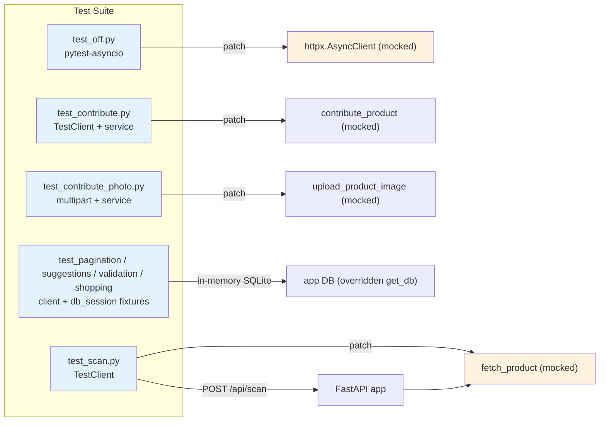

# Backend Tests

## Purpose

Validate the backend layers — HTTP endpoints (`/api/scan`, `/api/scan/contribute`, `/api/scan/contribute/photo`, `/api/inventory`, `/api/suggestions`, shopping lists) and the [Open Food Facts service](./backend-service-off.md) — with mocked external calls so no real network requests are made. Suite is green: **95 passed**.

## Test Framework

| Component | Tool |
|-----------|------|
| Test runner | [pytest](https://docs.pytest.org/) |
| Async support | `pytest-asyncio` |
| HTTP client mocking | `unittest.mock` (AsyncMock, patch) |
| API testing | FastAPI `TestClient` |
| DB isolation | SQLite in-memory + `StaticPool` (`conftest.py`) |

Both `pytest` and `pytest-asyncio` are declared in `requirements.txt` under `# dev / test` — see [Python dependencies](../dependencies/python-dependencies.md) for the full list.

## How to Run

```bash
.venv/bin/pytest backend/tests/ -q        # full suite
.venv/bin/pytest backend/tests/test_scan.py -q   # single file
.venv/bin/pytest backend/tests/ -q -k contribute # subset by name
```

DB-backed suites (`test_pagination.py`, `test_suggestions.py`, `test_validation.py`, `test_shopping.py`, `test_expiration.py`) use the `client` / `db_session` fixtures from `conftest.py`: each test gets a fresh in-memory SQLite DB with `get_db` overridden, so tests are isolated and need no external database.

## Key Files

| File | Role |
|------|------|
| `backend/tests/conftest.py` | Shared fixtures: in-memory DB engine, session, `TestClient` with `get_db` override |
| `backend/tests/test_scan.py` | Integration tests for `POST /api/scan` via `TestClient` |
| `backend/tests/test_off.py` | Unit tests for `backend.services.off.fetch_product` |
| `backend/tests/test_contribute.py` | Tests for `POST /api/scan/contribute` + `contribute_product` service |
| `backend/tests/test_contribute_photo.py` | Tests for `POST /api/scan/contribute/photo` + `upload_product_image` service |
| `backend/tests/test_off_upload_gap_red.py` | Red-phase reproduction tests for OFF upload gaps (multipart part name, lang truncation, string status) |
| `backend/tests/test_pagination.py` | `GET /api/inventory` limit/offset pagination |
| `backend/tests/test_suggestions.py` | `GET /api/suggestions` auth, prefix search, ordering, limits |
| `backend/tests/test_validation.py` | Pydantic/endpoint validation: quantity, barcode, name |
| `backend/tests/test_shopping.py` | Shopping-list CRUD, toggle, markdown export, auth |
| `backend/tests/test_expiration.py` | Expiration-date resolution and category-based estimation |
| `backend/tests/test_cors.py` | CORS allowlist, preflight, credentials |
| `backend/tests/test_markdown_escape.py` | Markdown table escaping for shopping export |

## Test Categories

### Scan endpoint tests (`test_scan.py`)

Tests the [`POST /api/scan` endpoint](./backend-routes-scan.md). Uses FastAPI's `TestClient` with `fetch_product` patched out via `unittest.mock.patch`. All tests verify HTTP status codes and JSON response bodies consistent with the [scan API specification](../api/scan.md).

| Test | Description |
|------|-------------|
| `test_scan_found_all_fields` | Mocked `fetch_product` returns full product data → 200, `found: true`, all fields present |
| `test_scan_found_empty_name_but_has_brands` | Product has empty name but a brand → still `found: true` (not rejected) |
| `test_scan_not_found` | `fetch_product` returns `{"found": False}` → 200 with `found: false` and Italian "non trovato" message |
| `test_scan_network_error` | `fetch_product` returns `None` → 502 with "comunicazione" message |
| `test_scan_category_normalization` | Categories arrive pre-normalized (no `en:` prefix) → 200, `found: true` |

### Open Food Facts service tests (`test_off.py`)

Uses `pytest.mark.asyncio`. Mocks `httpx.AsyncClient` at the class level to control HTTP responses without real network access.

| Test | Description |
|------|-------------|
| `test_fetch_product_valid` | Valid OFF response → parsed dict with `barcode`, `name`, `brand`, `categories` (prefix stripped), `image_url` |
| `test_fetch_product_not_found` | OFF returns `status: 0` → `{"found": False}` |
| `test_fetch_product_not_found_no_product` | OFF returns `status: 1` but `product` is `None` → `{"found": False}` |
| `test_fetch_product_network_error` | `httpx.HTTPError` raised → returns `None` |
| `test_fetch_product_categories_normalization` | `en:` prefix stripped from `categories_tags` |
| `test_fetch_product_uses_shared_client` | Service reuses the shared client instead of creating one per call |

### Contribute tests (`test_contribute.py`)

Tests `POST /api/scan/contribute` (endpoint-level, `contribute_product` mocked) plus two service-level tests (patched `httpx.AsyncClient`, `caplog` for the password-leak check).

| Test | Description |
|------|-------------|
| `test_contribute_disabled_returns_403_without_calling_off` | `OFF_WRITE_ENABLED=false` → 403, service never invoked |
| `test_contribute_consent_false_returns_400_without_calling_off` | `consent_cc_bysa=false` → 400 before any OFF call |
| `test_contribute_success_returns_200` | OFF accepts (`status=1`) → 200 with `ok: true`, `code` echoed |
| `test_contribute_off_rejection_returns_502` | OFF rejects (`status=0`) → 502 |
| `test_contribute_transport_error_returns_502` | `httpx.ConnectError` → 502, never 500 |
| `test_contribute_invalid_barcode_returns_422` | Non-numeric barcode → 422, OFF never called |
| `test_contribute_product_sends_add_fields_and_user_agent` | POST to `product_jqm2.pl` uses only `add_*` fields (`add_brands`, `add_categories`), `product_name_it`, and a `User-Agent` with app name/version |
| `test_contribute_product_never_logs_password` | On transport error, logs contain no OFF password |

### Contribute-photo tests (`test_contribute_photo.py`)

Tests `POST /api/scan/contribute/photo` multipart endpoint plus service-level `upload_product_image` checks. An autouse fixture clears the endpoint rate-limit store between tests.

| Test | Description |
|------|-------------|
| `test_photo_disabled_returns_403_without_calling_off` | Write disabled → 403 |
| `test_photo_consent_false_returns_400_without_calling_off` | Missing consent → 400 |
| `test_photo_invalid_imagefield_returns_422` | Unknown `imagefield` → 422 |
| `test_photo_invalid_code_returns_422` | Non-numeric barcode → 422 |
| `test_photo_too_large_returns_413` | Body over 5 MB → 413 |
| `test_photo_declared_content_length_oversize_returns_413_without_reading_body` | Oversize `Content-Length` header → fail-fast 413 without reading the body |
| `test_photo_unsupported_type_returns_415` | Non-image MIME → 415 |
| `test_photo_content_type_magic_mismatch_returns_415` | Declared PNG but JPEG bytes → 415 |
| `test_photo_success_returns_200` / `test_photo_success_png_returns_200` / `test_photo_success_heic_returns_200` | JPEG, PNG, HEIC uploads → 200 with `ok: true` |
| `test_photo_heif_alias_returns_200` | `.heif` alias accepted |
| `test_photo_mif1_major_with_heic_compat_returns_200` / `..._without_heic_compat_returns_415` | `ftypmif1` box accepted only with HEIC-compatible brand |
| `test_photo_empty_file_returns_415` | Empty file → 415 |
| `test_photo_off_rejection_returns_502` / `test_photo_transport_error_returns_502` | OFF `status=0` or transport error → 502 |
| `test_photo_rate_limited_returns_429` | 11th upload from same client → 429 |
| `test_upload_product_image_posts_multipart` | Service POSTs multipart to `product_image_upload.pl` with `code`, `imagefield`, credentials, `User-Agent`, and the `imgupload_{field}` file part |
| `test_upload_product_image_never_logs_password` | Transport error logs never contain the OFF password |

### OFF upload gap red tests (`test_off_upload_gap_red.py`)

Red-phase reproduction tests for OFF upload-spec gaps (written to fail before the executor fix, pass after). All mock `httpx.AsyncClient`; never touch the real network.

| Test | Description |
|------|-------------|
| `test_image_part_name_imgupload_field` | File part must be named `imgupload_{imagefield}` (e.g. `imgupload_nutrition_it`) |
| `test_lang_truncates_to_2_letters` | `lang=it-IT` must send `lc=it` and `lang=it`, with no spurious `cc` field |
| `test_upload_parses_string_status_ok` | OFF response `{"status": "status ok"}` (string) counts as success (`status=1`) |

### Pagination tests (`test_pagination.py`)

Seeds `InventoryItem` rows via the `db_session` fixture and exercises `GET /api/inventory?limit=&offset=`.

| Test | Description |
|------|-------------|
| `test_pagination_limit_offset` | Pages of 2 over 5 items: sorted by `expiration_date` asc, no overlap between pages, partial last page, empty list beyond total |
| `test_pagination_validation` | `limit=0`, `limit=101` (>100 max), negative `offset` → 422 |
| `test_pagination_default_limit` | No params returns all rows (default limit 50) |
| `test_pagination_limit_exceeds_total` | `limit=100` over 2 rows returns both |

### Suggestions tests (`test_suggestions.py`)

Seeds `ScanHistory` rows and exercises `GET /api/suggestions` (see [Suggestions](../api/suggestions.md)). Covers the auth requirement: suggestions is a data route, so a missing, malformed, or unknown `X-Pantry-Token` → 401.

| Test | Description |
|------|-------------|
| `test_suggestions_requires_pantry_token` | No token or malformed token → 401 |
| `test_suggestions_rejects_valid_but_unknown_token` | Well-formed UUID not tied to any pantry → 401 |
| `test_suggestions_accepts_known_pantry_token` | Owner token → 200 with matching names |
| `test_suggestions_prefix_case_insensitive` | Case-insensitive prefix match; substring (`tte`) does not match |
| `test_suggestions_prefix_trim_and_q_empty` | Query is trimmed; empty `q` returns all ordered by `times_scanned` desc, then `last_scanned_at` desc |
| `test_suggestions_limit_10` | At most 10 results |
| `test_suggestions_returns_minimal_fields` | Each item has `barcode`, `name`, `category`, `times_scanned` |

### Validation tests (`test_validation.py`)

| Area | Checks |
|------|--------|
| Quantity | `0`, `1000`, negative → 422 on `POST /api/inventory` and `/api/inventory/manual`; schema-level boundary test (1 and 999 valid, 0 and 1000 raise) |
| Barcode | Too short, too long, alphabetic → 422 on `POST /api/scan` and inventory create |
| Name | Empty or whitespace-only → 422 on inventory create, manual create, and shopping-list create; missing name → 422 |

### Shopping, expiration, CORS, markdown-escape

| Suite | Coverage |
|-------|----------|
| `test_shopping.py` | Shopping-list CRUD + toggle, input validation, markdown export, cross-check against inventory, 401 (missing/malformed token), 403 (forbidden pantry), 404 (pantry not found) |
| `test_expiration.py` | Explicit `expiration_date` passthrough (not estimated); category-based estimation (known category, case-insensitive, `en:` prefix); combined category + OFF tags dedup; unknown/empty tags fall back to the estimated default; end-to-end via API |
| `test_cors.py` | Allowlist (no wildcard `*`), allowed origin echoed back, disallowed origin rejected, preflight handling, `credentials: false` |
| `test_markdown_escape.py` | Pipe/newline/CR escaping in table cells, no broken columns or rows, status and estimated-note rendering, shopping grouping with compartment defaults |

## Mocking Strategy

- **Service boundary** (`test_scan.py`, `test_contribute.py`, `test_contribute_photo.py`): `patch("backend.routes.<module>.<service_fn>", new=AsyncMock(...))` controls what the route receives; `mock.assert_not_called()` / `assert_awaited_once()` verify whether OFF should have been reached.
- **HTTP layer** (`test_off.py`, service-level contribute/photo tests, `test_off_upload_gap_red.py`): replace `httpx.AsyncClient` with an `AsyncMock` handling the async context-manager protocol (`__aenter__` / `__aexit__`); capture `url`/`data`/`files`/`headers` to assert on the outgoing OFF request.
- **Config flags**: `monkeypatch.setattr(config, "OFF_WRITE_ENABLED", ...)` toggles the write gate per test.
- **Secrets**: `caplog` tests assert the OFF password never appears in logs on transport errors.

## Data Flow


```mermaid
graph LR
    subgraph "Test Suite"
        TestScan["test_scan.py<br/>TestClient"]
        TestOFF["test_off.py<br/>pytest-asyncio"]
        TestContrib["test_contribute.py<br/>TestClient + service"]
        TestPhoto["test_contribute_photo.py<br/>multipart + service"]
        TestPantry["test_pagination / suggestions / validation / shopping<br/>client + db_session fixtures"]
    end

    TestScan -->|patch| FetchProduct["fetch_product (mocked)"]
    TestOFF -->|patch| HttpxClient["httpx.AsyncClient (mocked)"]
    TestContrib -->|patch| ContribSvc["contribute_product (mocked)"]
    TestPhoto -->|patch| UploadSvc["upload_product_image (mocked)"]
    TestPantry -->|in-memory SQLite| AppDB["app DB (overridden get_db)"]
    TestScan -->|POST /api/scan| App["FastAPI app"]
    App --> FetchProduct

    style TestScan fill:#e3f2fd
    style TestOFF fill:#e3f2fd
    style TestContrib fill:#e3f2fd
    style TestPhoto fill:#e3f2fd
    style TestPantry fill:#e3f2fd
    style FetchProduct fill:#fff3e0
    style HttpxClient fill:#fff3e0
```

Endpoint tests exercise the full request-response cycle (routing, validation, serialization) with external dependencies cut at the service boundary. OFF service tests isolate `fetch_product` / `contribute_product` / `upload_product_image`, verifying each OFF API request/response shape. Pantry suites (pagination, suggestions, validation, shopping, expiration) run against a real in-memory database via the `conftest.py` fixtures.

## Key Test Scenarios

### Found product with all fields
The happy path: a valid barcode returns a complete product. Verifies that name, brand, categories, and image_url are all passed through to the response.

### Product not found
Two OFF-layer scenarios — `status: 0` (truly missing) and `status: 1` with no product data (edge case). Both converge to `{"found": False}`. The scan endpoint renders this as a 200 with an Italian "non trovato" message.

### Network error
When `httpx.HTTPError` is raised, `fetch_product` returns `None`. The scan layer translates this into a 502 Bad Gateway with a "comunicazione" error message. This distinguishes "product not in database" (200) from "backing service unreachable" (502). Contribute endpoints map OFF rejections and transport errors to 502 as well — never 500.

### Category normalization
OFF returns categories with an `en:` prefix (e.g., `en:pasta`). The service strips this prefix before returning. Both `test_off.py` and `test_scan.py` assert that the `en:` prefix is absent from the final output.

### Contribute write-gate ordering
Guards are checked before any OFF call: disabled flag → 403, missing consent → 400, invalid barcode → 422. Only then is the service invoked, and its failures surface as 502. Photo upload adds content checks (size → 413, type/magic bytes → 415) and per-client rate limiting (→ 429).

### Suggestions auth
`GET /api/suggestions` requires pantry ownership: missing, malformed, or unknown tokens all return 401, matching the behavior of other data routes via `get_pantry_context`.
