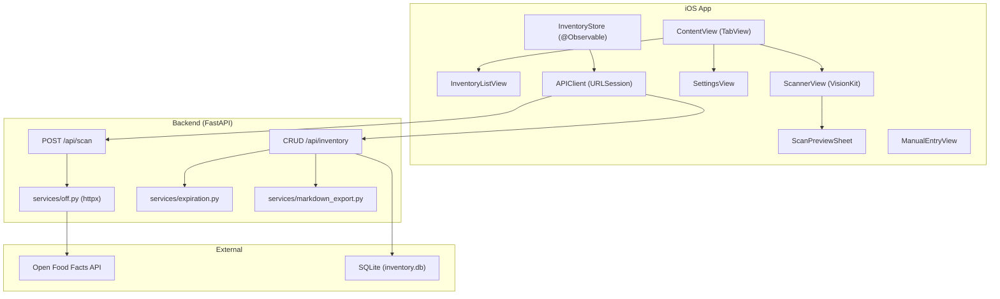

# Project Overview

**Inventario** (previously referred to as *dispensapp*) is a pantry inventory management application. Users scan or manually enter food products, track expiration dates, and view their pantry grouped by freshness status. The app uses the [*Open Food Facts*](../concepts/off-integration.md) (OFF) public database for barcode lookups and automatically estimates expiration dates based on product category when none is provided.

The system follows a [**client-server architecture**](./architecture.md): a SwiftUI iOS frontend communicates with a Python FastAPI backend over HTTP REST. The backend handles barcode resolution (via OFF), expiration estimation, and CRUD operations against a SQLite database.

## Key Features

- **[Barcode scanning](../api/scan.md)** — Uses VisionKit's `DataScannerViewController` (iOS 17+) to detect EAN-13, EAN-8, UPC-E, and Code-128 barcodes. Each scan triggers a lookup against the OFF API, pre-filling product name, brand, category, and image.
- **Manual product entry** — Add items without a barcode by filling in name, brand, category, expiration date, and quantity.
- **[Automatic expiration estimation](../concepts/expiration-estimation.md)** — When no expiration date is provided, the backend estimates it using a configurable shelf-life mapping by category (e.g., fresh milk → 7 days, pasta → 365 days, default → 30 days).
- **[Three-way item status](../concepts/item-status.md)** — Every item is classified as `ok`, `expiring_soon` (within *EXPIRING_SOON_DAYS* = 3 days), or `expired`, with associated color (green, orange, red) and SF Symbol.
- **[Inventory list](../api/inventory.md)** — Searchable list grouped by status, with pull-to-refresh, swipe-to-delete, and swipe-to-decrement-quantity (auto-delete at zero).
- **Markdown export** — Generates a markdown table of the full inventory with status indicators and estimated-expiration notes, sharable via the system share sheet.
- **[Configurable backend URL](../getting-started.md)** — The server address is stored in `UserDefaults` and editable from the settings screen.
- **Connection test** — Settings include a button to verify connectivity to the configured backend.

## Tech Stack

| Layer | Technology |
|-------|-----------|
| Backend language | Python 3 |
| Web framework | FastAPI |
| ORM | SQLAlchemy (declarative) |
| Database | SQLite |
| Validation | Pydantic v2 |
| HTTP client | httpx (async) |
| iOS language | Swift 5.9 |
| iOS UI framework | SwiftUI (iOS 17+) |
| Barcode scanning | VisionKit (`DataScannerViewController`) |
| iOS networking | Foundation `URLSession` with async/await |

## System Overview



The diagram shows the two main subsystems. The iOS app routes user interaction through [`InventoryStore`](../concepts/ios-state-management.md) (the single source of truth) and [`APIClient`](../concepts/ios-networking.md) (HTTP layer). The backend processes scan requests (proxying to OFF), manages inventory CRUD, computes expiration estimates, and generates markdown exports.

## Who It Is For

Inventario targets individuals who want to track their pantry contents and reduce food waste. The Italian-language UI (labels, error messages, export notes) suggests a primary audience of Italian-speaking users.

## Project Structure

```
Inventario/
├── backend/
│   ├── main.py              # FastAPI app entry point, CORS, router setup
│   ├── config.py             # Constants: DEFAULT_SHELF_LIFE, OFF URL, EXPIRING_SOON_DAYS, etc.
│   ├── database.py           # SQLAlchemy engine, session, Base
│   ├── models.py             # InventoryItem ORM model
│   ├── schemas.py            # Pydantic v2 request/response models
│   ├── routes/
│   │   ├── scan.py           # POST /api/scan — barcode lookup via OFF
│   │   └── inventory.py      # CRUD + export endpoints for inventory
│   ├── services/
│   │   ├── off.py            # Async OFF API client (httpx)
│   │   ├── expiration.py     # Expiration date estimation logic
│   │   └── markdown_export.py# Markdown table generation
│   └── tests/                # pytest suite
├── ios/Inventario/
│   ├── InventarioApp.swift   # App entry, @main, injects InventoryStore
│   ├── ContentView.swift     # Root TabView: Dispensa + Aggiungi tabs
│   ├── State/
│   │   └── InventoryStore.swift # @Observable @MainActor store
│   ├── Models/
│   │   ├── InventoryItem.swift  # Codable model, custom date decoder
│   │   ├── ItemStatus.swift     # Enum with color/symbol/label
│   │   └── ScanResult.swift     # Scan API response model
│   ├── Networking/
│   │   ├── APIClient.swift      # URLSession-based HTTP client
│   │   ├── APIConfig.swift      # Configurable base URL (UserDefaults)
│   │   └── APIError.swift       # Error enum with localized descriptions
│   ├── Features/
│   │   ├── Inventory/           # Inventory list, row, detail, status badge
│   │   ├── Scan/                # ScannerView, ScanPreviewSheet (post-scan form)
│   │   ├── ManualEntry/         # Manual product entry form
│   │   └── Settings/            # Server config, export, connection test
│   └── Components/              # Reusable: CategoryPicker, QuantityStepper, ErrorBanner, EmptyStateView
├── requirements.txt          # Python package dependencies
└── inventory.db              # SQLite database (generated at runtime)
```

## Glossary

- **Open Food Facts (OFF)**: Public food product database used for barcode lookups.
- **[InventoryItem](../concepts/ios-models.md)**: Core model representing a product in the pantry, persisted in both SQLite (ORM) and the iOS app (Codable).
- **is_estimated**: Boolean flag indicating the expiration date was auto-calculated from category shelf-life defaults rather than user-supplied.
- **Dispensa**: Italian for "pantry"; the main inventory tab in the iOS app.
- **ItemStatus**: Enum with cases `ok`, `expiring_soon`, `expired`, each with an associated color and icon.
- **EXPIRING_SOON_DAYS**: Configurable constant (set to 3) defining the "expiring soon" threshold from today.
- **ESTIMATED_NOTE**: Warning note appended to rows with estimated expiration dates in markdown export.
- **DEFAULT_SHELF_LIFE**: Mapping of product categories to shelf life in days, used for expiration estimation.
- **InventoryStore**: `@Observable @MainActor` class serving as the single source of truth on the iOS side.
