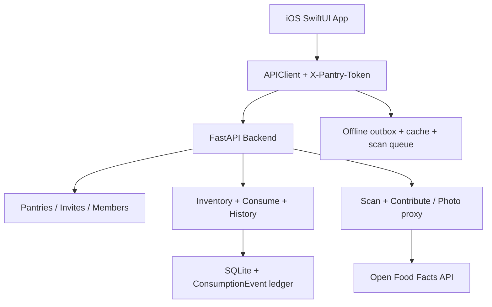

# Project Overview

**Inventario** is a pantry inventory management application. Users scan or manually enter food products, track expiration dates, and view their pantry grouped by freshness status. The app uses the [*Open Food Facts*](./concepts/off-integration.md) (OFF) public database for barcode lookups, automatically estimates expiration dates based on product category when none is provided, and lets users contribute missing data and photos back to OFF.

The system follows a [**client-server architecture**](./architecture.md): a SwiftUI iOS frontend communicates with a Python FastAPI backend over HTTP REST. The backend hosts a multi-pantry shared model — every inventory, scan, and history route is scoped to a pantry selected via the `X-Pantry-Token` header — and handles barcode resolution (via OFF), expiration estimation, atomic consumption with a history ledger, and CRUD operations against a SQLite database.

## Key Features

- **[Barcode scanning](./api/scan.md)** — Uses VisionKit's `DataScannerViewController` (iOS 17+) to detect EAN-13, EAN-8, UPC-E, and Code-128 barcodes. Each scan triggers a lookup against the OFF API, pre-filling product name, brand, category, and image.
- **[Continuous multi-scan queue](./components/ios-scan-session.md)** — A checkout-style session (`ScanSessionStore`) keeps scanning without leaving the camera: debounced enqueue (1.5 s per-barcode cooldown, max 20 items) with per-item states (`pending`, `loading`, `found`, `notFound`, `error`) and retry.
- **[Shared multi-pantry model](./concepts/pantry-sharing.md)** — Users create named pantries ([Pantries API](./api/pantries.md)), invite others with expiring single-use tokens (7 days, atomic claim), and manage members with owner/editor roles. All data routes are scoped as `/api/pantries/{id}/...` plus the `X-Pantry-Token` identity header (persisted in Keychain).
- **[Inventory list](./api/inventory.md)** — Searchable list grouped by status, with pull-to-refresh, swipe-to-delete, and swipe-to-decrement-quantity (auto-delete at zero).
- **[Atomic consume + history ledger](./concepts/inventory-consume-history.md)** — `POST .../inventory/{id}/consume` decrements quantity atomically (row-locked) and appends a `ConsumptionEvent` with delta and reason; deleting the row at zero keeps the per-item history readable.
- **OFF enrichment proxy** — Authenticated users contribute missing product data ([Contribute API](./api/contribute.md): `POST /api/scan/contribute`, CC BY-SA consent required, 10 req/min per-IP limit) and photos (`POST /api/scan/contribute/photo`, JPEG/PNG/HEIC, max 5 MB, min 640x160 px) back to OFF through the backend.
- **Manual product entry** — Add items without a barcode by filling in name, brand, category, expiration date, and quantity.
- **[Automatic expiration estimation](./concepts/expiration-estimation.md)** — When no expiration date is provided, the backend estimates it using a configurable shelf-life mapping by category (e.g., fresh milk → 7 days, pasta → 365 days, default → 30 days).
- **[Three-way item status](./concepts/item-status.md)** — Every item is classified as `ok`, `expiring_soon` (within *EXPIRING_SOON_DAYS* = 3 days), or `expired`, with associated color (green, orange, red) and SF Symbol.
- **[Offline-first outbox](./concepts/ios-offline-outbox.md)** — Mutations made offline (create, consume, update, delete) are queued in a persistent FIFO `OutboxStore` (Application Support, atomic writes) with per-pantry replay, temp-id remapping, and last-write-wins reconciliation; a `LocalInventoryCache` snapshot keeps the list readable and a connectivity monitor triggers replay on reconnect.
- **Markdown export** — Generates a markdown table of the full inventory with status indicators and estimated-expiration notes, sharable via the system share sheet.
- **[Configurable backend URL](./getting-started.md)** — The server address is stored in `UserDefaults` and editable from the settings screen.
- **Connection test** — Settings include a button to verify connectivity to the configured backend.

## Tech Stack

| Layer | Technology |
|-------|-----------|
| Backend language | Python 3 |
| Web framework | FastAPI |
| ORM | SQLAlchemy (declarative) |
| Database | SQLite (Alembic migrations) |
| Validation | Pydantic v2 |
| HTTP client | httpx (async) |
| iOS language | Swift 5.9 |
| iOS UI framework | SwiftUI (iOS 17+) |
| Barcode scanning | VisionKit (`DataScannerViewController`) |
| iOS networking | Foundation `URLSession` with async/await |
| Token storage | Keychain (`X-Pantry-Token`) |
| Connectivity | `NWPathMonitor`-based monitor |
| Offline persistence | JSON snapshot cache + FIFO outbox (atomic writes) |

## System Overview


```mermaid
graph TD
    A["iOS SwiftUI App"]
    B["APIClient + X-Pantry-Token"]
    C["FastAPI Backend"]
    D["Pantries / Invites / Members"]
    E["Inventory + Consume + History"]
    F["Scan + Contribute / Photo proxy"]
    G["Open Food Facts API"]
    H["SQLite + ConsumptionEvent ledger"]
    I["Offline outbox + cache + scan queue"]
    A --> B
    B --> C
    C --> D
    C --> E
    C --> F
    F --> G
    E --> H
    B --> I
```

The diagram shows the two main subsystems. The iOS app routes user interaction through [`InventoryStore`](./concepts/ios-state-management.md) (the single source of truth) and [`APIClient`](./concepts/ios-networking.md) (HTTP layer with pantry-token auth), backed by an offline outbox, a local snapshot cache, and a continuous scan-session queue. The backend scopes every request to a pantry (`X-Pantry-Token` + `PantryContext`), processes scan requests (proxying reads and contributions to OFF), manages inventory CRUD with atomic consume plus a `ConsumptionEvent` history ledger, and generates markdown exports.

## Who It Is For

Inventario targets households and small groups who share one or more pantries and want to track contents and reduce food waste. Members join via invite links with distinct owner/editor roles. The Italian-language UI (labels, error messages, export notes) suggests a primary audience of Italian-speaking users.

## Project Structure

```
Inventario/
├── backend/
│   ├── main.py              # FastAPI app entry point, CORS, router setup
│   ├── config.py             # Constants: DEFAULT_SHELF_LIFE, OFF URL, EXPIRING_SOON_DAYS, etc.
│   ├── database.py           # SQLAlchemy engine, session, Base
│   ├── models.py             # InventoryItem, Pantry, PantryMember, Invite, ConsumptionEvent models
│   ├── schemas.py            # Pydantic v2 request/response models
│   ├── dependencies/
│   │   └── pantry.py          # X-Pantry-Token auth, PantryContext scoping
│   ├── routes/
│   │   ├── scan.py           # POST /api/scan — barcode lookup via OFF
│   │   ├── contribute.py     # POST /api/scan/contribute + /photo — OFF write proxy
│   │   ├── pantries.py       # /api/pantries + invites/members — sharing model
│   │   └── inventory.py      # Pantry-scoped CRUD + consume + history + export
│   ├── services/
│   │   ├── off.py            # Async OFF API client (httpx, read + contribute + photo)
│   │   ├── expiration.py     # Expiration date estimation logic
│   │   └── markdown_export.py# Markdown table generation
│   └── tests/                # pytest suite
├── ios/Inventario/
│   ├── InventarioApp.swift   # App entry, @main, injects InventoryStore
│   ├── ContentView.swift     # Root TabView: Dispensa + Spesa tabs
│   ├── State/
│   │   ├── InventoryStore.swift    # @Observable @MainActor store, outbox replay
│   │   ├── OutboxStore.swift       # Persistent FIFO offline mutation queue
│   │   └── LocalInventoryCache.swift # Per-pantry JSON snapshot cache
│   ├── Models/
│   │   ├── InventoryItem.swift  # Codable model, custom date decoder
│   │   ├── ItemStatus.swift     # Enum with color/symbol/label
│   │   └── ScanResult.swift     # Scan API response model
│   ├── Networking/
│   │   ├── APIClient.swift      # URLSession-based HTTP client (pantry-scoped)
│   │   ├── APIConfig.swift      # Configurable base URL (UserDefaults)
│   │   ├── APIError.swift       # Error enum with localized descriptions
│   │   ├── PantryToken.swift    # X-Pantry-Token Keychain storage
│   │   └── ConnectivityMonitor.swift # NWPathMonitor online/offline signal
│   ├── Features/
│   │   ├── Inventory/           # Inventory list, row, detail, status badge, invites
│   │   ├── Scan/                # ScannerView, ScanSessionStore queue, ScanPreviewSheet
│   │   ├── ManualEntry/         # Manual product entry form
│   │   └── Settings/            # Server config, export, connection test
│   └── Components/              # Reusable: CategoryPicker, QuantityStepper, ErrorBanner, EmptyStateView
├── requirements.txt          # Python package dependencies
└── inventory.db              # SQLite database (generated at runtime)
```

## Glossary

- **Open Food Facts (OFF)**: Public food product database used for barcode lookups.
- **[InventoryItem](./concepts/ios-models.md)**: Core model representing a product in the pantry, persisted in both SQLite (ORM) and the iOS app (Codable).
- **Pantry**: Named shared container; all inventory/history data is scoped to a pantry id plus the caller's token.
- **X-Pantry-Token**: Identity header selecting the caller's pantries; stored in Keychain on iOS.
- **Invite**: Single-use expiring token granting editor membership in a pantry via atomic claim.
- **ConsumptionEvent**: Append-only ledger row recording each atomic consume (delta, reason, timestamp).
- **Outbox**: Persistent FIFO queue of offline mutations, replayed per-pantry on reconnect.
- **is_estimated**: Boolean flag indicating the expiration date was auto-calculated from category shelf-life defaults rather than user-supplied.
- **Dispensa**: Italian for "pantry"; the main inventory tab in the iOS app.
- **ItemStatus**: Enum with cases `ok`, `expiring_soon`, `expired`, each with an associated color and icon.
- **EXPIRING_SOON_DAYS**: Configurable constant (set to 3) defining the "expiring soon" threshold from today.
- **ESTIMATED_NOTE**: Warning note appended to rows with estimated expiration dates in markdown export.
- **DEFAULT_SHELF_LIFE**: Mapping of product categories to shelf life in days, used for expiration estimation.
- **InventoryStore**: `@Observable @MainActor` class serving as the single source of truth on the iOS side.

## Quick Links

- [Architecture](./architecture.md) — client-server layout and request flow.
- [Getting Started](./getting-started.md) — backend setup and iOS configuration.
- [Scan API](./api/scan.md) — barcode lookup contract.
- [Inventory API](./api/inventory.md) — pantry-scoped CRUD, consume, and history.
- [Pantries API](./api/pantries.md) — pantry lifecycle, invites, and members.
- [Suggestions](./api/suggestions.md) — scan-history autocomplete.
- [OFF Integration](./concepts/off-integration.md) — Open Food Facts reads and contributions.
- [Glossary](./glossary.md) — domain terms.
